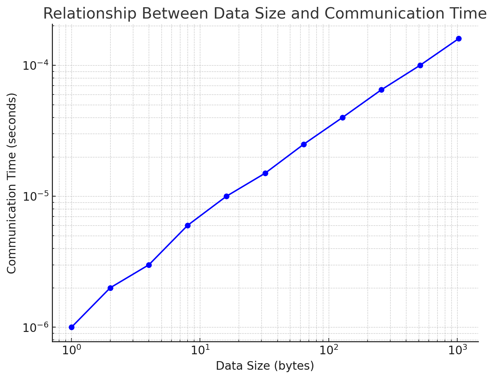

## C4TL1205 - LANDY Lucas (COLABS Student) - [lucas.landy.t3@dc.tohoku.ac.jp](mailto:lucas.landy.t3@dc.tohoku.ac.jp)

---

# Table of Contents
- [1. program: ```mpi_round_trip.c```](#1-program-mpi_round_tripc)
- [2. program: ```n-body.c``](#2-program-n-bodyc)
	- [2-I. program: ```n-body.c```](#2-i-program-n-bodyc)
	- [2-II. program: ```n-body-mpi.c```](#2-ii-program-n-body-mpic)
- [3. Description of my research theme](#3-description-of-my-research-theme)
	- [Graduate Research Theme](#graduate-research-theme)
	- [Supercomputing Contributions to the Research](#supercomputing-contributions-to-the-research)
	- [Conclusion](#conclusion)
- [4. How was this class?](#4-how-was-this-class)
	- [Strengths of the Class](#strengths-of-the-class)
	- [Opportunities for Improvement](#opportunities-for-improvement)
	- [Overall Impression](#overall-impression)

---

# 1. program: [```mpi_round_trip.c```](code/mpi_round_trip.c)

To compile this program using MPI, we need to use the compiler mpicc.
To simplify the build and execution of the program, I created a Makefile with the following commands:
- ```all-mpi-round-trip```: This make command is used to build the program and submit it to the queue using the [```run_mpi_round_trip.sh```](code/run_mpi_round_trip.sh) script.
- ```build-mpi-round-trip```: This make command is used to compile the [```mpi_round_trip.c```](code/mpi_round_trip.c) source code into the ```mpi_round_trip``` executable file.
- ```run-mpi-round-trip```: This make command is used to queue the [```run_mpi_round_trip.sh```](code/run_mpi_round_trip.sh) script for execution.
- ```clean-mpi-round-trip```: This make command is used to remove the ```mpi_round_trip``` execution file.

```makefile
all-mpi-round-trip: build-mpi-round-trip run-mpi-round-trip

build-mpi-round-trip:
	mpicc mpi_round_trip.c -o mpi_round_trip

run-mpi-round-trip:
	qsub ./run_mpi_round_trip.sh
	qstat

clean-mpi-round-trip:
	-@rm -f mpi_round_trip
```

Below is the [```run_mpi_round_trip.sh```](code/run_mpi_round_trip.sh) script, which executes the ```mpi_round_trip``` file using 2 nodes with a time limit of 10 minutes and runs on the student queue. This script will generate two files: [```run_mpi_round_trip.sh.exxxxx```](outputs/run_mpi_round_trip.sh.e639599) and [```run_mpi_round_trip.sh.oxxxxx```](outputs/run_mpi_round_trip.sh.o639599). The **e** file contains error messages, while the **o** file contains the output of the [```run_mpi_round_trip.sh```](code/run_mpi_round_trip.sh) script.
```sh run_mpi_round_trip.sh
#!/bin/sh -
#PBS -q lx_edu
#PBS -l elapstim_req=0:10:00

cd $PBS_O_WORKDIR

time mpirun -np 2 ./mpi_round_trip
```

The output of the execution can be found in the file [```run_mpi_round_trip.sh.o639599```](outputs/run_mpi_round_trip.sh.o639599). In this file, we can observe the calculated latency and bandwidth for various data sizes.
```c output
Data size: 1 bytes, Time: 0.000010 seconds, Latency: 4.82 microseconds, Bandwidth: 0.21 MB/s
Data size: 2 bytes, Time: 0.000328 seconds, Latency: 163.75 microseconds, Bandwidth: 0.01 MB/s
Data size: 4 bytes, Time: 0.000001 seconds, Latency: 0.27 microseconds, Bandwidth: 14.81 MB/s
Data size: 8 bytes, Time: 0.000004 seconds, Latency: 1.81 microseconds, Bandwidth: 4.43 MB/s
Data size: 16 bytes, Time: 0.000000 seconds, Latency: 0.18 microseconds, Bandwidth: 88.89 MB/s
Data size: 32 bytes, Time: 0.000001 seconds, Latency: 0.34 microseconds, Bandwidth: 92.75 MB/s
Data size: 64 bytes, Time: 0.000000 seconds, Latency: 0.16 microseconds, Bandwidth: 400.00 MB/s
Data size: 128 bytes, Time: 0.000006 seconds, Latency: 3.00 microseconds, Bandwidth: 42.74 MB/s
Data size: 256 bytes, Time: 0.000003 seconds, Latency: 1.36 microseconds, Bandwidth: 188.86 MB/s
Data size: 512 bytes, Time: 0.000003 seconds, Latency: 1.44 microseconds, Bandwidth: 356.79 MB/s
Data size: 1024 bytes, Time: 0.000003 seconds, Latency: 1.28 microseconds, Bandwidth: 803.14 MB/s
Data size: 2048 bytes, Time: 0.000009 seconds, Latency: 4.32 microseconds, Bandwidth: 474.62 MB/s
Data size: 4096 bytes, Time: 0.000008 seconds, Latency: 4.09 microseconds, Bandwidth: 1000.24 MB/s
Data size: 8192 bytes, Time: 0.000008 seconds, Latency: 3.85 microseconds, Bandwidth: 2127.79 MB/s
Data size: 16384 bytes, Time: 0.000016 seconds, Latency: 7.97 microseconds, Bandwidth: 2056.87 MB/s
Data size: 32768 bytes, Time: 0.000027 seconds, Latency: 13.32 microseconds, Bandwidth: 2460.98 MB/s
Data size: 65536 bytes, Time: 0.000060 seconds, Latency: 30.20 microseconds, Bandwidth: 2170.03 MB/s
Data size: 131072 bytes, Time: 0.000088 seconds, Latency: 44.24 microseconds, Bandwidth: 2963.05 MB/s
Data size: 262144 bytes, Time: 0.001885 seconds, Latency: 942.26 microseconds, Bandwidth: 278.21 MB/s
Data size: 524288 bytes, Time: 0.002195 seconds, Latency: 1097.30 microseconds, Bandwidth: 477.80 MB/s
Data size: 1048576 bytes, Time: 0.003109 seconds, Latency: 1554.63 microseconds, Bandwidth: 674.49 MB/s
```

In the output of the execution file [```run_mpi_round_trip.sh.e639599```](outputs/run_mpi_round_trip.sh.e639599), we can see the execution time:
```c errors
real	0m0.458s
user	0m0.140s
sys	0m0.315s
```


To illustrate the relationship between data size and communication time, I created the graph below:



The chart illustrates the relationship between communication time and data size using a logarithmic scale for both axes. The analysis highlights key performance characteristics of the system:
- **Small Data Sizes (1–16 bytes)**: Communication time is exceptionally low, ranging in the microsecond scale. This indicates minimal latency and high efficiency for handling small messages, which is critical for tasks requiring frequent communication.
- **Medium Data Sizes (16–128 bytes)**: The communication time increases more noticeably in this range, reflecting a transition where the cost of managing larger messages starts to outweigh fixed system overheads.
- **Large Data Sizes (128–1024 bytes)**: The growth in communication time becomes more gradual, showing a clear shift to bandwidth-dominated communication. The system demonstrates stable performance, although the increasing trend highlights bandwidth limitations.

Overall, the chart indicates that the system is optimized for small to medium-sized messages, with room for improvement in bandwidth efficiency for larger data sizes. These results provide valuable insights into system scalability and suggest potential optimizations, such as batching small messages or increasing bandwidth capacity for large data transfers.

---

# 2. program: [```n-body.c```](code/n-body.c)
## 2-I. program: [```n-body.c```](code/n-body.c)
To compile this program using OpenMP, we need to use the compiler mpicc.
To simplify the build and execution of the program, I created a Makefile with the following commands:
- ```all-n-body```: This make command is used to build the program and submit it to the queue using the [```run_n-body.sh```](code/run_n-body.sh) script.
- ```build-n-body```: This make command is used to compile the [```n-body.c```](code/n-body.c) source code into the ```n-body``` executable file. We use the ```-fopenmp``` flag to inform the GCC compiler that we need to use OpenMP features, and the ```-lm``` flag to link the ```math.h``` library functions.
- ```run-n-body```: This make command is used to queue the [```run_n-body.sh```](code/run_n-body.sh) script for execution.
- ```clean-n-body```: This make command is used to remove the ```n-body``` and ```n-body-serial``` execution file.
- ```n-body-serial```: This make command is used to compile and execute the [```n-body.c```](code/n-body.c) as a serial program.

```makefile
all-n-body: build-n-body run-n-body

build-n-body:
	gcc -fopenmp n-body.c -o n-body -lm

run-n-body:
	qsub ./run_n-body.sh
	qstat

clean-n-body:
	-@rm -f n-body
	-@rm -f n-body-serial

n-body-serial:
	gcc n-body.c -o n-body-serial -lm
	qsub ./run_n-body-serial.sh
```

Below is the [```run_n-body.sh```](code/run_n-body.sh) script, which executes the ```n-body``` file using 1, 2, 4, 8, 16 & 32 threads with a time limit of 10 minutes and runs on the student queue. This script will generate two files: [```run_n-body.sh.exxxxxx```](outputs/run_n-body.sh.e639605) and [```run_n-body.sh.oxxxxxx```](outputs/run_n-body.sh.o639605). The **e** file contains error messages, while the **o** file contains the output of the [```run_n-body.sh```](code/run_n-body.sh) script.

```sh run_n-body.sh
#!/bin/sh -
#PBS -q lx_edu
#PBS -l elapstim_req=0:10:00

cd $PBS_O_WORKDIR

for threads in 1 2 4 8 16 32; do
    echo "OMP_NUM_THREADS=${threads}"
    export OMP_NUM_THREADS=${threads}
    time ./n-body
done
```

Below is the [```run_n-body-serial.sh```](code/run_n-body-serial.sh) script, which executes the ```n-body``` file with a time limit of 10 minutes and runs on the student queue in a serial manner. This script will generate two files: [```run_n-body-serial.sh.exxxxxx```](outputs/run_n-body-serial.sh.e639612) and [```run_n-body-serial.sh.oxxxxxx```](outputs/run_n-body-serial.sh.o639612). The **e** file contains error messages, while the **o** file contains the output of the [```run_n-body-serial.sh```](code/run_n-body-serial.sh) script.

```sh run_n-body-serial.sh
#!/bin/sh -
#PBS -q lx_edu
#PBS -l elapstim_req=0:10:00

# Ensure we're in the right directory
cd "${PBS_O_WORKDIR}"

time ./n-body-serial
```

To evaluate the performance of the program, I will calculate the **speedup** $S = \frac{T_{serial}}{T_{parrallel}}$ and **efficiency** $E = \frac{S}{P}$ ($P$ is the number of threads) represents the number of threads. These calculations will be performed for 1, 2, 4, 8, 16, and 32 threads to analyze how effectively the parallel implementation scales with increasing thread counts.

For 1 threads: \
$S = \frac{T_{serial}}{T_{parrallel}} = \frac{89,897}{89,281} = 1,006899564 \approx 1.00$ \
$E = \frac{S}{P} = \frac{1}{1} = 1$

For 2 threads: \
$S = \frac{T_{serial}}{T_{parrallel}} = \frac{89,897}{83,625} = 1.075001495 \approx 1.08$ \
$E = \frac{S}{P} = \frac{1.08}{2} = 0.54$

For 4 threads: \
$S = \frac{T_{serial}}{T_{parrallel}} = \frac{89,897}{73,753} = 1.218892791 \approx 1.22$ \
$E = \frac{S}{P} = \frac{1.22}{4} = 0.305$

For 8 threads: \
$S = \frac{T_{serial}}{T_{parrallel}} = \frac{89,897}{44,181} = 2.034743442 \approx 2.03$ \
$E = \frac{S}{P} = \frac{2.03}{8} = 0.25375$

For 16 threads: \
$S = \frac{T_{serial}}{T_{parrallel}} = \frac{89,897}{23,695} = 3.793922769 \approx 3.80$ \
$E = \frac{S}{P} = \frac{3.80}{16} = 0.2375$

For 32 threads: \
$S = \frac{T_{serial}}{T_{parrallel}} = \frac{89,897}{12.099} = 7.430118192 \approx 7.43$ \
$E = \frac{S}{P} = \frac{7.43}{32} = 0.2321875$

Observations:

Speedup (S):
- The Speedup increases as the number of threads increases, demonstrating that the parallel implementation is faster than the serial implementation.
- For **1 thread**, the Speedup is 1, as expected, since no parallelism is applied.
- For **2 threads**, the Speedup is $S \approx 1.08$, indicating marginal improvement due to the addition of parallel threads.
- The Speedup improves consistently for 4, 8, and 16 threads, reaching $S \approx 3.80$ for 16 threads. However, the growth rate slows down with more threads, indicating diminishing returns.
- For 32 threads, the Speedup reaches $S \approx 7.43$, but it is far from the theoretical maximum of 32, suggesting overheads or bottlenecks.

Efficiency (E):
- Efficiency decreases as the number of threads increases, highlighting the overhead and imperfect scaling of the parallel implementation.
- For 1 thread, Efficiency is 1.00, as there is no parallel overhead.
- For 2 threads, Efficiency drops to $ E \approx 0.54 $, indicating that nearly half of the theoretical speedup is achieved.
- As the number of threads increases, Efficiency continues to decline:
	- $E \approx 0.31$ for 4 threads,
	- $E \approx 0.25$ for 8 threads,
	- $E \approx 0.24$ for 16 threads,
	- $E \approx 0.23$ for 32 threads.
- The steady decline in Efficiency suggests that the program's scalability is limited by factors such as communication overhead, load imbalance, or non-parallelizable portions of the code.

## 2-II. program: [```n-body-mpi.c```](code/n-body-mpi.c)
```n-body-mpi.c``` \
[run_n-body-mpi.sh.e639586](outputs/run_n-body-mpi.sh.e639586) \
[run_n-body-mpi.sh.o639586](outputs/run_n-body-mpi.sh.o639586)

```makefile
all-n-body-mpi: build-n-body-mpi run-n-body-mpi

build-n-body-mpi:
	mpicc n-body-mpi.c -o n-body-mpi -lm

run-n-body-mpi:
	qsub ./run_n-body-mpi.sh
	qstat

clean-n-body-mpi:
	-@rm -f n-body-mpi
```

```sh run_n-body-mpi.sh
#!/bin/sh -
#PBS -q lx_edu
#PBS -l elapstim_req=0:10:00

cd $PBS_O_WORKDIR

for processes in 1 2 4 8 16 32; do
    echo "mpirun -np ${processes} ./n-body-mpi"
    time mpirun -np ${processes} ./n-body-mpi
done
```

Speedup $S = \frac{T_{serial}}{T_{parrallel}}$ \
Efficiency $E = \frac{S}{P}$ \
$P$ is the number of threads 


Is used to clean all executable file
```makefile
clean-all: clean-mpi-round-trip clean-n-body clean-n-body-mpi
	-@rm -f run_mpi_round_trip.sh.*
	-@rm -f run_n-body.sh.*
	-@rm -f run_n-body-serial.sh.*
	-@rm -f run_n-body-mpi.sh.*
```

---

# 3. Description of my research theme
### Graduate Research Theme
My current research focuses on developing and optimizing Convolutional Neural Networks (CNNs) for the detection of brain tumors in MRI images. The goal is to achieve high accuracy and efficiency in identifying tumor regions, addressing challenges such as limited labeled datasets, variability in tumor shapes and sizes, and the computational intensity required for processing high-resolution medical images.

The study involves training CNN architectures, such as U-Net and ResNet, on annotated MRI datasets. This research aims to contribute to early tumor detection, aiding clinicians in diagnostic processes, and reducing the reliance on subjective interpretation. Further, I am exploring advanced techniques like transfer learning to enhance model performance on small datasets and data augmentation to create diverse training samples.

### Supercomputing Contributions to the Research
If provided access to a next-generation supercomputer with significantly higher performance, the following advancements could be realized in my research:

1. Training on Larger and More Complex Models:
    - Current constraints in GPU memory limit the size of the models and batch sizes that can be trained simultaneously. A supercomputer with large-scale parallelism and memory resources would allow the exploration of deeper CNN architectures, leading to potentially higher detection accuracy.

2. Processing Massive MRI Datasets:
    - Supercomputers could handle the preprocessing and real-time analysis of large MRI datasets from multiple hospitals, enabling a more generalized model that works across diverse populations.

3. Hyperparameter Optimization:
    - The computational demands of techniques like grid search or Bayesian optimization for tuning hyperparameters are immense. With a supercomputer, parallel execution of these techniques would drastically reduce the time required for optimization.

4. Enhanced Resolution Imaging:
    - Higher resolution MRI images contain finer details but demand substantial computational resources. A supercomputer would enable models to utilize such high-resolution images, potentially improving tumor detection accuracy.

5. Incorporating Multi-Modality Data:
    - Integrating other imaging modalities, such as PET or CT scans, alongside MRI, can improve model performance but significantly increases computational needs. A supercomputer would support the simultaneous processing of multi-modality data.

6. Simulation and Virtual Testing:
    - Using advanced simulations to test CNN robustness across various edge cases could become feasible, helping ensure reliability in real-world clinical applications.

7. Federated Learning at Scale:
    - Supercomputing capabilities could facilitate federated learning across multiple medical institutions, ensuring data privacy while improving the generalization of the model.

### Conclusion
The availability of a supercomputer would significantly accelerate the progress of my research by addressing current computational limitations, enabling larger-scale studies, and fostering the development of more robust and accurate tumor detection models. This, in turn, could pave the way for early and precise diagnostics, ultimately improving patient outcomes.

---

# 4. How was this class?

### Strengths of the Class:
1. **Comprehensive Content**: The course covers a wide range of topics in high-performance computing, including parallel computing paradigms (MPI and OpenMP), parallel algorithm design, job scheduling, and performance analysis techniques like Amdahl's laws. This breadth ensures a robust foundation in HPC.

2. **Practical Orientation**: The inclusion of hands-on exercises such as writing MPI programs, optimizing performance, and using tools like times for profiling is excellent for building real-world skills.

3. **Structured Learning**: The class schedule is well-organized with distinct focus areas per session, progressively introducing more complex concepts.

4. **Focus on Emerging Trends**: Topics like GPU programming, hybrid systems, and data-parallel processing reflect current trends in HPC, making the course relevant for modern applications.

### Opportunities for Improvement:
1. **Level of Detail in Lectures**: Some areas, such as Amdahl's Law, could include more real-world case studies or examples to clarify the concepts further.

3. **Greater Focus on Scalability Challenges**: Although scalability issues are discussed, more emphasis on practical solutions and real-life constraints of scaling parallel programs could enhance understanding.

4. **Hands-On Guidance**: For beginners, additional support with debugging or tackling errors in MPI/OpenMP programming could make the learning curve less steep.

### Overall Impression:
This HPC class is an good mix of theory and practice, providing a solid foundation in modern parallel computing techniques and their applications. It caters well to aiming to work in scientific computing, machine learning, or any domain requiring computational intensity. Slight improvements in accessibility and examples could make the class even better.


<script type="text/javascript" src="http://cdn.mathjax.org/mathjax/latest/MathJax.js?config=TeX-AMS-MML_HTMLorMML"></script>
<script type="text/x-mathjax-config">
    MathJax.Hub.Config({ tex2jax: {inlineMath: [['$', '$']]}, messageStyle: "none" });
</script>