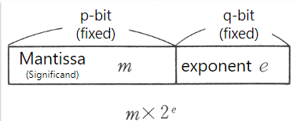
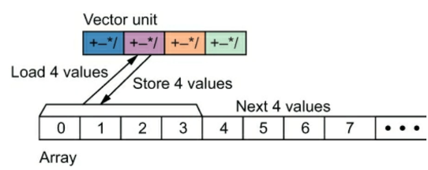
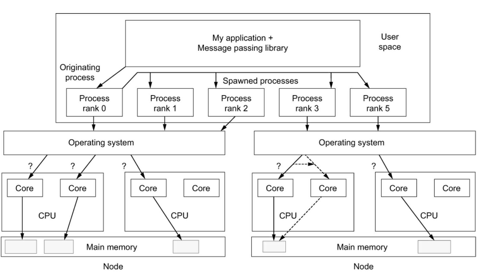
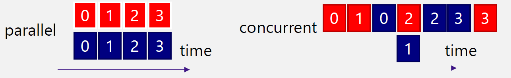
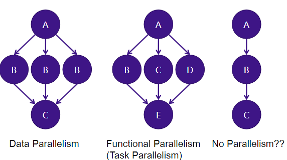
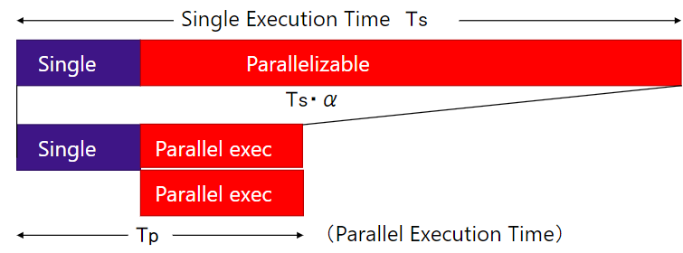
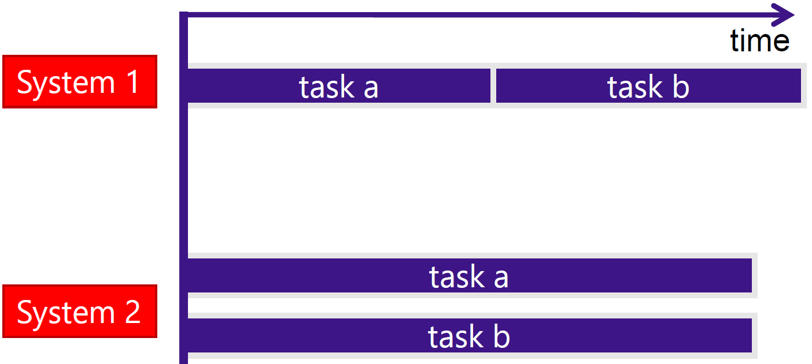
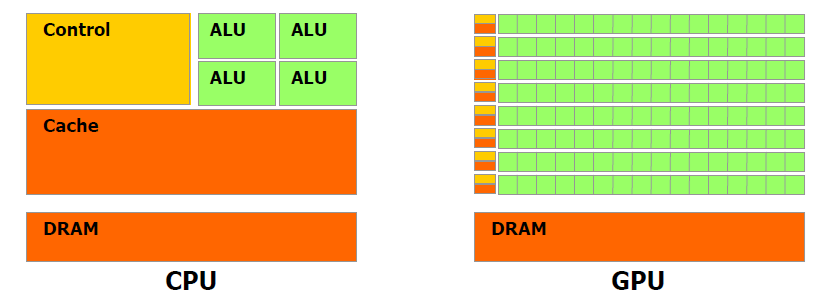
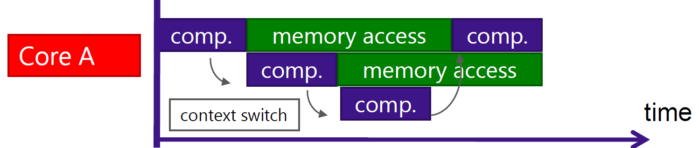

# High-Performance Computing (HPC) - Course Summary #1 ([hpc_01.pdf](hpc_01.pdf))

## Instructor
- **Hiroyuki TAKIZAWA** (滝沢寛之)
  - Processor at Cyberscience Center, Tohoku University
  - Research Interests: HPC software and systems, computer architectures, parallel and distributed computing systems, and applications
  - Contact: takizawa@tohoku.ac.jp

## Table of Contents
- [Instructor](#instructor)
- [Class Schedule](#class-schedule)
- [Introduction to HPC](#introduction-to-hpc)
- [Supercomputers and Parallel Computing](#supercomputers-and-parallel-computing)
- [The Modern Scientific Method](#the-modern-scientific-method)
- [Target Applications](#target-applications)
- [Floating-Point Operations (FLOPS)](#floating-point-operations-flops)
- [Parallel Computing](#parallel-computing)
- [Parallel Architectures](#parallel-architectures)
- [Power Calculation Example](#power-calculation-example)
- [System Overview](#system-overview)
- [Software Overview](#software-overview)
- [Benefits of Parallel Computing](#benefits-of-parallel-computing)
- [Importance of Application Parallelism](#importance-of-application-parallelism)
- [Seeking Concurrency](#seeking-concurrency)
- [Parallelism in Graphs](#parallelism-in-graphs)
- [Parallelization Ratio and Amdahl’s Law](#parallelization-ratio-and-amdahls-law)
- [Parallel Programming](#parallel-programming)
- [Accelerators and Heterogeneous Computing](#accelerators-and-heterogeneous-computing)
- [System Performance Metrics](#system-performance-metrics)
- [Heterogeneous Computing](#heterogeneous-computing)
- [Latency-Oriented Features](#latency-oriented-features)
- [Cache Memory](#cache-memory)
- [Branch Prediction](#branch-prediction)
- [Strategies for High Throughput](#strategies-for-high-throughput)
- [Conclusion](#conclusion)

## Class Schedule
1. **1-Oct**: Introduction to HPC (1)
2. **1-Oct**: Introduction to HPC (2)
3. **8-Oct**: Parallel Architectures
4. **8-Oct**: How to use Supercomputer AOBA
5. **15-Oct**: Parallel Algorithm Design (1)
6. **15-Oct**: Parallel Algorithm Design (2)
7. **5-Nov**: MPI Programming (1)
8. **5-Nov**: MPI Programming (2)
9. **12-Nov**: OpenMP Programming (1)
10. **12-Nov**: OpenMP Programming (2)
11. **26-Nov**: Hybrid Programming
12. **26-Nov**: Performance Modeling and Analysis

## Introduction to HPC
- HPC systems, often called **supercomputers**, use **parallel computing** to perform many operations at once.
- The importance of parallelism in modern hardware and software.
- Methods for exploiting parallelism and the impact of software parallelism.

## Supercomputers and Parallel Computing
- A supercomputer is designed to perform a vast number of floating-point operations (FLOPS).
- Key applications include **simulation, AI, and machine learning**, which have a high demand for computing power.

## The Modern Scientific Method
- Traditional scientific methods involve hypothesis, experimentation, and observation.
- Modern methods incorporate **simulation** and **data science** to predict and analyze complex systems.

## Target Applications
- Scientific problems like **boundary value problems** and **heat conduction simulations**.
- Growth in AI and ML applications driving demand for larger datasets and computational power.

## Floating-Point Operations (FLOPS)
- A supercomputer's performance is measured by the number of floating-point operations per second (FLOPS).
  - A number is represented by a mantissa (significand) and an exponent, similar to scientific notation
  - Representable range extended
  - Complicated processing needed for arithmeticoperations
- High performance in **numerical simulations** requires the ability to handle a large number of floating-point calculations quickly.
- The performance of a supercomputer is discussed based on how many floating-point operations the supercomputer can execute per unit time.



| Chinese Characters (KANJI) | Value      | SI Prefixes (Intl. Syst. of Unit) | Value   |
|----------------------------|------------|-----------------------------------|---------|
| 万 (man)                   | 10^4       | K (kilo)                         | 10^3    |
| 億 (oku)                   | 10^8       | M (mega)                         | 10^6    |
| 兆 (chou)                  | 10^12      | G (giga)                         | 10^9    |
| 京 (kei)                   | 10^16      | T (tera)                         | 10^12   |
| 垓 (gai)                   | 10^20      | P (peta)                         | 10^15   |
| 秭/禰 (jo)                 | 10^24      | E (exa)                          | 10^18   |
| 穣 (jou)                   | 10^28      | Z (zetta)                        | 10^21   |
| ...                        | ...        | Y (yotta)                        | 10^24   |
| 無量大数                    | 10^68      |                                   |         |

Note: K Computer = 10 Pflop/s = 10^16

## Parallel Computing
- The practice of **executing many operations simultaneously at a time** by identifying and exposing parallelism in algorithms. Expressing the parallelism in the software implementation necessite to understanding the costs, benefits, and limitations of the chosen implementation. 
- Parallel computing focuses on **performance** with different goals such as **speedup**, **problem size scaling**, and **energy efficiency**.


## Parallel Architectures
- Modern computers no longer rely on increasing clock speed for performance, but instead, add more processing cores (parallelism).
- Parallel computing systems save power by distributing tasks across multiple processors running at lower frequencies.

### Power Consumption Calcul:
$P_d = \alpha \times f \times V_{dd}^2$

Where:
- $P_d$: dynamic power consumption
- $f$: clock frequency
- $V_{dd}$: power-supply voltage

Note $f$ is correlated with $V_{dd}$.

$P_d$ increases at the rate of $O(f^3)$ if $f$ is proportional to $V_{dd}$.


### Power Calculation Example
To illustrate the power-saving benefits of parallel computing, consider the following two system configurations:
1. **System 1**: A single processor with a clock frequency of 2 GHz and power-supply voltage of 1.5V.

    $f = 2GHz, V_{dd} = 1.5V, Nbr\_Core = 1$

    $P_{d} = \alpha \times 2000 \times 1.5^2 \times 1 = 4500 \alpha$

2. **System 2**: Four processors, each with a clock frequency of 500 MHz and power-supply voltage of 0.8V.

    $f = 0.5GHz, V_{dd} = 0.8V, Nbr\_Core = 4$

   $P_d = \alpha \times 500 \times 0.8^2 \times 4 = 1280 \alpha$
   
   If the **4** processors of System 2 work perfectly in parallel, they achieve the same performance as System 1, but with only 28% of the power consumption. This demonstrates that **parallel computing is power-effective**.

## System Overview
- **CPU-GPU Heterogeneous Systems**: Systems are composed of multiple CPUs and GPUs, connected by high-speed networks.
- CPUs are designed for **latency-oriented tasks** while GPUs are optimized for **throughput-oriented tasks**.
- Contains multiple **Cores** for processing.

### Vector (aka. SIMD) Processing



- **Vector Unit**:
  - Capable of loading and storing $X$ values at a time.
  - Performs parallel operations on these values using SIMD (Single Instruction, Multiple Data).

- **Array Processing**:
  - Processes arrays by loading and storing chunks of values (e.g., 4 values at a time).
  
- **AOBA**:
  - A **vector computer** that can process 256 values with a single instruction.

## Software Overview
- **Processes and Threads**: Software is executed by multiple **processes**, each assigned to a node and run on one or more cores.
- Software must be written to exploit **thread-level parallelism** (OpenMP) and **process-level parallelism** (MPI).

When a program is launched, several kinds of resources such as CPU time and memory are allocated for the execution. A unit of allocated resource is called a **process**. An **application** (user program) is executed by multiple processes.

Each process is assigned to a node, which runs the OS, such as Linux.

The OS on each node decides the core(s) to execute the process. A process can be executed by multiple cores. The execution sequence on each core is called a **thread**.



## Benefits of Parallel Computing
1. **Faster runtime**: More cores reduce execution time.
2. **Larger problem sizes**: More compute nodes allow solving larger problems.
3. **Energy efficiency**: More but slower cores can perform computations while consuming less power.

Energy = (No. CPUs) x (Power/CPU) x (Hour)

## Importance of Application Parallelism
- Successful parallel computing depends on **well-parallelized applications**. Applications need to be optimized to take advantage of hardware parallelism.

## Seeking Concurrency

### Data Dependence Graphs

- **Vertex**:
  - Represents a task that needs to be completed.

- **Edge**:
  - Directed from task **u** to task **v**, meaning **task u** must be completed before **task v** begins.

- **Concurrency**:
  - If there is **no edge** between tasks **u** and **v**, they are independent and may be performed concurrently.

### Parallel vs Concurrent Execution

- **Parallel Execution**:
  - Multiple tasks are executed physically at the same time.
  
- **Concurrent Execution**:
  - Multiple tasks can be in progress at the same time, but not necessarily executed at the same moment.



## Parallelism in Graphs

1. **Data Parallelism**:
   - Multiple tasks (e.g., B, B, B) can be processed in parallel when derived from the same parent node (A) and before moving to subsequent dependent tasks (e.g., C).

2. **Functional Parallelism (Task Parallelism)**:
   - Different tasks (e.g., C, D, E) stemming from different parts of the graph can be executed in parallel.

3. **No Parallelism**:
   - A linear dependency structure (A → B → C) does not allow for any parallelism as each task depends on the completion of the previous one.



## Parallelization Ratio and Amdahl’s Law
Amdahl’s Law is a fundamental principle in parallel computing that describes the potential speedup from parallelizing a task. The formula is:

$\text{Speedup} = \frac{T_s}{T_p} = \frac{1}{(1 - \alpha) + \frac{\alpha}{n}}$

Where:
- $\alpha$ is the fraction of the program that can be parallelized.
- $n$ is the number of processors.




## Parallel Programming
- **Parallel programming** involves writing software that explicitly indicates the parallel portions of the program that can be executed concurrently.
- Standards like **OpenMP** and **MPI** are essential for writing parallel programs.

## Accelerators and Heterogeneous Computing
- **Accelerators** like GPUs and many-core processors (e.g., Intel Xeon Phi) are used to enhance computational performance.
- These accelerators must be programmed to exploit both **parallelism** and the **heterogeneity** of hardware resources.

## System Performance Metrics
1. **Latency**: The time to complete a single task (shorter is better).
2. **Throughput**: The number of tasks completed in a given time (higher is better).

System 1 is better in terms of latency. \
System 2 is better in terms of throughput. \


## Heterogeneous Computing
### CPU: Latency-Oriented Design (Speculative)
  - CPUs have a large **cache memory** and a **control unit**.
  - Latency-oriented design is focused on minimizing delays and managing speculative tasks.
### GPU: Throughput-Oriented Design (Parallel)
  - GPUs allocate more hardware resources to **ALUs** (Arithmetic Logic Units).
  - Throughput-oriented design is aimed at maximizing the number of parallel tasks executed at once.
### CPU vs GPU Architecture
- **CPU**:
  - Contains **Control**, **Cache**, **ALUs**, and **DRAM**.
- **GPU**:
  - Focuses heavily on **ALUs** with large amounts of resources allocated to parallel processing, with **DRAM** for memory.



## Latency-Oriented Features
### Preparing for Future Events:
  - **Cache Memory**: Stores data that is likely to be accessed soon, reducing latency.
  - **Out-of-Order (OoO) Execution** and **Branch Prediction**:
    - Predicts upcoming branches to execute speculatively, optimizing future operations.

## Cache Memory
- **Memory is much slower than CPU**:
  - To mitigate this, CPUs use cache memory to prepare for future memory accesses.
### Cache Process:
  1. **Read** data from memory.
  2. **Process** the data.
  3. **Write** the data back to memory.
- **Caching Process**:
  - Without cache: The speed is limited by memory access times.
  - With cache: The speed is enhanced by reducing the frequency of accessing slower main memory.
- **Data to be cached**:
  - Determined based on the **locality of reference**, which predicts that the same memory locations will be used frequently.
- **Cache Hit Ratio**:
  - Increasing the cache hit ratio is critical for improving performance in modern processors.
  - **Cache memory** occupies a significant portion of the chip to ensure high hit ratios.

## Branch Prediction
- **Goal**: Predict the branch target to execute either A or B **speculatively**.
  - This allows the CPU to continue working without waiting for the branch decision to be finalized.

### Types of Branches:

<div style="display: flex; justify-content: space-between;">
  <div style="width: 45%;">

  ```
  if ( i == 0 ){
    A;
  }
  B;
  ```
  </div>
  <div style="width: 45%;">

  ```
  for ( i = 0; i < N; i++ ){
    A;
  }
  B;
  ```
  </div>
</div> 

  - **Conditional Branch**:
    - If a condition is met (e.g., `i == 0`), the processor executes **A**, otherwise **B**.
    - There is often a statistical bias in the branch targets that can be leveraged to improve prediction accuracy.
  - **Loop**:
    - For loop structures (e.g., `for (i = 0; i < N; i++)`), **A** is executed repeatedly, followed by **B** once the loop ends.
- **Speculative Execution**:
  - Reduces latency by avoiding pipeline stalls when the processor predicts which branch will be taken.
  - This makes the processor more complex and increases the hardware cost of each core.

## Strategies for High Throughput
### Many Simple Cores
- **No speculation features**:
  - These cores are designed to be simple, avoiding complex speculative execution to increase the total number of cores on a chip.
- **Many tasks (threads) executed in parallel**:
  - Multiple threads are executed simultaneously, though the execution speed of an individual thread may be slower.
### Many In-Flight Threads
- **Context Switching**:
  - When a thread is stalled (e.g., waiting for memory access), another thread is executed on the core to keep it active. This is referred to as a **context switch**.
- **Hiding Memory Access Latency**:
  - Memory access latency is hidden by allowing another thread to execute while one is waiting for memory.
- **Use of Registers**:
  - A large number of registers are used to reduce the overhead caused by context switching, allowing for smoother transitions between threads.
### Visual Example:
- Shows how **Core A** performs a mix of computations and memory accesses, switching between threads as needed, to maintain high throughput over time.


## Conclusion
- This course introduces HPC and covers both **theoretical and practical aspects** of high-performance computing.
- Topics include parallelism in modern hardware, application optimization for parallel execution, and the use of tools like **OpenMP** and **MPI**.
- Key focus areas include **power efficiency**, **system architectures**, and **parallel programming techniques**.

# /!\ Not Sure about that /!\
### Example Calculation:
If 80% of a task ($\alpha = 0.8$) can be parallelized and we run the program on 4 processors ($n = 4$):
$\text{Speedup} = \frac{1}{(1 - 0.8) + \frac{0.8}{4}} = \frac{1}{0.2 + 0.2} = 2.5$
Thus, using 4 processors would yield a **2.5x speedup**. However, Amdahl’s Law also shows that increasing $n$ does not result in infinite speedup, as the non-parallelizable portion of the task limits the overall improvement.