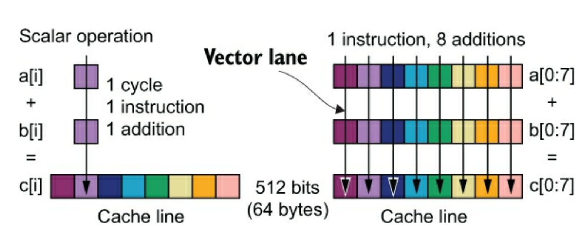
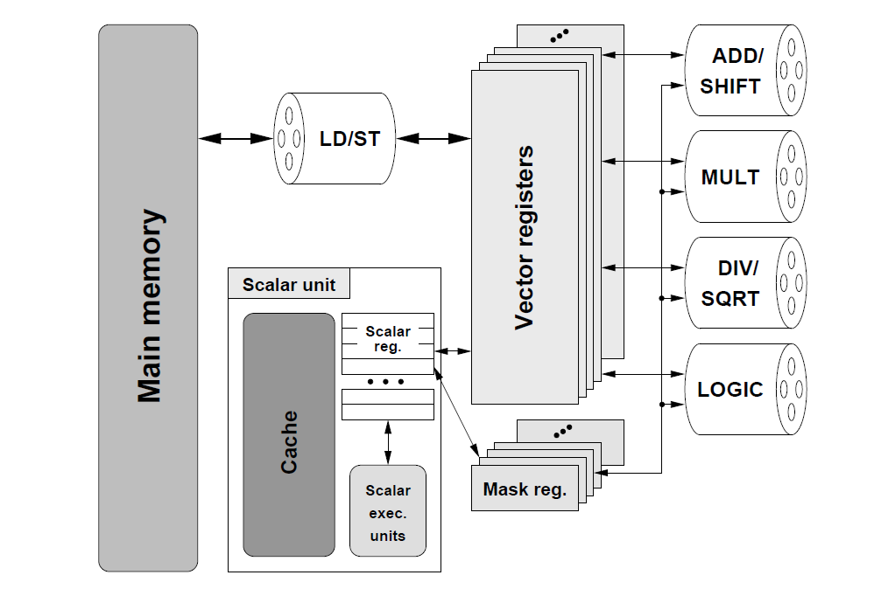
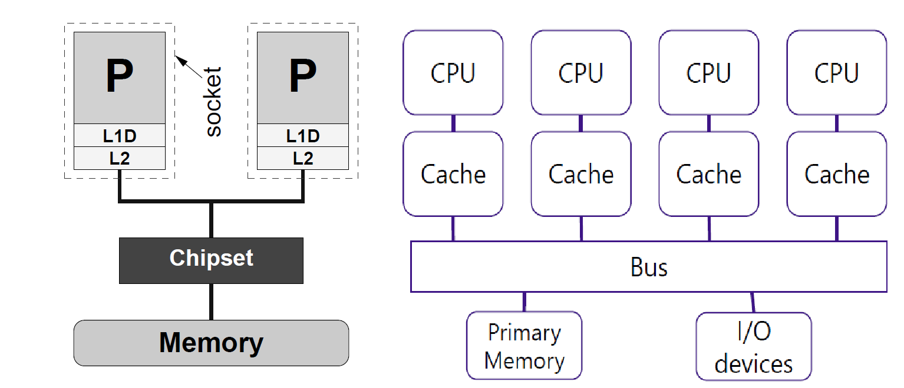
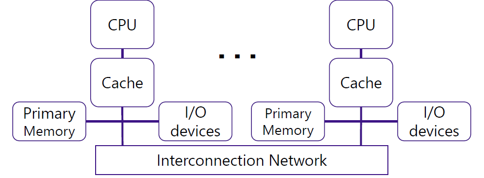
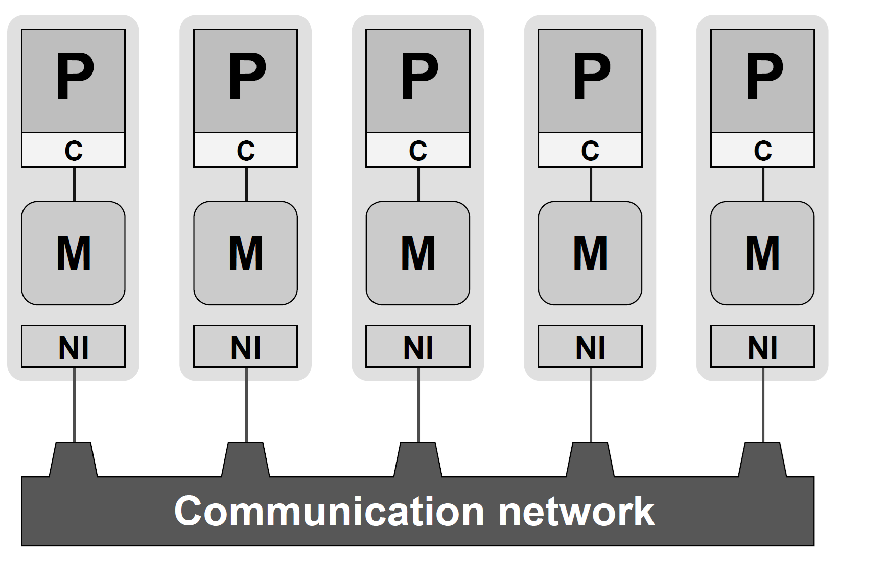
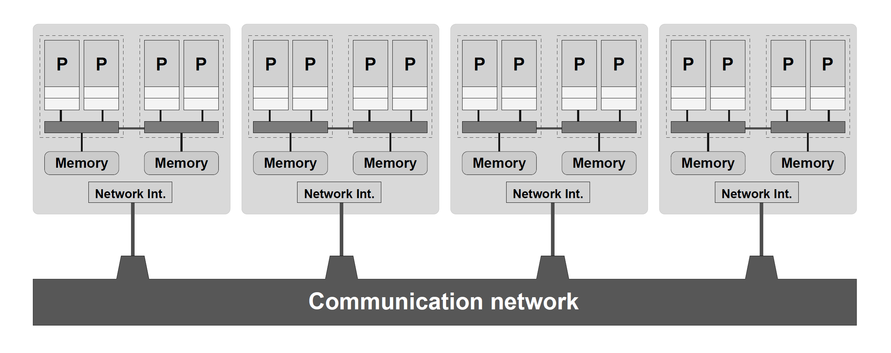
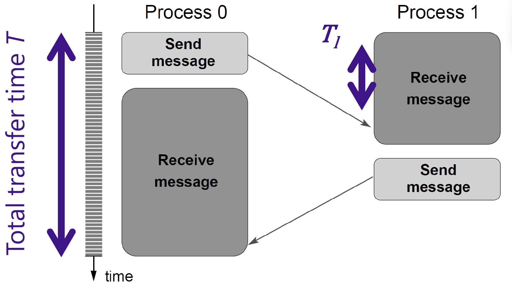
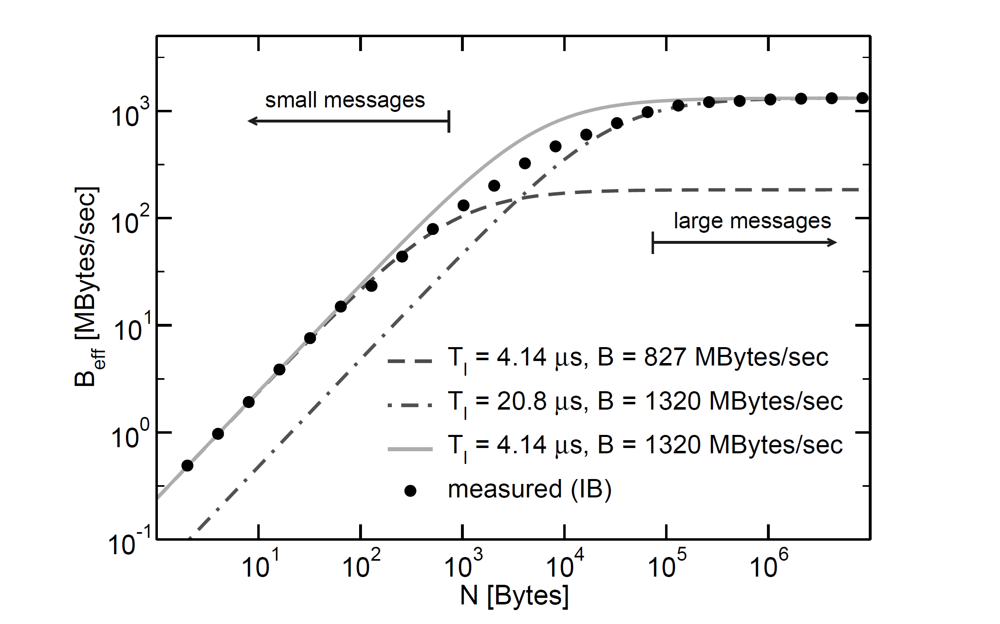
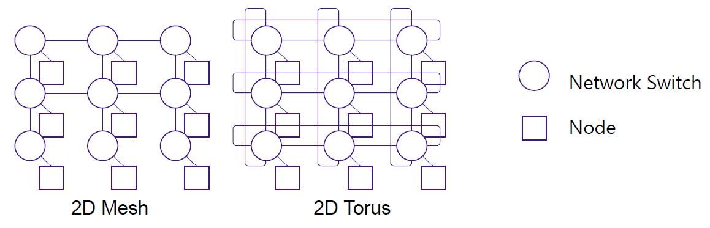
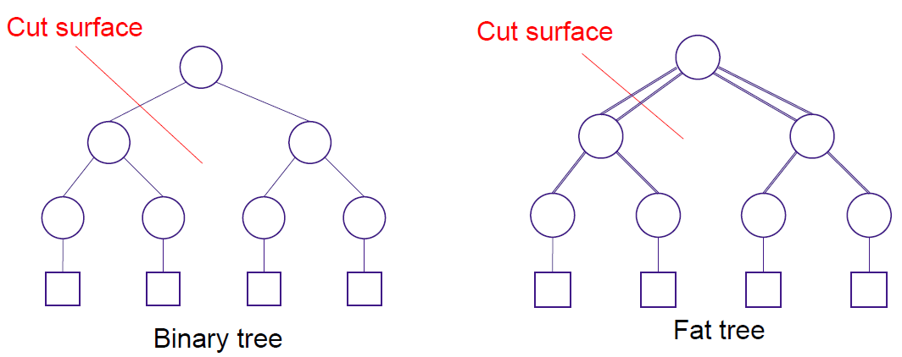

# High Performance Computing (HPC) - Volume 2

**Instructor:**  
Hiroyuki Takizawa, Cyberscience Center, Tohoku University  
Email: <takizawa@tohoku.ac.jp>

---

## Table of Contents
1. [Instructor](#instructor)
2. [Today's Topics: Parallel Computers](#todays-topics-parallel-computers)
3. [Dependencies in Parallel Computing](#dependencies-in-parallel-computing)
4. [Parallel Loops](#parallel-loops)
5. [Loop Dependence](#loop-dependence)
6. [Compiler Optimization](#compiler-optimization)
7. [SIMD Overview](#simd-overview)
8. [Vector Processors](#vector-processors)
9. [Hardware Trends for Vectorization](#hardware-trends-for-vectorization)
10. [Code optimization for NEC SX-AT](#code-optimization-for-nec-sx-at)
11. [Shared-memory Computer](#shared-memory-computer)
12. [UMA Architecture](#uma-architecture)
13. [Shared Data](#shared-data)
14. [What is a Cache Memory?](#what-is-a-cache-memory)
15. [The principle of locality](#the-principle-of-locality)
16. [Message Collision](#message-collision)
17. [NUMA Architecture](#numa-architecture)
18. [Switch Networks](#switch-networks)
19. [Cache coherence in NUMA](#cache-coherence-in-numa)
20. [Distributed-Memory Computers](#distributed-memory-computers)
21. [Hybrid Systems](#hybrid-systems)
22. [Performance Metrics](#performance-metrics)
23. [Network Topology](#network-topology)
24. [Summary](#summary)

---
## Today's Topics: Parallel Computers
- **Vectorization**
- **Shared-memory computers**
- **Distributed-memory computers**
- **Hierarchical (hybrid) systems**
- **Networks**

---

## Dependencies in Parallel Computing:
- **True dependence (RAW):** Data are written then read. \
$S1: A = 1;$ \
$S2: B = A;$ *Execute S1 and S2 otherwise the result changes*
- **Output dependence (WAW):** Data written sequentially.\
$S1: A = 1;$ \
$S2: A = 2;$ *Execute S1 and S2 otherwise the result changes*
- **Anti-dependence (WAR):** Data read then overwritten.\
$S1: A = 1;$ \
$S2: B = A;$ \
$S3: A = 2;$ *Execute S2 and S3 otherwise the result changes*

False dependencies (WAW & WAR) can be removed by variable renaming. \
**Output dependence**
|             |    |              |
|-------------|----|--------------|
| A = 1; //S1 |    | A1 = 1; //S1 |
| A = 2; //S2 | => | A2 = 2; //S2 |
| B = A;      |    | B = A2;      |

**Anti dependence** \
|             |    |              |
|-------------|----|--------------|
| A = 1;      |    | A1 = 1;      |
| B = A; //S1 | => | B = A1; //S1 |
| A = 2; //S2 |    | A2 = 2; //S2 |

---

## Parallel Loops:
Most scientific computing time is spent in loops. The execution time can be reduced by 
accelerating loop execution.
```c
for(i=1; i<4; i++) {
    b[i] += i; //S1
    a[i] = b[i]+1; //S2
}
```
Loops can be optimized for parallel execution (loop-level parallelism), especially in GPUs and vector processors. Loop iterations are parallelizable = **Loop-level parallelism**.
```c
i=1: b[1] += 1; a[1] = b[1]+1;
i=2: b[2] += 2; a[2] = b[2]+1;
i=3: b[3] += 3; a[3] = b[3]+1;
```
GPUs and vector processors exploit this parallelism
```c
A = (a[0],a[1],a[2])
B = (b[0],b[1],b[2])
B = B + (1,2,3) // vector op.
A = B + (1,1,1)  // vector op.
```

---

## Loop Dependence:
1. **Loop Carried Dependence:**  
   Iterations depend on previous results, making parallelization difficult.
```c
for(i=1; i<4; i++) {
  a[i] = a[i+1]+1;
}
// Doesn't work!
i=1: a[1] = a[2]+1;
i=2: a[2] = a[3]+1;
i=3: a[3] = a[4]+1;
 ```
2. **Removing Anti Dependence:**  
   Using data copies to eliminate anti-dependence allows parallel execution.
```c
for(i=1; i<4; i++) {
  a2[i] = a[i+1];
}
//
i=1: a2[1] = a[2];
i=2: a2[2] = a[3];
i=3: a2[3] = a[4];

//////////////////////////

for(i=1; i<4; i++) {
  a[i] = a2[i]+1;
}
//
i=1: a[1] = a2[1]+1;
i=2: a[2] = a2[2]+1;
i=3: a[3] = a2[3]+1;
```

---

## Compiler Optimization:
- Compilers analyze code to optimize loops and parallelize where possible.
- Programmer hints (e.g., `#pragma omp simd`) can guide compilers to apply vectorization and parallelism.

---

## SIMD Overview:
- **Vector Lane:** Path for each data item.
- **Vector Width:** The width of the vector unit in bits.
- **Vector Length:** The number of data items a vector instruction processes.
- **SIMD Instructions:** Used to exploit vector processing. \


---

## Vector Processors:
- Operate on vectors, not scalars.
- Enable parallelism with deep pipelines, reducing instruction fetch overhead.

### Advantages:
- No intra-vector dependencies.
- Each instruction generates a lot of work
- Highly regular memory access patterns.
- No need to explicitly code loops
  
### Disadvantages:
- Inefficient with irregular workloads.
    - Vector processing works well only if the program has regular memory access and operation patterns.
        - Updating all elements in a big data array as commonly shown in scientific computing.
    - Program behaviors could be very irregular.
        - There are many cases where key loops are essentially non-vectorizable especially in non-scientific computing.
- Primarily useful in scientific computing.
    - Scientific computing is important but a niche market in the entire computer industry.  
    - Vector computers need special hardware design and it’s often non-affordable in practice.

**GPUs are often used for loop-level parallelism because of their high vector processing capability and some big markets.**



Vector Load p21 \
Pipeline Utilization Timeline p22 \
Mask Register p23 \
Inefficiency for short vectors p24

---

## Hardware Trends for Vectorization
Vector functionality has been improved since 1997. In 1997 the vector size bits was 64 and now it's 512.
The **auto-vectorization** is use for the compiler vectorizable parts of a code but by default is disable, and need to add a specific flag to do that.

---

## Code optimization for NEC SX-AT
The tool *ftrace* can report some perfomance numbers:
- Vectorization ratio (higher is better): is use to approximated the execution time of vectorizable part over the total execution time.
- Average vector length(higher is better): is the number of instructions who can be process at the same time.

---

## Shared-memory Computer:
- A multiple-CPU/core computer with shared memory space. The same address on different cores refers to the same memory location.
- Two types of architecture:
  1. **UMA (Uniform Memory Access) / Symmetric Multiprocessors (SMP)**
  2. **NUMA (Non-Uniform Memory Access)**

---

## UMA Architecture
- All the primary memory is in one place.
- Additional CPUs are attached to a memory bus.


---

## Shared Data
- Private data: Data items used only by a single core.
- Shared data:
    - Data items shared by a multiple cores
    - Cores can communicate with each other through shared data values
    - Two problems associated with shared data:
        - **Cache Coherence:** Prevents different processors from storing different values for the same memory location.
        - **Snooping Protocol:** Maintains cache coherence by invalidating outdated cache entries when a value is updated.

---

## What is a Cache Memory?
- Memory is much slower than Processors.
    - Processors must wait for memory data arrival?
- **Cache memory** is small but fast memory.
    - Reduces the frequency of memory accesses.
    - Stores a copy of memory data.
    - Helps to keep processors busy.
- Other important terms
    - Locality of reference
    - Write back/ write through

---

## The principle of locality
- Program accesses a relatively small portion of the address space at any instant of time.
- Two Different Types of Locality:
    - **Temporal Locality** (Locality in Time): If an item is referenced, it will tend to be referenced again soon (e.g., loops, reuse)
    - **Spatial Locality** (Locality in Space): If an item is referenced, items whose addresses are close by tend to be referenced soon 

---

## Message Collision

### Bus = Shared Network
- In a shared network, **access arbitration** is decentralized, meaning there is no central control for sending messages.

### Access Arbitration Process:
1. **Core checks** if the network is unused.
2. **Core attempts** to send a message.
3. A **message collision** occurs if two or more cores attempt to send their messages at the same time.

### Message Collision Effects:
- When a collision happens:
  - Cores must **resend** their messages after waiting for a random amount of time.
  - This leads to **severe performance degradation** in large systems where many cores are trying to communicate simultaneously.

---

## NUMA Architecture:
- Memory and I/O **distributed** across multiple CPUs (or cores).
- Single memory address space is used with **higher scalability** and **aggregated bandwidth**.


---

## Switch Networks
- Each processor has its own path to a network switch.
- Two advantages over shared media.
    - Concurrent transmission among different pairs
    - Scalability to accommodate greater numbers of 

---

## Cache coherence in NUMA
- ccNuma
    - NUMA with cache coherence
- Directory-based protocol
    - **Snooping does not scale well as # cores grows**
    - Each directory entry holds sharing info about one **memory block**
    - For each **cache block** (a copy of memory block), the directory entry indicates whether it is:
        - uncached - not currently in any cache
        - shared - cached by one or more caches
        - exclusive - updated and cached exactly by one cache 

---

## Distributed-Memory Computers:
- Memory and I/O are distributed over multiple CPUs
- Each CPU has **its own memory space**, interacting via message passing.
- No cache coherence issues.

### Programming Model
- Each node runs a process with its own memory space. No process can access the data of another process directly. 
- Processes communicate via network interfaces over a network.
- Programmers need to explicitly express **message passing**, which is the communication among processes = **Message Passing Interface (MPI)**.


---

## Hybrid Systems:
- Mix of shared and distributed parallel systems.
- Common in large-scale parallel computing.


---

## Performance Metrics:
1. **Latency:** Time taken for data transfer.

2. **Bandwidth:** Maximum data transfer rate. \
The effectif bandwidth \
$B_{eff} = \frac{N}{T} = \frac{N}{T_l + \frac{N}{B}}$ \
- $T = T_l + \frac{N}{B}$: total transfer time (sec)
- $T_l$: latency (sec)
- $B$: maximum bandwidth
- $N$: transferred data size (bytes)

3. **Bisection Bandwidth:** Total bandwidth when a network is halved (bottleneck).
4. **Network Diameter:** Number of hops between nodes.

---

## Network Topology:
1. **2D Mesh & Torus:** 
    - Good point: bisection bandwidth and a shorter latency for communication with neighbors.
    - Bad point: the diameter is larger and grows at $O(\sqrt{n})$ for n switches.
    - A torus network has a wraparound connection to reduce the diameter by half.In higher-dimensional networks a node can have direct connections with more node

2. **Binary Tree & Fat Tree:** Low diameter but potentially low bandwidth.
    - Good point: the diameter is small and grows slowly at $O(\log{n})$.
    - Bad point: the bisection bandwidth could be small
    - A fat tree network increases the bandwidth of  upper-layer links to increase the bisection bandwidth -> more hardware cost and adaptive routing mechanisms.


---

## Summary:
- **SIMD:** Single instruction operates on multiple data.
- **Shared-Memory Computers:** Parallel computing with one memory space, communication via shared data.
- **Distributed-Memory Computers:** Parallel computing with separate memory spaces, communication via message passing.
- **Hybrid Systems:** Combination of shared and distributed memory.
- **Networks:** No single optimal topology for every scenario.
