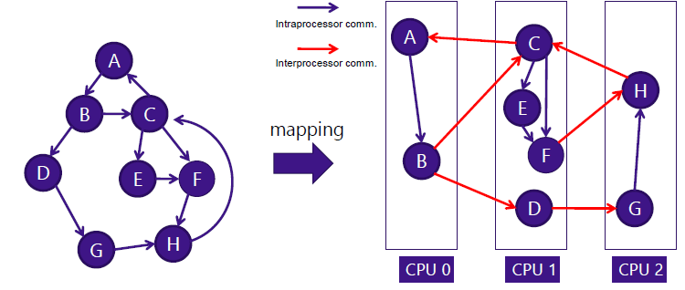

# High Performance Computing (HPC)
**Cyberscience Center, Tohoku University**  
Instructor: Hiroyuki Takizawa

---

## SIMD Overview
- **Vector Lane**: Pathway for each data item to be processed.
- **Vector Width**: Width of the vector unit, usually expressed in bits.
- **Vector Length**: Number of data items processed by a vector instruction.
- **Vector (SIMD) Instruction Set**: Set of instructions utilizing vector processing.


---

## Sharing a Memory Space
- **Shared-Memory Computers (left)**: Single memory space shared across CPUs.
- **Distributed-Memory Computers (right)**: Each CPU has its own memory space.
- **NUMA (Non-Uniform Memory Access)**: Type of shared memory architecture where memory access time depends on the memory location relative to the processor.


---

## Basic Network Topology
- **2D Mesh & 2D Torus**:
  - Good: Bisection bandwidth scales with network size; shorter latency for neighboring communication.
  - Bad: Large diameter that grows as O(√n) for n switches.
- **Torus Network**: Wraparound connection reduces diameter by half, common in higher-dimensional networks.

---

## Basic Network Topology (continued)
- **Binary Tree**:
  - Good: Small diameter grows slowly, O(log n).
  - Bad: Small bisection bandwidth.
- **Fat Tree Network**: Increases upper-layer bandwidth, improving bisection bandwidth at the cost of more hardware and adaptive routing mechanisms.

---

## Parallel Algorithm Design
- **Algorithm**: Procedure to solve a problem in a finite number of instructions.
- **Parallel Algorithm**: Designed to run on parallels computers.
- **Key Concept**: Parallelization is the process of designing algorithms to run concurrently across multiple processors.

---

## Today's Topics
1. **Job-Level Parallelism**
2. **Parallel Algorithm Design**
   - Model of Parallel Computation
   - Foster’s Design Methodology
   - Case Studies

---

## How to Run a Program on HPC?
- **Batch Job**: A unit of work submitted to the HPC system, typically a batch of tasks.
    - **Taks**: Unit of work for a computer.
    - **Job**: Unit of work for a human.
- **Front-end Server**: Users log into this server to submit jobs for execution on compute nodes.
    User -login-> server -submit job-> node

---

## Why Job Submission is Needed
- **Supercomputer AOBA**: A shared resource where job submission ensures fair scheduling of tasks.

---

## Job Script File
- **Script File**: Expresses how tasks should be executed. Consists of Linux commands and directives used by the job scheduler.
```sh
#!/bin/sh –                     #This is a bourne shell job script.
#PBS -q lx_edu                  #The job is submitted to a queue named lx_edu.
#PBS -l elapstim_req=0:05:00    #Requesting job execution of 5 minutes
cd $PBS_O_WORKDIR               #Job is executed at the directory it is submitted
# Linux commands                #
echo "hello world"              # The text following # is basically ignored at the execution. But some lines are used as hints for the job scheduler.
```

---

## Job Submission
1. Write a shell script (`run.sh`).
```sh
#!/bin/sh –
#PBS -q lx_edu
#PBS -l elapstim_req=0:05:00
cd $PBS_O_WORKDIR
mpirun –np 4 ./sum1
```
2. Submit to the job scheduler (`qsub run.sh`).
3. Monitor job status (`qstat`).
4. Get the result
```sh
run.sh.eXXXX    #stderr
run.sh.oXXXX    #stdout
```

---

## Job Scheduling
- Decide **where** and **when** a job is executed.
- Efficient use of a limited amount of resource.
- **First Come First Serve (FCFS)**: Basic policy used in job scheduling.
- **Backfilling**:
    - **Conservative Backfilling**: A job can overtake others if it doesn't delay any other jobs.
    
    - **EASY Backfilling**: A job can overtake others if it doesn't delay the first waiting job.
    

---

## Workflows
- **Dependency Between Jobs**: Temporal and spatial assignment of jobs must consider dependencies to achieve optimal execution.


---

## Technical Challenges
- **Throughput Challenge**: Handling large numbers of jobs.
- **Co-scheduling Challenge**: Complex coupling and sophisticated scheduling requirements.
- **Job coordination and communication challenge**: Intimate interactions with RJMS are equired to keep track of the overall progress of the ensemble execution, and existing approaches lack well-defined interfaces.
- **Portability Challenge**: User-level schedulers may be non-portable.

---

## Various Workloads
1. **Rigid Jobs**: Traditional numerical simulations.
2. **On-Demand Jobs**: Urgent tasks.
3. **Malleable Jobs**: Big data analysis, parameter surveys.
4. **Others**:
    - Containerization
    - Sensor data streaming

---

## Task/Channel Model (Ian Foster, 1995)

The **Task/Channel Model** defines parallel computation as a set of **tasks** that send messages through **channels**. This model is a fundamental approach for parallel computing, focusing on task interactions through data exchange.
### Task
- A **task** represents a unit of computation.
- Each task operates with its **private data** stored in **local memory**.
- A task performs two primary actions:
  - **Sends** local data values to other tasks via **output ports**.
  - **Receives** data values from other tasks through **input ports**.
### Channel
- A **channel** is a **message queue** that connects the output port of one task to the input port of another task.
- The message queue works on a **FIFO (First In First Out)** basis, ensuring that messages are processed in the order they are sent.
## Visual Representation
- The slide provides a visual example where multiple **tasks (T)** are connected through **channels** (lines with arrows).
- Each task is represented as a circle with the letter **T** inside, signifying a computational unit.
- Channels link tasks, and the flow of messages between tasks happens through these channels.
### Code Example
- A basic **C program** is shown, demonstrating a loop that prints "hello world" ten times. This indicates that tasks perform computations, which can involve simple or complex operations.
### Components of a Task
- **Memory**: Each task has its private data stored in local memory.
- **I/O**: Tasks interact with other tasks by sending and receiving data, represented as input/output operations.

---

## Synchronous vs Asynchronous Communication
- **Synchronous**: Task must wait until the required data arrives (**blocking**).
- **Asynchronous**: Task can send messages without waiting (**non-blocking**).

---

## Execution Time
- **Execution Time**: The period during which any task is active. Minimizing this time is crucial for efficiency. (Shorter is Better)

---

## Foster’s Design Methodology
- **Four Steps**:
  1. Partitioning
    - To discover as much parallelism as possible.
    - **Domain Decomposition**: Data-centric, dividing data first.
    
    - **Functional Decomposition**: Computation-centric, dividing computation first.
    
    - *Partitioning Checklist*:
        - There are much more primitive tasks than processors in the target system (at least an order of magnitude).
        - Redundant computation and redundant data structure storage are minimized.
        - Primitive tasks are roughly the same size.
        - The number of tasks is an increasing function of the problem size.
  2. Communication
    - **Local Communication**: Between a small number of tasks.
    - **Global Communication**: Involves many tasks.
    - *Communication Checklist*:
        - Communication = overhead of a parallel algorithm
        - Minimizing parallel overhead is an important goal of parallel algorithm design.
        - Communication Quality Checklist
            - The communication operations are balanced among the tasks.
            - Each task should communicate with only a small number of neighbors whenever possible.
            - Tasks can perform their communications concurrently.
            - Tasks can perform their computations concurrently.
  3. Agglomeration
    - **Agglomeration**: Grouping tasks to improve performance and simplify programming. It reduces communication overhead and increases locality.
    
    - Don’t combine too many tasks. A program should be portable to a system of more processors.
    - Reducing the software engineering cost
    - *Agglomeration Checklist*:
        - The agglomeration has increased the locality of the algorithm.
        - Replicated computations take less time than the communications they replace.
        - The amount of replicated data is small enough to allow the algorithm to scale.
        - Agglomerated tasks have similar computational and communication costs.
        - The number of tasks is an increasing function of the problem size.
        - The number of tasks is as small as possible, yet as great as the number of processors in the target computers.
        - The trade-off between the chosen agglomeration and the cost of modifications to existing sequential code is reasonable.
  4. Mapping
    - **Task Assignment**: Automatic mapping by MPI runtime or manual mapping for optimized performance.
        - Automatic
            - MPI runtime automatically assigns tasks to a distributed-memory parallel computer.
            - OS automatically assigns tasks to shared-memory systems.
        - Manual mapping sometimes improves performance
            - MPI rank layout/mapping on distributed-memory system
            - Thread affinity on shared-memory system
    - Maximizing processor utilization.
        - Average percentage of time executing tasks necessary for solution of the problem
            - Is maximized when the computation is balanced evenly, i.e. all processors begin and finish the execution at the same time.
            - Decreases if one or more processors are idle.
    - Minimizing interprocessor communication. → Those goals are often conflicting
        - Interprocessor Communication
            - Increases when two tasks connected by a channel are mapped to different processors.
            - Decreases when they are mapped to the same processor.
        
    - *Mapping Checklist*:
        - Two designs, one task per processor and multiple tasks per processor, have been considered.
        - Both static and dynamic allocations of tasks to processors have been evaluated.
        - If a dynamic allocation of tasks to processors has been chosen, the manager (task allocator) is not a bottleneck to performance.
        - If a static allocation of a tasks to processors has been chosen, the ratio of tasks to processors is at least 10:1.


---

## Case Study: Boundary Value Problem
- **Rod Insulation**: An example where heat conduction is computed over time using a difference method.

---

## Parallel Reduction Design
- **Reduction**: Summing values across tasks. Performed in `log n` communication steps using binomial trees.
- **Agglomeration**: Tasks are grouped to minimize communication, and the mapping assigns them to processors.

---

## n-Body Problem
- **Newtonian Simulation**: Parallel algorithm designed for simulating particle motion.
- **All-gather Communication**: Needed to update particle positions and velocities in `log p` communication steps.

---

## Other Communication Patterns
- **Scatter Operation**: Opposite of gather; involves distributing data across tasks.

---

## Summary
- **Job-Level Parallelism**: Essential for efficient resource management in HPC.
- **Foster's Methodology**: Key framework for designing parallel algorithms, including partitioning, communication, agglomeration, and mapping.

---

