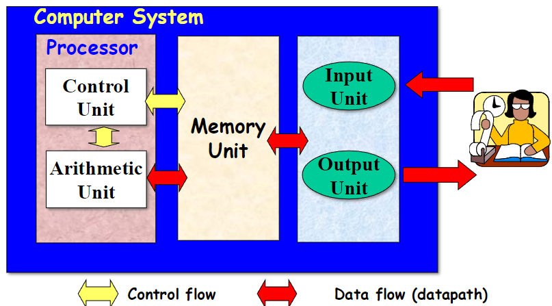
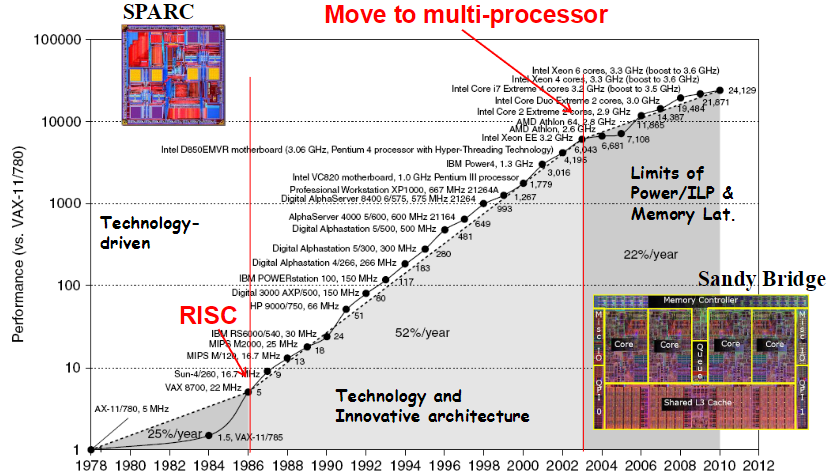
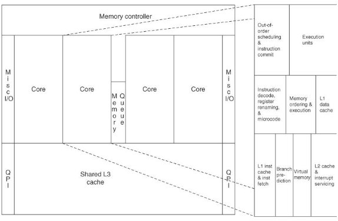
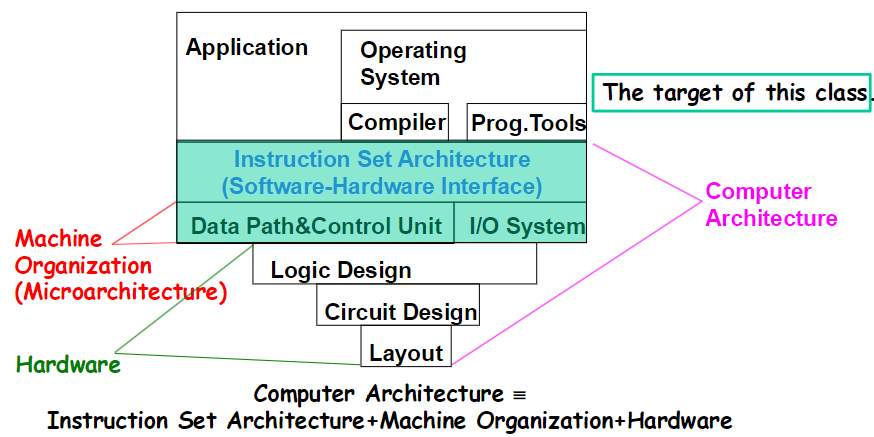
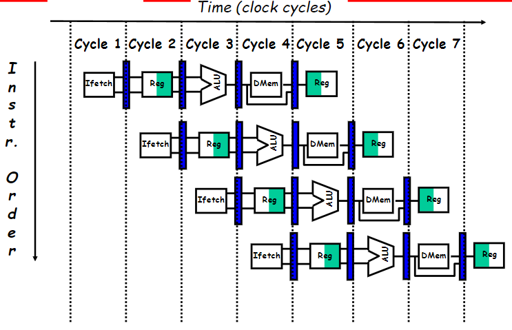
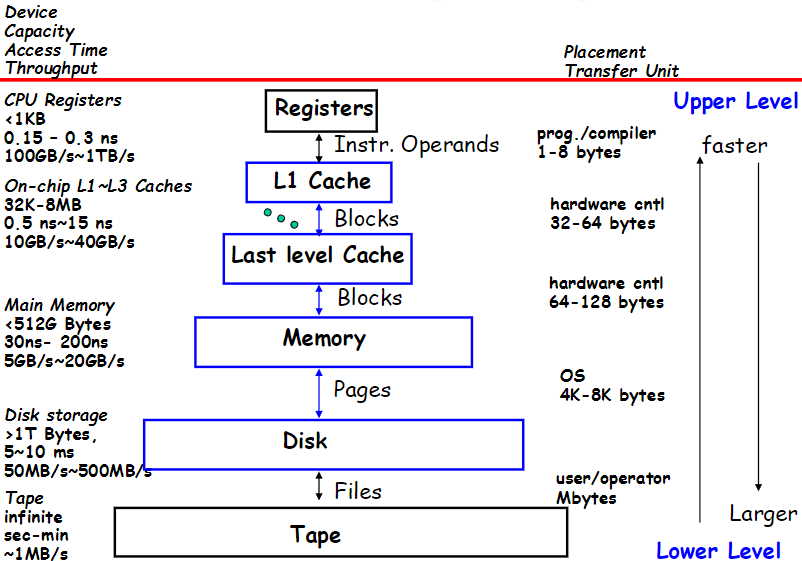
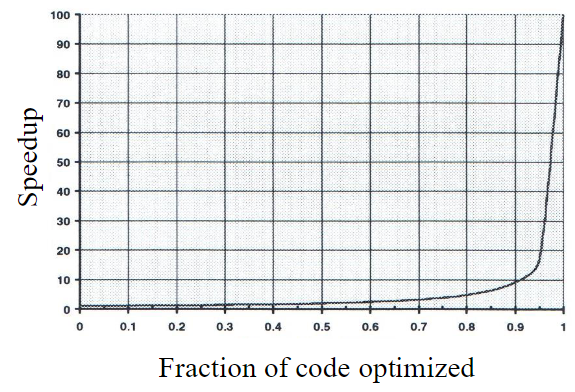

# Computer Architecture Design (CAD) - Course Summary #1 ([chapter1-6.pdf]-(chapter1-6.pdf))

---

## Instructor
- Hiroaki Kobayashi
    - Professor, Graduate School of Information Sciences 
    - Office:Room523, 5-th floor, Mechanical Engineering Building No.2
    - E-mail: koba@tohoku.ac.jp
- Masayuki Sato
    - Associate Professor, Graduate School of Information Sciences
    - Office: Room 525 in the same building
    - E-mail: masa@tohoku.ac.jp

---

## Table of Contents
- [Introduction](#introduction)
- [Classes of Computers](#class-of-computers)
- [Defining Computer Architecture](#defining-computer-architecture)
- [Trends in Technology](#trends-in-technology)
- [Measuring, Reporting, and Summarizing Performance](#definition-of-performance)
- [5 Quantitative Principles of Computer Design](#5-quantitative-principles-of-computer-design)

---

## Introduction
What is a computer?
- A programmable electronic device that can store, retrieve and process data.
- Basic functions:
    - Input
    - Output
    - Memory
    - Calculation
    - Control (programmable)
- Computer $\neq$ Calculator：does calculations, but is not programmable

(Yellow arrow) Control flow = is use for control the calculator flow \
(Red arrow) Data flow = is use to transfert the data to calculate

Moore's law = Calculations per second per constant dollar by year increase du to the number of transistor in a CPU increase due to the process of miniaturisation of them.

The Law of Accelerating Returns:

Different type of architecture of a CPU. x86 was invented by Intel and it's was amazing!

MIPS (Million Instruction Pers Seconds) = It's one way to calculate the performance of a computer

---

## Class of Computers
Changes in computer systems
- Large mainframes in 1960s
- Minicomputer and Supercomputers in 1970s
- Desktop computers in 1980
- Handheld computing devices (PDA, Video games) in 1990s
- Cell phones in 2000

Class of Parallelism and Parallel Architectures
- Two parallelism in applications
    - Data-Level Parallelism (DLP)
        - Parallelism exploited in many data items that can be operated on at the same time
    - Task-Level Parallelism (TLP)
        - Parallelism exploited in tasks of work that can operate independently and largely in parallel
- Computer hardware can use these two kinds of applications parallelism  in four major way.
    - Pipelining and Superscalar use Instruction-Level Parallelism
    - SIMD/Vector Processing/GPU use data level parallelism with a single instruction for a collection of data in parallel.
    - Multicore processors/ parallel processors use Thread-Level. Parallelism created by using data-level parallelism or task-level parallelism
    - Request-Level Parallelism exploits parallelism among largely decoupled tasks specified by the programmer or the operating system

Flynn’s Classification (1966): 
|                     | **Data Streams**           |                      |
|---------------------|----------------------------|----------------------|
| **Instruction Streams** | **Single**               | **Multiple**         |
| **Single**          | **SISD:** Intel Pentium 4  | **SIMD:** SSE/AVX of Core i7 |
| **Multiple**        | **MISD:** No examples today | **MIMD:** Multicore Core i7 |

**SPMD (Single Program Multiple Data)**:
- Parallel program on a MIMD computer
- Conditional code for different processors

.png)

---

## Defining Computer Architecture
ISA (Instruction Set Architecture) design:
- The actual programmer-visible instruction set
- The boundary between the software and hardware

The target of this lecture is **Computer Architecture** and **Machine Oraganization**.

### Seven dimension of an ISA:
1. **Class of ISA**
    - General-purpose register architectures
        - Register-memory ISAs of 80x86
        - Load-store ISAs of MIPS
2. **Memory addressing**
    - Byte-addressing
    - Aligned (MIPS)
    - Not aligned (80x86)
3. **Addressing modes**
    - register, immediate, displacement, register indirect, based with scaled index
4. **Types and sizes of operands**
    - 8-bit (char), 16-bit (unicode char, half-word), 32-bit (integer or word), 64-bit (double word or long int), and IEEE 745 fp in 32-bit(single)&64-bit(dobule), 80-bit fp in 80x86)
5. **Operations**
    - Data transfer, arithmetic logical, control, and floating point
    - MIPS is simple but 80x86 has a much richer and larger set
6. **Control flow instructions**
    - Cond branch, uncond jump, procedure call and return
    - PC-relative addressing
    - MIPS cond branches test the contents of registers
    - 80x86 branches test condition code bits set as side effects of operations
7. **Encoding an ISA (bits sequences)**
    - Fixed length (**32-bit fix in MIPS**) and variable length (1 to 18 bytes in 80x86)
    - Variable length inst. can take less space, but needs complicated decoding
    - Number of registers and number of addressing modes have a significant impact on size of instructions

MPIS ISA instructions:
- 3 Basics intrusction formats
    - **R** : 
        | 31-26 | 25-21 | 20-16 | 15-11 | 10-6  | 5-0   |
        |-------|-------|-------|-------|-------|-------|
        | opcode|   rs  |   rt  |   rd  | shamt | funct |
    - **I** : 
        | 31-26 | 25-21 | 20-16 | 15-0        |
        |-------|-------|-------|-------------|
        | opcode|   rs  |   rt  | immediate   |
    - **J** : 
        | 31-26 | 25-0                |
        |-------|---------------------|
        | opcode| address             |
- Floating-point instruction formats:
    - **FR** :
        | 31-26 | 25-21 | 20-16 | 15-11 | 10-6  | 5-0   |
        |-------|-------|-------|-------|-------|-------|
        | opcode|  fmt  |   ft  |   fs  |   fd  | funct |
    - **FI** :
        | 31-26 | 25-21 | 20-16 | 15-0        |
        |-------|-------|-------|-------------|
        | opcode|  fmt  |   ft  | immediate   |

**Organization**: the high-level aspects of a computer’s design \
**Hardware**: the specifics of a computer, including the detailed logic design and the packaging technology

### ***Computer architecture = ISA, Organization, and Hardware***

Microarchitecture Design= Data Path & Control Units Design
- Pipelining
- Instruction Level / Parallel Processing
- On-chip cache and TLB
- Speculation and Branch Prediction

Intel’s TICK-TOCK Strategy, and Then Process-Architecture-Optimization Strategy

Requirements in Designing a New Computer
- Design a computer to meet functional requirements as well as price, power, performance, and availability goals.
- Market (applications), and technology decide the requirements.
- Although technology improves continuously, the impact of these improvements can be in discrete leaps.

---

## Trends in Technology
Tracking Technology Performance Trends
- Drill down into 4 technologies:
    - Disks, 
    - Memory, 
    - Network, 
    - Processors
- Compare ~1980 Archaic (Nostalgic) vs. ~2010 Modern (Newfangled)
    - Performance Milestones in each technology
- Compare for Bandwidth vs. Latency improvements in performance over time
- **Bandwidth**,**Throughput**: number of events per unit time
    - E.g., MIPS (million instructions/second), M bits / second over network, M bytes / second from disk
- **Latency**: elapsed time for a single event
    - E.g., one-way network delay in microseconds, average disk access time in milliseconds
- **Disk** evolution increase speed W/R, increase cache memory.
- **LAN** evolution increase speed, decrease gigue.
- **CPU** evolution increase GHz/s, increase cache memory.
- Increase of **bandwidth** and decrease **latency**.
- Scaling of Transistor Performance and Wires.
- Trends in Power and Energy in Integrated Circuits
    - For CMOS chips, traditional dominant energy consumption has been in switching transistors, called **dynamic power**: $Power_{dynamic} = \frac{1}{2} \times CapacitiveLoad \times Volateg^{2} \times FrequencySwitched$
    - And energy is given by : $Energy_{dynamic} = CapacitiveLoad \times Volateg^{2}$
- Power Estimation vs Energy Estimation
    - 1 watt = 1 joule per second
    - $Energy = AveragePower \times ExecutionTime$
    - Exemple on slide 49 & 52
- Techniques for Reducing Power
    - Do nothing
    - Dynamic Voltage-Frequency Scaling (DVFS)
    - Design for typical case
    - Overclocking and turning off cores
- Static Power Consumption
    - $Power_{static} = Current_{static} \times Voltage$
- Trends in Cost
    - Cost driven down by learning curve
    - DRAM:  price closely tracks cost
    - Microprocessors:  price depends on volume
- Cost of an Integrated Circuit
    - $Cost of integrated circuit = \frac{Cost of die + Cost of testing die + Cost of packaging and final test}{Final test yield}$
    - $Cost of die = \frac{Cost of water}{Dies per wafer \times Die yield}$
    - $Dies per wafer = \frac{\pi \times (\frac{Wafer diameter}{2})^{2}}{Die area} - \frac{\pi \times Wafer diameter}{\sqrt{2 \times Die area}}$
    - $Die yield = Wafer yied \times \frac{1}{(1 + Defects per unit area \times Die area)^{N}}$
        - **Die yield**: the fraction of good dies on a wafer number
            - Inversely proportional to the complexity of the fabrication process
        - **Wafer yield** accounts for wafers that are completely bad and so need not to be tested (100% wafer yield assumed here)
        - **Defects per unit area** is a measure of the random manufacturing defects that occur.
            - 0.1〜0.3 defects per cm2 for 40nm in 2011
        - N is a parameter called the process-complexity factor, a measure of manufacturing difficulty.  N ranged from 11.5 to 15.5 for 40nm processes in 2010.
    - Exemple on slide 60

---

### Define and Quantity Dependability
- How decide when a system is operating properly?
- Infrastructure providers now offer Service Level Agreements (SLA) to guarantee that their networking or power service would be dependable.
- Systems alternate between 2 states of service with respect to an SLA:
    1. **Service accomplishment**, when the service is delivered as specified in SLA.
    2. **Service interruption**, where the delivered service is different from the SLA.
- **Failure** = transition from state 1 to state 2
- **Restoration** = transition from state 2 to state 1
- Module reliability = measure of continuous service accomplishment (or time to failure).
    1. **Mean Time To Failure** (MTTF) measures reliability
    2. **Failures In Time** (FIT) = 1/MTTF, the rate of failures
        - Traditionally reported as failures per billion hours of operation
- **Mean Time To Repair** (MTTR) measures Service Interruption
- **Mean Time Between Failures** $(MTBF) = MTTF+MTTR$
- **Module availability** measures service as alternation between the 2 states of accomplishment and interruption (number between 0 and 1, e.g. 0.9)
- **Module availability**: $\frac{MTTF}{MTTF+MTTR}$ $MTBF=MTTR+MTTF$ (exemple slides 64)

### Definition of Performance
- Performance is in units of things per sec (bigger is better)
$performance(x) = \frac{1}{execution_times(x)}$
"X is n times fatser than Y" means : $n = \frac{Performance(X)}{Performance(Y)} = \frac{Execution_time(Y)}{Execution_time(X)}$

- Usually rely on benchmarks vs. real workloads
- To increase predictability, collections of benchmark applications, called  benchmark suites, are popular
- **SPECCPU**: popular desktop benchmark suite
    - CPU only, split between integer and floating point programs
    - SPECint2000 has 12 integer prgms, SPECfp2000 has 14 floating point pgms
    - SPECCPU2006 12 integer prgs (CINT2006) & 17 floating point prgs (CFP2006)
        - http://www.spec.org/cpu2006/
    - **SPECSFS** (NFS file server) and SPECWeb (WebServer) added as server benchmarks
- Transaction Processing Council measures server performance and cost-performance for databases
    - TPC-C Complex query for Online Transaction Processing
    - TPC-H models ad hoc decision support
    - TPC-W  a transactional web benchmark
    - TPC-App application server and web services benchmark
- SPECRatio : Normalize execution times to reference computer, yielding a ratio proportional to performance $= \frac{time on reference computer}{time on computer being rated}$
- $GeometricMean = \sqrt[n]{\prod_{i=1}^n \text{SPECRatio}_i}$

---

## 5 Quantitative Principles of Computer Design
1. **Take Advantage of Parallelism**
    - Increasing throughput of server computer via multiple processors or multiple disks (at the system level)
    - At the processor level, **Pipelining**: overlap instruction execution to reduce the total time to complete an instruction sequence. 
        - Not every instruction depends on immediate predecessor  executing instructions completely/partially in parallel possible
        - Classic 5-stage pipeline: 
            1) Instruction Fetch (Ifetch), 
            2) Register Read (Reg), 
            3) Execute (ALU), 
            4) Data Memory Access (Dmem), 
            5) Register Write (Reg) 
    - Detailed HW design level
        - **Carry lookahead adders** uses parallelism to speed up computing sums from linear to logarithmic in number of bits per operand
        - **Multiple memory banks** searched in parallel in set-associative caches
    - Pipelined Instruction Execution 
        - Limits to pipelining
            - **Hazards** prevent next instruction from executing during its designated clock cycle
                - **Structural hazards**: attempt to use the same hardware to do two different things at once
                - **Data hazards**: Instruction depends on result of prior instruction still in the pipeline
                - **Control hazards**: Caused by delay between the fetching of instructions and decisions about changes in control flow (branches and jumps).
2. **Principle of Locality**
    - The Principle of Locality:
        - Program access a relatively small portion of the address space at any instant of time.
    - Two Different Types of Locality:
        - Temporal Locality (Locality in Time): If an item is referenced, it will tend to be referenced again soon (e.g., loops, reuse)
        - Spatial Locality (Locality in Space): If an item is referenced, items whose addresses are close by tend to be referenced soon (e.g., straight-line code, array access)
    - Data acces is more slower when we want to stock a lot of data.
    
3. **Focus on the Common Case**
    - Common sense guides computer design
        - Since its engineering, common sense is valuable
    - In making a design trade-off, favor the frequent case over the infrequent case
        - E.g., Instruction fetch and decode unit used more frequently than multiplier, so optimize it 1st
        - E.g., If database server has 50 disks / processor, storage dependability dominates system dependability, so optimize it 1st
    - Frequent case is often simpler and can be done faster than the infrequent case
        - E.g., overflow is rare when adding 2 numbers, so improve performance by optimizing more common case of no overflow 
        - May slow down overflow, but overall performance improved by optimizing for the normal case
    - What is frequent case and how much performance improved by making case faster => **Amdahl’s Law**
4. **Amdhal's Law**
- $ExTime_{new} = ExTime_{old} \times [(1 - Fraction_{enhanced}) + \frac{Fraction_{enhanced}}{Seepdup_{enhanced}}]$
- $Speedup_{overall} = \frac{ExTime_{old}}{ExTime{new}} = \frac{1}{(1 - Fraction_{enhanced}) + \frac{Fraction_{enhanced}}{Speedup_{enhanced}}}$
- Best you could ever hope to do is: $Speedup_{maximum} = \frac{1}{1 - Fraction_{enhanced}}$
- Non-Optimized Portion Slows the Speedups: 
- Amdahl’s Law example on slide 79
5. **The Processor Performance Equation**
- $CPU time = \frac{Seconds}{Program} = \frac{Instructions}{Program} \times \frac{Cycles}{Instruction} \times \frac{Seconds}{Cycle}$
- $CPU time = (CPU clock cycles for a program) \times Clock cycle time$
    - $CPU Clock cycles = \sum{IC_{i}} \times CP_{i}$ $IC_{i}$: instruction count for instruction $i$, $CPI_{i}$: Clocks per instruction $i = \sum{IC_{i}} \times CP_{i} \times Clock cycle time$
    - Overall $CPI = \sum{IC_{i}} \times \frac{CPI_{i}}{Instruction count} = \sum{ \frac{IC_{i}}{Instruction Count}} \times CPI_{i} = Instruction Count \times Overall CPI \times Clock cycle time$
- Example of Evaluating Design Altarnatives on slide 82

### Fallacies and Pitfalls
- Fallacy: Multiprocessors are a silver bullet
- Pitfall: Falling prey to Amdahl’s heartbreaking Law
- Pitfall: A single point of failure
- Fallacy: Hardware enhancements that increase performance improve energy efficiency or are at worst energy neutral.
- Fallacy: Benchmarks remain valid indefinitely.
- Fallacy: The rated mean time to failure of disks is 1,200,000 hours or almost 140 years, so disks practically never fail.
- Fallacy: Peak performance tracks observed performance.
- Pitfall: Fault detection can lower availability.