# Computer Architecture Design (CAD) - Course Summary #2 ([chapter2.pdf](chapter2.pdf))

---

## Table of Contents
- [Von Neumann Model: An Execution Model of Computers](#von-neumann-model-an-execution-model-of-computers)
- [Classifying Instruction Set Architectures](#classifying-instruction-set-architectures)
- [Classification of Instructions based on Number of Operands](#classification-of-instructions-based-on-number-of-operands)
- [Memory Addressing](#memory-addressing)
- [Addressing Mode](#addressing-mode)
- [Type and Size of Operands](#type-and-size-of-operands)
- [Operations in the Instruction Set](#operations-in-the-instruction-set)
- [Instructions for Control Flow](#instructions-for-control-flow)
- [Encoding an Instruction Set](#encoding-an-instruction-set)
- [Example: MIPS Architecture](#example-mips-architecture)
- [Fallacies and Pitfalls](#fallacies-and-pitfalls)
- [Conclusion](#conclusion)

---

## Von Neumann Model: An Execution Model of Computers
- Von Neumann Computer Model

    - Basic model of modern computers, designed and proposed by John von Neumann in 1945
        - First implementation in 1949; EDVAC (Electronic Discrete Variable Automatic Computer)
- Characteristics of Von-Neumann-type Computers
    - Stored program
        - Program and data are stored in memory
        - Instruction read from memory, decode, data read from memory, processing (calculation), and result store to memory
    - Linear memory space
        - Memory cells (unit for data storage) are placed as an 1D array
        - Each cell has its own address to specify a cell for data read and write
    - Simple instructions to control a computer are provided such as
        - Addition, subtraction, shift, logical AND/OR,  Data move for read/write to/from memory
        - Execution sequence control
    - Sequentially-controlled computer that processes an instruction one by one
        - Program (machine instructions) is processed sequentially stored on memory
        - Special counter named program counter specifies the address of the  current executing  instruction.
            - Change value of program counter if you want to change the sequence of execution.
- Structure of Memory
    - Logical Structure (visible from programmers)
        - 1 dimensional array of memory cells
        - Each cell stores a unit of data and has its own address to specify for data read/write in memory
    - Physical Structure (actual implementation)
        - Memory devices are placed in a 2-dimensional and accessed through a combination of row and column address
- Physical Memory Structure
    - SRAM:Static Random Access Memory
    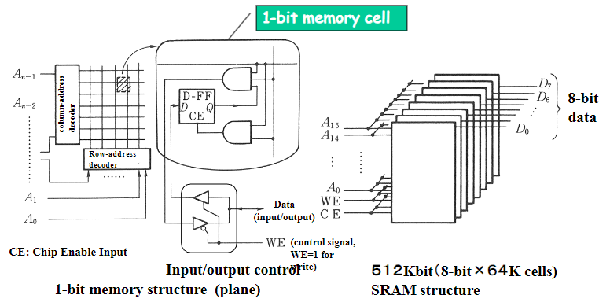
    - DRAM:Dynamic Random Access Memory
    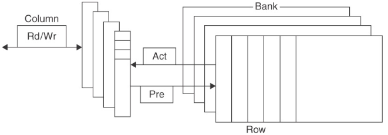
        - Represent 1-bit data whether a capacitor is charged or not.
            - Need only one transistor and one capacitor for 1-bit memory
            - Less hardware compared with SRAM (1/4)
                - More memory capacity on the same area
            - Since real capacitors leak charge, the information eventually fades unless the capacitor charge is refreshed periodically.
            - Need periodical refreshment of the memory content
                - So named dynamic memory
                - Longer access time for read/write of DRAM
- **SRAM vs. DRAM**
    - SRAM:Static Random Access Memory
        - Use D-FF(equivalent to 4 Transistors) for 1-bit storage
            - Stable(static) memory
            - Fast memory access
                - Access time: 0.5ns-5ns
            - High (hardware) cost/1bit
    - DRAM:Dynamic Random Access Memory
        - Use one transistor and one capacitor for 1 bit storage
            - More memory capacity at lower cost
            - Unstable and need refreshment of contents
                - Dynamic operation
            - Refresh mechanism enlarges memory access time
                - Access time: 50～70ns
- Memory Operations \
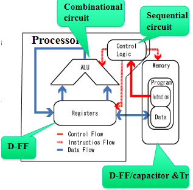
    - Data read from memory
        - Specify an address to read data and a register to have data in processor
            - A register is an internal memory in processor
        - Move data from memory specified to the register
    - Data write to memory
        - Prepare data (calculation result) in a register
        - Specify an address to write data
        - Move data from the register to memory specified.
- Basic Operation of Computer：Data Processing
    - Basic behavior for data processing
        - Move data from memory to processor,
        - Perform an operation on data
        - Store the operation result to memory
    - Example: perform an addition of two values
        - y = a + b
        - Data y,a,b are placed in memory
        - Addition is performed in a processor by using an adder (combinational circuit) 
    - Processing of y=a+b is realized as a sequence of basic instructions
        - Execute the following four instructions sequentially
            - **Instructions 1 and 2** for data movement from memory locations a and b to internal registers
            - **Instruction 3** to perform addition of data stored in the registers, and store the result in (another) register
            - **Instruction 4** for data movement from register to memory location for y
- Sequential Processing: Basic Execution Control for Computer
    - Computer sequentially processes instructions in order of memory locations
        - Sequential processing
        - Current memory location of an instruction processed by computer is held by a program counter (PC)
        - Sequential processing is carried out by incrementing the content of PC
            - Basic operations specified by instructions are: data movement to/from memory, arithmetic operations
    - In addition, special instructions (named JUMP and BRANCH) for execution control are prepared to change the order of instruction execution for handling
        - if...then...else,  and
        - loop (iteration)
        - Action: change the content of PC to the destination address specified by JUMP or BRANCH instruction
- Execution control of a computer
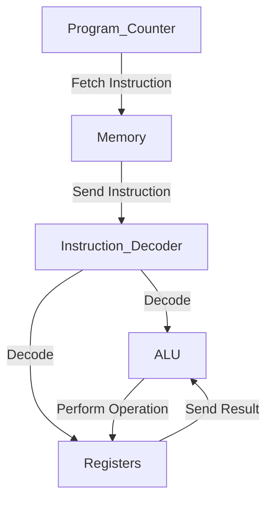
- Control and data path of a computer
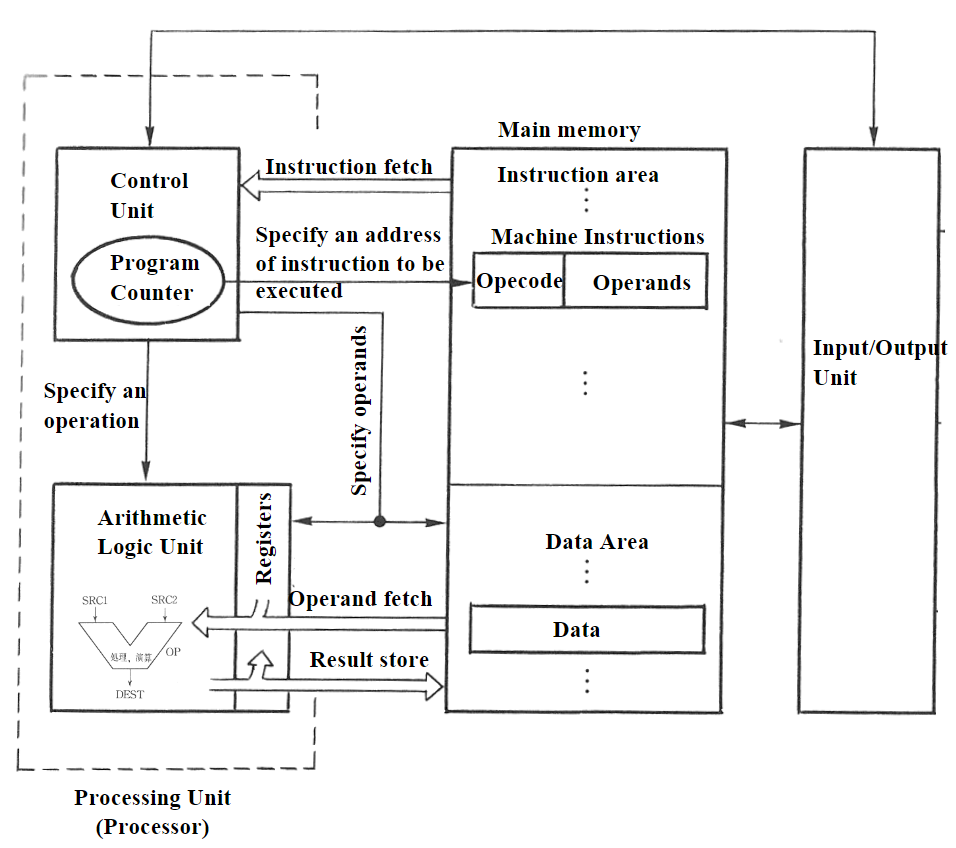
- Three Basic Execution Flow Available on Computers
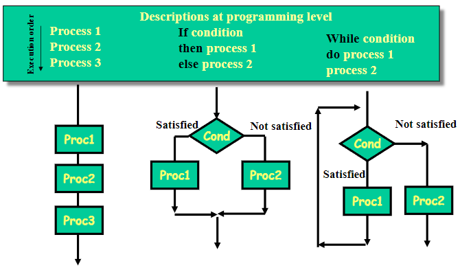
    - Sequential Execution of Instructions 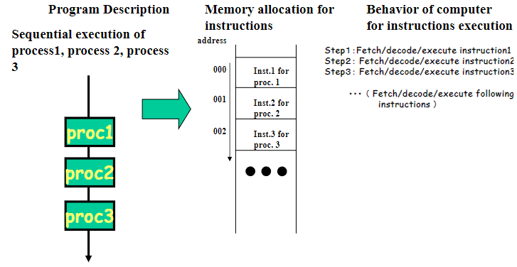
    - Execution of Conditional Branches 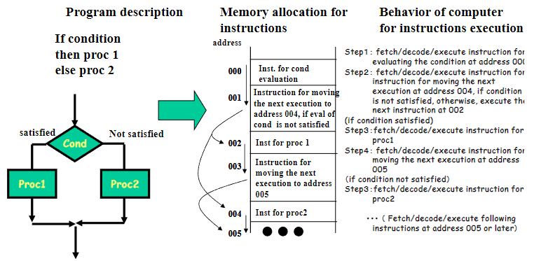
    - Execution of Loop (Iterations) 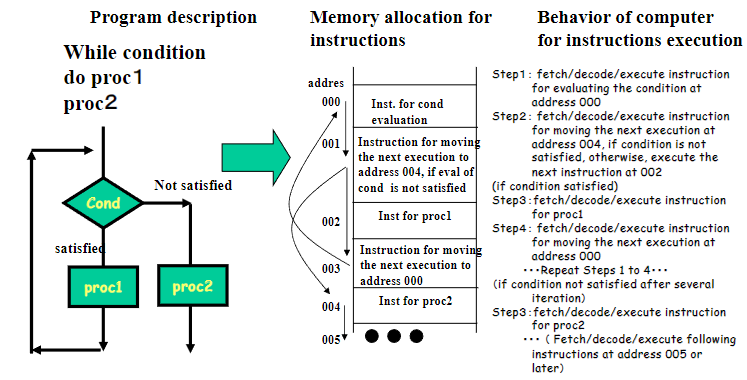
- How Machine Instructions is Organized
    - An instruction has a fixed bit width (for example, 32-bit) and consists of an operation code and its operands 
        - Opecode (OPEration CODE) specifies an operation to be performed
            - Arithmetic operations
                - AND，OR，＋，－，×，...
            - Data movement
                - load/store instructions
            - Execution Control
                - Unconditional Jump
                - Conditional Branch
        - Operands is a one of inputs/output (arguments) of an opcode
            - 0 ~ 3 operands are specified depending on the type of architectures
        - Bits of an instruction are divided into the opcode field and operand fields
- [Seven dimesion of an ISA](../chapter-1/README.md/#seven-dimension-of-an-isa)

---

### Classifying Instruction Set Architectures
- Four Instruction Set Architecture Classes
    - The difference in the classes is operand locations!
        - (Operands may be named explicitly or implicitly)
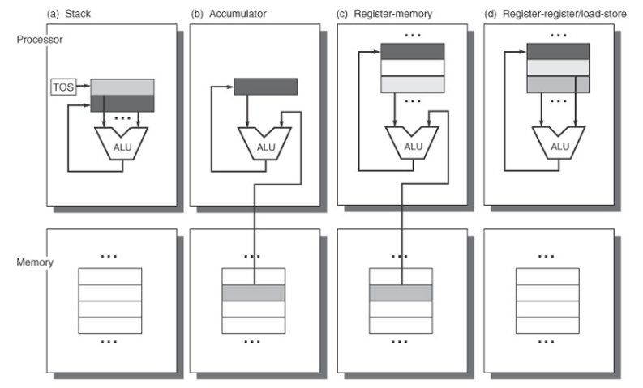

1. **Stack Architecture**
- The operands are implicitly on the top of stack
    - A Top of Stack register (TOS) points to the top input operand and the second input operand below.  
    - The first operand is removed from the stack
    - The result is written back to the place of the second operand, and 
    - TOS is updated to point to the result
    - Push/Pop are separate instructions for data transfer between the stack and memory
    - 0-operand instructions for operations and 1-operand instructions for push/pop operations are used.

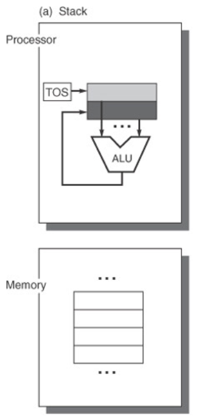

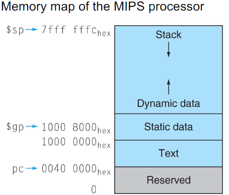

.png)

2. **Accumulator Architecture**
- One operand is implicitly coming from the accumulator, and the other operand is explicitly from the memory location.
    - The accumulator is a special register used for both an implicit operand and a result.
    - Data should be loaded/stored into/from the accumulator from/to memory before/after an ALU operation via a separate instruction (load/store)
    - 1-operand instruction format used

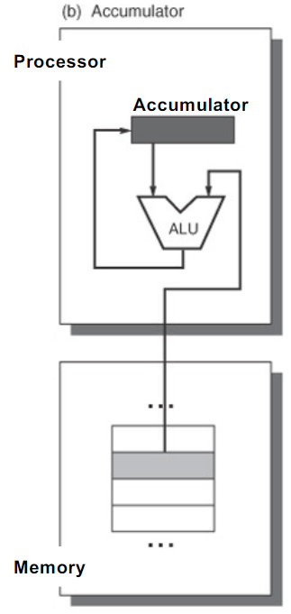

3. **Register-Memory Architecture**
- Operands are explicitly specified; ether register or memory location
    - More transistors used for internal storage: general purpose registers (GPRs)
    - One input operand is a register, one is in memory, and the result goes to a register
        - Increase the flexibility in register allocation by compiler
        - Provide sophisticated addressing modes for efficient data handling 
    - 2- or 3-operand instruction format used

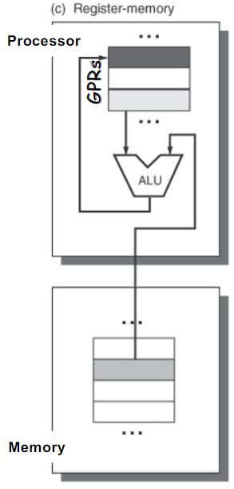

4. **Register-Register Architecture**
- Operands are explicitly specified only on GPRs 
    - Memory can be accessed only with load/store instructions
    - Virtually every new architecture designed after 1980 uses a load-store register architecture
        - Registers are faster than memory
        - Registers are more efficient for a compiler to use
        - Registers can be used to hold variables
            - Memory traffic reduces
            - Program speeds up
            - Code density improves
    - 2- or 3-operand instruction format
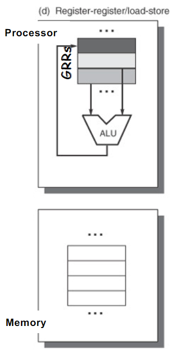

### Classification of Instructions based on Number of Operands:
- Arithmetic Operations
    - Zero-operand instruction
        - Operands are implicitly defined by the stack pointer
        - The result also goes to the memory location specified by the stack pointer
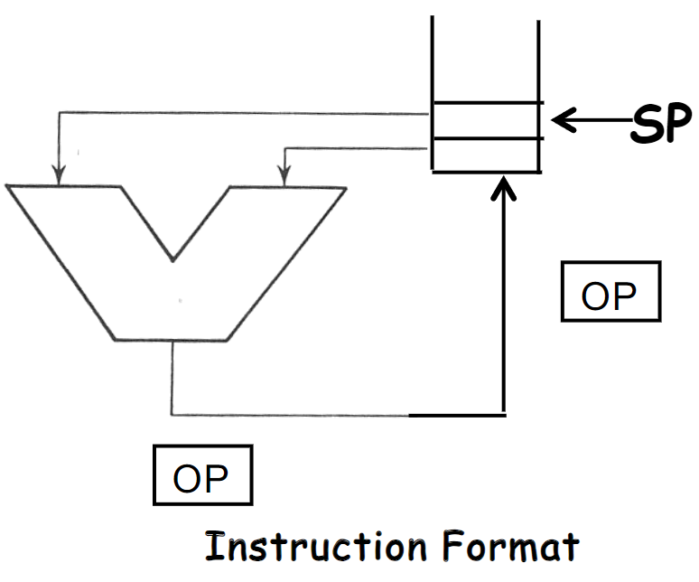

    - One-operand instruction
        - Specify one operand and the others are defined implicitly
        - Implicitly defined internal register is called Accumulator
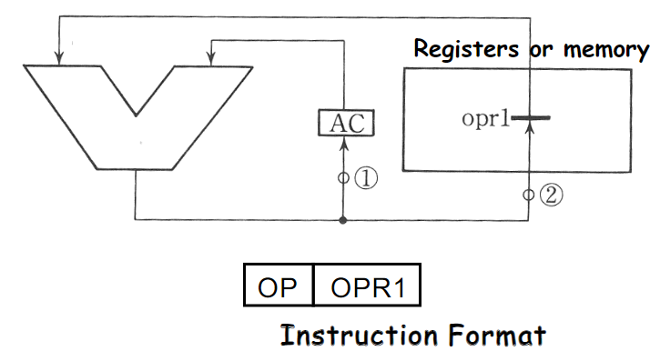

- Arithmetic Operations **(Contʼd)**
    - Two-operand instruction
        - Two operands specified, and one of them is also used as a destination (output)
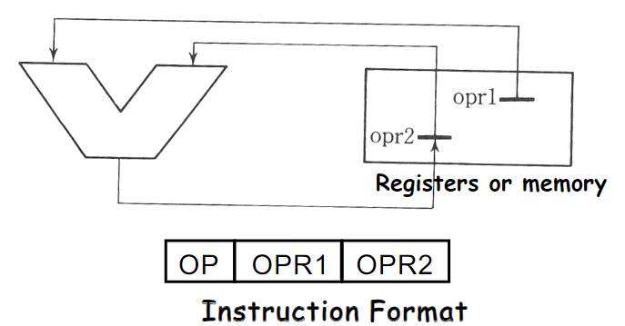
    - Three-operand instruction
        - Three operands, two for inputs and one for output, are specified
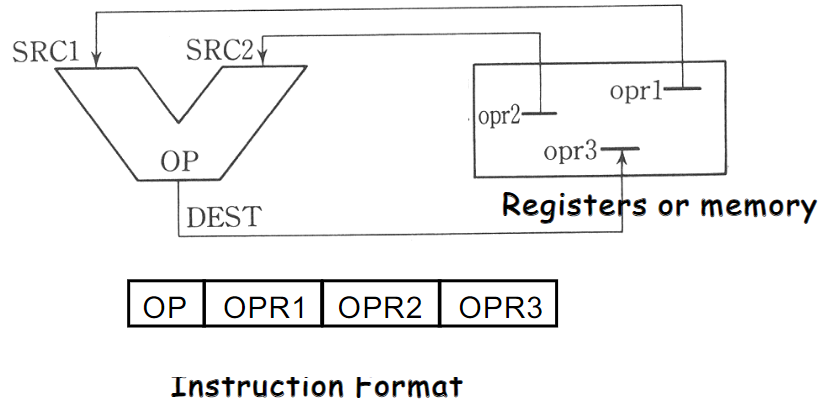

### How many Operations Should be Coded in a Single Opcode?
- **CISC: Complex Instruction Set Computer** 
    - Has rich instruction sets and is designed to simplify compilation of high-level languages
        - Narrowing the gap between high-level languages and machine instruction
        - Optimizing code size because compiled programs were often too large for available memories in 1970s ~ 1980s
        - IBM 360/370, VAX-11/780, Intel X86 ISA
- **RISC: Reduced Instruction Set Computer (1980~)**
    - Has commonly used instructions only and make them fast in execution.
        - Make common case fast and keep the system simple
            - Rarely executed instructions slow the entire control of the system
            - The increase in memory size on computers eliminated the code size problems arising from high-level languages and enabled operating systems to be written in high-level languages
        - Simple instructions and their fixed size and format make pipelining much more efficient, running at higher frequency.
        - Intel Xeon (Internal translation from X86 inst. to risc-ops), MIPS, SPARC, PowerPC, PA-RISC, DEC Alpha, ARM, SuperH...

---

## Memory Addressing
- MIPS uses fixed size instructions (4-byte width), its memory addressing is Byte-addressed and Aligned.
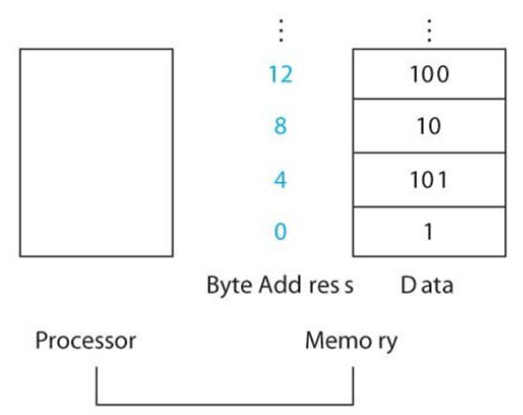
- X86 uses variable size instructions (1-byte to 17-byte width), its memory addressing is Byte-addressed but Not  Aligned.

### Endianness
- Endianness: the ordering of individually addressable sub-units (words, bytes, or even bits) within a longer data word stored in external memory.
    - How a 16-, 32- or 64-bit word (multi-byte data) is stored in a byte-addressed memory???
- Big-Endian: Most significant byte first
    - MC6800/68000, PowerPC, IBM System/370, SPARC(until version 9) , JAVA VM
- Little-Endian: Least significant byte first
    - x86, 6502, Z80, VAX
- Bi-Endian: switchable endianness
    - ARM, PowerPC, Alpha, SPARC V9, MIPS, PA-RISC, IA-64, Crusoe
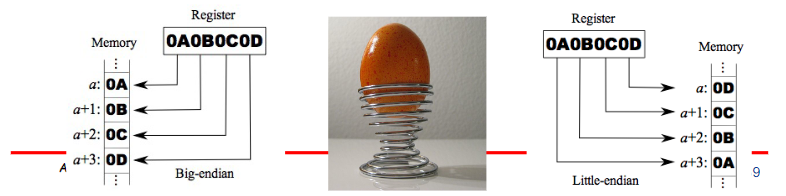
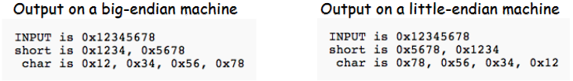

---

## Addressing Mode
| Addressing mode       | Example            | Meaning                                                                 | When used                                                                 |
|-----------------------|--------------------|-------------------------------------------------------------------------|---------------------------------------------------------------------------|
| **Register**          | Add R4, R3        | Regs[R4] ← Regs[R4] + Regs[R3]                                         | When a value is in a register                                             |
| **Immediate**         | Add R4, #3        | Regs[R4] ← Regs[R4] + 3                                                | For constants                                                             |
| **Displacement**      | Add R4, 100(R1)   | Regs[R4] ← Regs[R4] + Mem[100 + Regs[R1]]                               | Accessing local variables                                                 |
| **Register indirect** | Add R4, (R1)      | Regs[R4] ← Regs[R4] + Mem[Regs[R1]]                                     | Accessing using a pointer or a computed address                           |
| **Indexed**           | Add R3, (R1+R2)   | Regs[R3] ← Regs[R3] + Mem[Regs[R1] + Regs[R2]]                          | Sometimes useful in array addressing: R1=base of array; R2=index amount   |
| **Direct or absolute**| Add R1, (1001)    | Regs[R1] ← Regs[R1] + Mem[1001]                                         | Useful for accessing static data: address constant may need to be large.  |
| **Memory indirect**   | Add R1, @(R3)     | Regs[R1] ← Regs[R1] + Mem[Mem[Regs[R3]]]                                 | If R3 is the address of a pointer, the mode yields `*p`                   |
| **Autoincrement**     | Add R1, (R2)+     | Regs[R1] ← Regs[R1] + Mem[Regs[R2]]; Regs[R2] ← Regs[R2] + d            | Useful for stepping through arrays within a loop. Each reference increments R2 by size of an element, `d`. |
| **Autodecrement**     | Add R1, -(R2)     | Regs[R1] ← Regs[R1] + Mem[Regs[R2] - d]; Regs[R2] ← Regs[R2] - d        | Same use as autoincrement. Autodecrement/increment can also act as push/pop to implement a stack. |
| **Scaled**            | Add R1, 100(R2)[R3] | Regs[R1] ← Regs[R1] + Mem[100 + Regs[R2] + Regs[R3]×d]                 | Used to index arrays. May be applied to any indexed addressing mode in some computer systems. |

---

## Type and Size of Operands
- Common operand types include:
    - Character (8 bits for ASCII, 16bits for Unicode)
    - Half word (16 bits, short integer)
    - Word (32 bits)
        - Integer
        - Single-precision floating point (IEEE standard 754)
    - Double-word (64 bit)
        - Double integer
        - Double-precision floating point (IEEE standard 754)
    -Decimal format for business applications

- Floating-Point Numbers (IEEE745: Standard Format for Floating-Point Data Representation)
    - Fixed-point notation
        - Binary point is fixed, e.g., rightmost for integers
            - Easy for arithmetic operations
            - Representable range limited
        - Numbers are presented by a mantissa (significand) and an exponent, similar to scientific notation
            - Representable range extended
            - Complicated processing needed for arithmetic operations
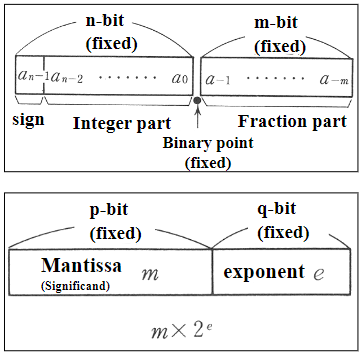

- Binary-Coded Decimal (BCD) Representation
    - Decimal numbers are presented digit by digit in the binary form
        - 4 bits are needed to represent decimal digit from 0 to 9
        - No error occur in representation of fraction numbers
    - Additions on BCD Numbers (ex slide 49)
        - Add 4-bit (BCD digit) by 4-bit from the lower 
        - As there is unused range from 1010 to 1111, if a result of addition of each digit is greater than 9, add offset 110(6) for compensation and carry generation 
    - Subtraction on BCD Numbers (ex slide 52)
        - Subtract 4-bit (BCD digit) by 4-bit from the lower 
        - If subtraction of each digit needs a borrow from the upper digit and a subtraction result is greater than 9, subtract offset 110(6) for compensation

| **Decimal** | **BCD** |
|-------------|----------|
| 0           | 0000     |
| 1           | 0001     |
| 2           | 0010     |
| 3           | 0011     |
| 4           | 0100     |
| 5           | 0101     |
| 6           | 0110     |
| 7           | 0111     |
| 8           | 1000     |
| 9           | 1001     |

---

## Operations in the Instruction Set
### Categories of instruction operators

| **Operator type**        | **Examples**                                                                 |
|--------------------------|-----------------------------------------------------------------------------|
| Arithmetic and logical    | Integer arithmetic and logical operations: add, subtract, and, or, multiply, divide |
| Data transfer             | Load-stores (move instructions on computers with memory addressing)         |
| Control                   | Branch, jump, procedure call and return, traps                             |
| System                    | Operating system call, virtual memory management instructions              |
| Floating point            | Floating-point operations: add, multiply, divide, compare                  |
| Decimal                   | Decimal add, decimal multiply, decimal-to-character conversions            |
| String                    | String move, string compare, string search                                 |
| Graphics                  | Pixel and vertex operations, compression/decompression operations          |

### Top 10 instructions for X86

| **Rank** | **X86 Instruction**    | **Integer average** (% total executed) |
|----------|-------------------------|----------------------------------------|
| 1        | Load                   | 22%                                    |
| 2        | Conditional branch     | 20%                                    |
| 3        | Compare                | 16%                                    |
| 4        | Store                  | 12%                                    |
| 5        | Add                    | 8%                                     |
| 6        | And                    | 6%                                     |
| 7        | Sub                    | 5%                                     |
| 8        | Move register-register | 4%                                     |
| 9        | Call                   | 1%                                     |
| 10       | Return                 | 1%                                     |
| **Total**|                        | 96%                                    |

---

## Instructions for Control Flow
- Four types of control flow change
    1. Conditional branches
    2. Jumps
    3. Procedure calls
    4. Procedure returns
- Addressing Modes for Control Flow Instructions
    - The most common way to specify the destination is to supply a displacement that is added to the program counter (PC)
        - PC-relative
    - Advantages:
        - The target is often near the current instruction
        - Specifying the position relative to the current PC requires fewer bits.
        - Allow the code to run independently of where it is loaded
            - Position independence
            - Eliminate some work when the program is linked and is also useful in programs linked dynamically during execution
- Register Indirect Jump
    - Registers are used to implement returns and indirect jumps when the target is not known at compile time
        - Case or switch statements
        - Virtual functions or methods in object-oriented languages like C++ or Java 
            - Which allow different routines to be called depending on the type of the argument
        - Higher-order functions or function pointers in languages like C or C++ 
            - Which allow functions to be passed as arguments
        - Dynamic shared libraries 
            - Which allow a library to be loaded and linked at runtime only when it is actually invoked by the program rather than loaded and linked statically before the program is run.

#### Conditional Branch Options

| Name                | Examples                          | How condition is tested                                  | Advantages                                | Disadvantages                                                                                      |
|---------------------|-----------------------------------|---------------------------------------------------------|------------------------------------------|--------------------------------------------------------------------------------------------------|
| Condition Code (CC) | X86, ARM, PowerPC, SPARC, SuperH | Tests special bits set by ALU operations, possibly under program control | Sometimes condition is set for free     | CC is extra state. Condition codes constrain the ordering of instructions since they pass information from one instruction to a branch |
| Condition register  | Alpha, MIPS                      | Tests arbitrary register with the result of a comparison | Simple                                   | Uses up a register                                                                                 |
| Compare and branch  | PA-RISC, VAX                     | Compare is part of the branch. Often compare is limited to subset       | One instruction rather than two for a branch | May be too much work per instruction for pipelined execution                                      |

---

## Encoding an Instruction Set
- The architect must balance several competing forces
    - The desire to have as many registers and addressing modes as possible
        - The impact of the size of the register and addressing mode fields on the average instruction size and hence on the average program size
    - A desire to have instructions encoded into lengths that will be easy to handle in a pipelined implementation
        - Multiples of bytes, rather than a arbitrary bit length
        - Fixed-length instruction to gain implementation benefits while sacrificing average code size.
- Three Basic Variations in Instruction Encoding
    - 1. **Variable Length Encoding (e.g., Intel 80x86, VAX):**
        - The instruction length varies from 1 to 17 bytes.
        - Focuses on minimizing **code size**, using as few bits as possible to represent instructions.
        - Adds complexity to decoding and pipelined execution.
    - 2. **Fixed Length Encoding (e.g., Alpha, ARM, MIPS, PowerPC, SPARC, SuperH):**
        - All instructions have a fixed size.
        - Focuses on improving **performance**, making decoding straightforward and pipeline-friendly.
    - 3. **Hybrid Encoding (e.g., IBM 360/370, MIPS16, Thumb, TI TMS320C54x):**
        - Combines aspects of both variable and fixed encoding.
        - Balances between optimizing for code size and maintaining manageable decoding complexity.
- Example: X86 Architecture (slide 59)
- Example of Machine Instructions on X86 (slide 60)

---

## Example: MIPS Architecture
- MIPS emphasizes
    - A simple load-store instruction set
    - Design for pipelining efficiency, including a fixed instruction set encoding
    - Efficiency as a compiler target

| Name       | Fields                          | Comments                                |
|------------|---------------------------------|-----------------------------------------|
| Field size | 6 bits  | 5 bits  | 5 bits  | 5 bits  | 5 bits    | 6 bits | All MIPS instructions are 32 bits long |
| R-format   | op rs  rt  |         l =>                           Arithmetic branch |

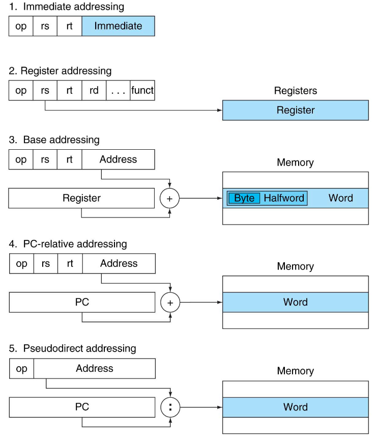

### MIPS Operands

| Name              | Example                                                                                      | Comments                                                                                                                                                   |
|-------------------|----------------------------------------------------------------------------------------------|-----------------------------------------------------------------------------------------------------------------------------------------------------------|
| 32 registers      | `$s0–$s7`, `$t0–$t9`, `$zero`, `$a0–$a3`, `$v0–$v1`, `$gp`, `$fp`, `$sp`, `$ra`, `$at`         | Fast locations for data. In MIPS, data must be in registers to perform arithmetic. Register `$zero` always equals 0, and register `$at` is reserved by the assembler to handle large constants. |
| 2^30 memory words | `Memory[0]`, `Memory[4]`, ..., `Memory[4294967292]`                                          | Accessed only by data transfer instructions. MIPS uses byte addresses, so sequential word addresses differ by 4. Memory holds data structures, arrays, and spilled registers. |

### MIPS Assembly Language

| Category           | Instruction          | Example                 | Meaning                                         | Comments                                     |
|--------------------|----------------------|-------------------------|------------------------------------------------|---------------------------------------------|
| **Arithmetic**     | `add`               | `add $s1, $s2, $s3`     | `$s1 = $s2 + $s3`                              | Three register operands                      |
|                    | `sub`               | `sub $s1, $s2, $s3`     | `$s1 = $s2 - $s3`                              | Three register operands                      |
|                    | `addi`              | `addi $s1, $s2, 20`     | `$s1 = $s2 + 20`                               | Used to add constants                        |
| **Data Transfer**  | `lw`                | `lw $s1, 0($s2)`        | `Word from memory to register`                 |                                             |
|                    | `sw`                | `sw $s1, 20($s2)`       | `Word from register to memory`                 |                                             |
|                    | `lh`                | `lh $s1, 20($s2)`       | `Halfword memory to register`                  |                                             |
|                    | `lhu`               | `lhu $s1, 20($s2)`      | `Halfword memory to register`                  |                                             |
|                    | `sh`                | `sh $s1, 20($s2)`       | `Halfword register to memory`                  |                                             |
|                    | `lb`                | `lb $s1, 20($s2)`       | `Byte from memory to register`                 |                                             |
|                    | `lbu`               | `lbu $s1, 20($s2)`      | `Byte from memory to register`                 |                                             |
|                    | `sb`                | `sb $s1, 20($s2)`       | `Byte from register to memory`                 |                                             |
|                    | `ll`                | `ll $s1, 20($s2)`       | `Load word as 1st half of atomic swap`         |                                             |
|                    | `sc`                | `sc $s1, 20($s2)`       | `Store word as 2nd half of atomic swap`        |                                             |
|                    | `lui`               | `lui $s1, 20`           | `$s1 = 20 * 2^16`                              | Loads constant in upper 16 bits             |
| **Logical**        | `and`               | `and $s1, $s2, $s3`     | `$s1 = $s2 & $s3`                              | Three reg. operands; bit-by-bit AND         |
|                    | `or`                | `or $s1, $s2, $s3`      | `$s1 = $s2 | $s3`                              | Three reg. operands; bit-by-bit OR          |
|                    | `nor`               | `nor $s1, $s2, $s3`     | `$s1 = ~($s2 | $s3)`                           | Three reg. operands; bit-by-bit NOR         |
|                    | `andi`              | `andi $s1, $s2, 20`     | `$s1 = $s2 & 20`                               | Bit-by-bit AND reg with constant            |
|                    | `ori`               | `ori $s1, $s2, 20`      | `$s1 = $s2 | 20`                               | Bit-by-bit OR reg with constant             |
|                    | `sll`               | `sll $s1, $s2, 10`      | `$s1 = $s2 << 10`                              | Shift left by constant                      |
|                    | `srl`               | `srl $s1, $s2, 10`      | `$s1 = $s2 >> 10`                              | Shift right by constant                     |
| **Conditional Branch** | `beq`          | `beq $s1, $s2, 25`      | If `$s1 == $s2` go to `PC + 4 + 100`           | Equal test; PC-relative branch              |
|                    | `bne`               | `bne $s1, $s2, 25`      | If `$s1 != $s2` go to `PC + 4 + 100`           | Not equal test; PC-relative branch          |
|                    | `slt`               | `slt $s1, $s2, $s3`     | If `$s2 < $s3` `$s1 = 1`; else `$s1 = 0`       | Compare less than                           |
|                    | `sltu`              | `sltu $s1, $s2, $s3`    | If `$s2 < $s3` `$s1 = 1`; else `$s1 = 0`       | Compare less than unsigned                  |
|                    | `slti`              | `slti $s1, $s2, 20`     | If `$s2 < 20` `$s1 = 1`; else `$s1 = 0`        | Compare less than constant                  |
|                    | `sltiu`             | `sltiu $s1, $s2, 20`    | If `$s2 < 20` `$s1 = 1`; else `$s1 = 0`        | Compare less than constant unsigned         |
| **Unconditional Jump** | `j`            | `j 2500`                | Jump to target address                        | Jump to address                             |
|                    | `jr`                | `jr $ra`                | Go to `$ra`                                   | For switch, procedure return                |
|                    | `jal`               | `jal 2500`              | `$ra = PC + 4; go to 10000`                   | For procedure call                          |

- Reduced Code Size in RISCs
    - As now RISCs are used in embedded applications, smaller codes are important.
        - 1. A hybrid encoding approach use multiple formats specified by the opcode.
            - The narrow instructions support fewer operations, smaller address and immediate fields, fewer registers, and two-address format rather than the classic three-address format of RISC computer 
            - Effective use of small limited memory, in particular on-chip memory, in MIPS16 and Thumb
        - 2. A compressed instructions approach compresses its standard instruction set and then adds hardware to decompress instructions as they are fetched from memory.
            - Compressed code is kept in main memory, ROMs and the disk
            - PowerPC uses run-length encoding compression
- Compiler Structure
    - How the architect can help the compiler writer
        - Provide regularity
        - Provide primitives, not solutions
        - Simplify trade-offs among alternatives
        - Provide instructions that bind the quantities known at compile time as constants
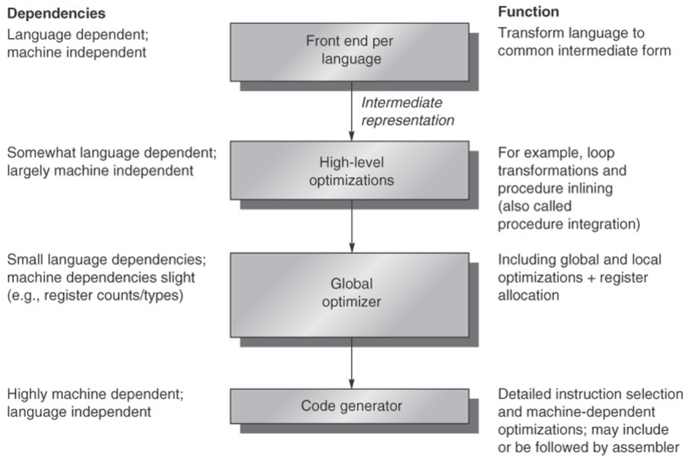

## Fallacies and Pitfalls
| **Type**  | **Description**                                                                                                                                                                    |
|-----------|------------------------------------------------------------------------------------------------------------------------------------------------------------------------------------|
| **Pitfall** | Designing a "high-level" instruction set feature specifically oriented to supporting a high-level language structure:                                                             |
|           | - Making the semantic gap small leads to semantic clash.                                                                                                                           |
|           | - By giving too much semantic content to the instruction, the computer designer makes it possible to use the instruction only in limited contexts.                                  |
|           | Example: Transition from CISC (Complex Instruction Set Architecture) to RISC (Reduced Instruction Set Architecture).                                                               |
| **Fallacy** | There is such a thing as a typical program:                                                                                                                                      |
|           | - Many variations in operations and data sizes occur across different applications.                                                                                               |
| **Pitfall** | Innovating at the instruction set architecture level to reduce code size without considering the compiler:                                                                        |
|           | - Compilers play a key role in extracting the potential of computers.                                                                                                              |
| **Fallacy** | An architecture with flaws cannot be successful:                                                                                                                                 |
|           | - Example: X86 has lasted for more than 30 years.                                                                                                                                  |
| **Fallacy** | You can design a flawless architecture:                                                                                                                                          |
|           | - Stack → Memory/Memory → Memory/Register → Register/Register                                                                               |

## Conclusion
- Trend in computer architectures changed from CISC to RISC.
    - In the 1960s, stack architectures were viewed as being a good match for high-level languages
    - In the 1970s, the main concern of architects was how to reduce software costs.
    - High-level language computer architecture and powerful architectures like VAX, which has a large number of addressing modes, multiple data types, and a highly orthogonal architecture
    - In the 1980s, more sophisticated compiler technology and a renewed emphasis on processor performance saw a return to simpler architectures
    - In the 1990s, the following instruction set architectures changes occurred.
        - Address size double from 32 bits to 64 bits
        - Optimization of conditional branches via conditional execution
        - Optimization of cache performance via prefetch
        - Support for multimedia
        - Faster floating-point operations