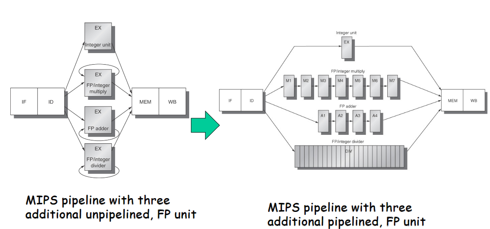
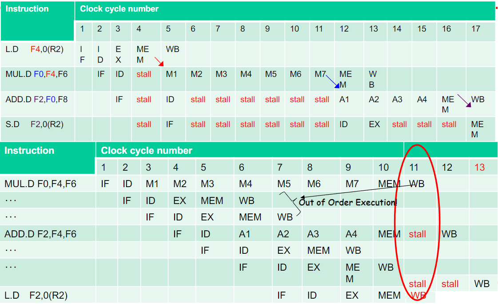
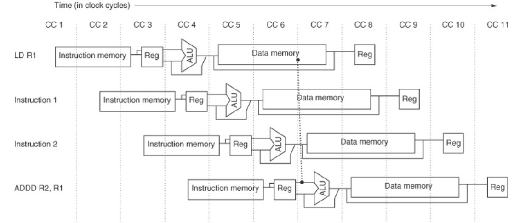
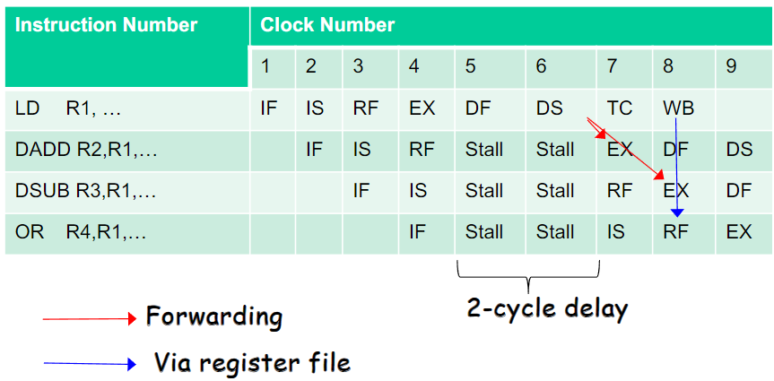
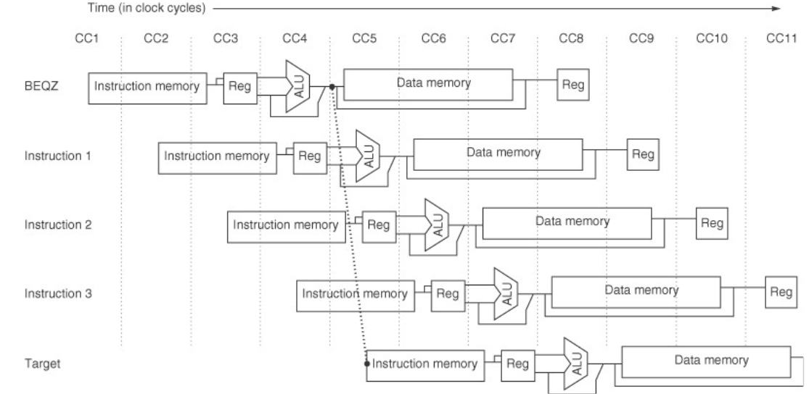
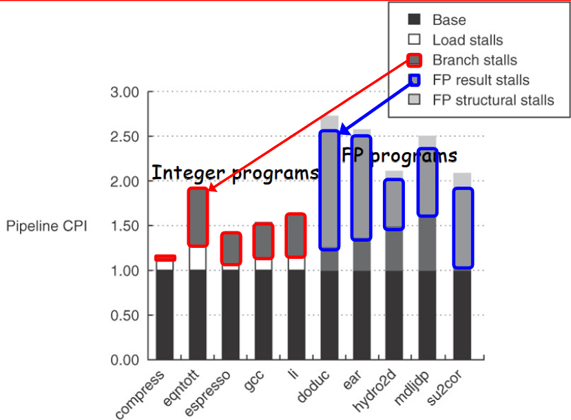

# Computer Architecture Design (CAD) - Course Summary #3 ([chapter3.pdf]-(chapter3.pdf))

---

## Table of Contents
- [How computers handle machine instructions](#how-computers-handle-machine-instructions)
- [What is Pipelining?](#what-is-pipelining)
- [The Classic Five-Stage Pipeline for a RISC Processor](#the-classic-five-stage-pipeline-for-a-risc-processor)
- [The Major Hurdle of Pipelining-Pipeline Hazards](#the-major-hurdle-of-pipelining-pipeline-hazards)
- [How is Pipelining Implemented?](#how-is-pipelining-implemented)
- [Extending the MIPS Pipeline to Handle Muticycle Operations](#extending-the-mips-pipeline-to-handle-muticycle-operations)
- [Example: MIPS R4000 Pipeline](#example-mips-r4000-pipeline)
- [Conclusions](#conclusion)

---

## How computers handle machine instructions

---

## What is Pipelining?

---

## The Classic Five-Stage Pipeline for a RISC Processor

---

## The Major Hurdle of Pipelining-Pipeline Hazards

---

## How is Pipelining Implemented?

---

## Extending the MIPS Pipeline to Handle Muticycle Operations

### Pipeline timing (independent operations)
| Instruction | Pipe Stages |      |      |      |      |      |      |      |      |      |
|-------------|------|------|------|------|------|------|------|------|------|------|------|
| MUL.D       | IF   | ID   |**M1**| M2   | M3   | M4   | M5   | M6   | *M7* | MEM  | WB   |
| ADD.D       |      | IF   | ID   |**A1**| A2   | A3   | *A4* | MEM  | WB   |      |      |
| L.D         |      |      | IF   | ID   |**EX**| *MEM*| WB   |      |      |      |      |
| S.D         |      |      |      | IF   | ID   |**EX**|**MEM**| WB   |      |      |      |

**Bold**: where data are needed  
*Italic*: where a result is available

### Hazards in Longer Latency Pipelines
1. Because the divide unit is not fully pipelined, structural hazards can occur.
    - These will need to be detected and issuing instructions will need to be stalled.
2. Because the instructions have varying running times, the number of register writes required in a cycle can be larger than1.
3. WAW (Write After Read) hazards are possible, since instructions no longer reach WB in order.
    - Note that WAR (Write After Read) hazards are not possible, since the register reads always occur in ID
4. Instructions can complete in a different order than they were issued, causing problems with exceptions
5. Because of longer latency of operations, stalls for RAW (Read After Write) hazards will be more frequent.

### Three Checks before Instruction Issue
1. **Check for structural hazards**
    - Wail until the required functional unit is not busy and make sure the register write port is available when it will be needed.
2. **Check for a RAW data hazard**
    - Wait until the source registers are not listed as pending destinations in a pipeline register that will not be available when this instruction needs the result.
3. **Check for a WAW data hazard**
    - Determine if any instruction in A1, ..., A4, D, M1, ..., M7 has the same register destination as this instruction.  If so, stall the issue of the instruction in ID.

---

## Example: MIPS R4000 Pipeline
- A deeper pipelin to achieve a higher clock rate
    - Superpipelining:
        
        - IF: Fist half of Instruction Fetch (PC selection, initial cache access)
        - IS: Second half of Instruction Fetch (cache access completed)
        - RF: Instruction Decode and Register Fetch, hazard checking, I$ hit detection
        - EX: Execution, Effective Address Calc., ALU op. Br.Targt comput&Cond.Eval.
        - DF: 1st half of Data Fetch (D$ access stated)
        - DS: 2nd half of data fetch
        - TC: Tag check, determine whether D$ hit
        - WB: Write back
### A **2**-cycle Load Delay of R4000

### A **3**-cycle Load Delay of R4000

### Performance of the R4000 Pipeline

### Fammacies and Pitfalls
- **Pitfall**: Unexpected execution sequences may cause unexpected hazards
    - Ex.   BNEX  R1, foo
            DIV.D  F0, F2, F4   ; moved into delay slot
                                ; from fall through
            ...
        foo:  L.D  F0,qrs
- **Pitfall**: Extensive pipelining can impact other aspects of a design, leading to overall worse cost-performance
    - Ex.  VAX8600/8650/8700 implementations
        - A simple implementation of 8700 realizes a smaller CPU with a faster clock cycle (but a bit longer CPI), resulting in the same performance with much less hardware. 
- **Pitfall**: Evaluating dynamic or static scheduling on the basis of unoptimized code
    - Unpotimized code is much easier to schedule than “tight” optimized code.

---

## Conclusion 
- Pipelining is a simple and easy way to improve the performance.
- To maximize the effect of pipelining, avoid hazards that make the pipeline stall
    - Enrich hardware resources to reduce resource conflicts
    - Data forwarding between pipeline registers 
    - Fill the delay slots of load and branch with independent instructions
        - Instruction reordering
        - Branch prediction/speculation