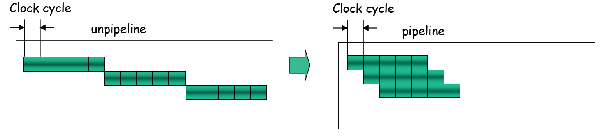
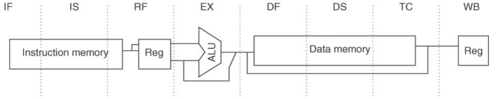

# Computer Architecture Design (CAD) - Course Summary #3 ([chapter3.pdf]-(chapter3.pdf))

---

## Table of Contents
- [How computers handle machine instructions](#how-computers-handle-machine-instructions)
    - [How to Process Machine Instructions](#how-to-process-machine-instructions)
    - [Basic Steps of Execution of Machine Instructions](#basic-steps-of-execution-of-machine-instructions)
    - [Features of the General-Purpose Register Processor](#features-of-the-general-purpose-register-processor)
    - [How to Improve Throughput of Machine Instructions Processing](#how-to-improve-throughput-of-machine-instructions-processing)
- [What is Pipelining?](#what-is-pipelining)
    - [Pipelining: A Mechanism to Increase the Throughput in General-Purpose Register Architecture Processors](#pipelining-a-mechanism-to-increase-the-throughput-in-general-purpose-register-architecture-processors)
    - [Example of a Pipelined RISC Processor (Cont’d)](#example-of-a-pipelined-risc-processor-contd)
    - [A RISC Data Path Drawn in a Pipeline Fashion](#a-risc-data-path-drawn-in-a-pipeline-fashion)
    - [A Pipeline with Pipeline Registers](#a-pipeline-with-pipeline-registers)
    - [Basic Performance Issues in Pipelining](#basic-performance-issues-in-pipelining)
    - [Major Hurdle of Pipelining: Pipeline Hazards](#major-hurdle-of-pipelining-pipeline-hazards)
    - [Performance of Pipelines with Stalls](#performance-of-pipelines-with-stalls)
    - [Performance of Pipelines with Stalls (cont’d)](#performance-of-pipelines-with-stalls-contd)
- [The Major Hurdle of Pipelining-Pipeline Hazards](#the-major-hurdle-of-pipelining-pipeline-hazards)
    - [Structure Hazards](#structure-hazards)
    - [A Processor with Only One Memory Port](#a-processor-with-only-one-memory-port)
    - [A Pipeline Stalled for a Structural Hazard](#a-pipeline-stalled-for-a-structural-hazard)
    - [Consideration about Structural Hazard](#consideration-about-structural-hazard)
    - [Data Hazards](#data-hazards)
    - [Minimizing Data Hazard Stalls by Forwarding](#minimizing-data-hazard-stalls-by-forwarding)
    - [Data forwarding](#data-forwarding)
    - [Implementation of Data Forwarding](#implementation-of-data-forwarding)
    - [Data Hazards Requiring Stalls](#data-hazards-requiring-stalls)
    - [Pipeline Interlocking to Preserve Correct Execution](#pipeline-interlocking-to-preserve-correct-execution)
    - [Control (Branch) Hazards](#control-branch-hazards)
    - [Reducing Pipeline Branch Penalties](#reducing-pipeline-branch-penalties)
    - [Scheduling the Branch Delay Slot](#scheduling-the-branch-delay-slot)
    - [Implementation of the MIPS Data Path (non-pipelined)](#implementation-of-the-mips-data-path-non-pipelined)
- [How is Pipelining Implemented?](#how-is-pipelining-implemented)
    - [Simple (Non-Pipelined) Implementation of MIPS in 5 cycles](#simple-non-pipelined-implementation-of-mips-in-5-cycles)
    - [Implementation of the Pipelined MIPS Data Path](#implementation-of-the-pipelined-mips-data-path)
    - [Events on Every Pipe Stage](#events-on-every-pipe-stage)
    - [Implementing the Control for the MIPS Pipeline](#implementing-the-control-for-the-mips-pipeline)
    - [Data Path for Forwarding](#data-path-for-forwarding)
    - [Dealing with Branches in the Pipeline](#dealing-with-branches-in-the-pipeline)
- [Extending the MIPS Pipeline to Handle Muticycle Operations](#extending-the-mips-pipeline-to-handle-muticycle-operations)
    - [Pipeline timing (independent operations)](#pipeline-timing-independent-operations)
    - [Hazards in Longer Latency Pipelines](#hazards-in-longer-latency-pipelines)
    - [Three Checks before Instruction Issue](#three-checks-before-instruction-issue)
- [Example: MIPS R4000 Pipeline](#example-mips-r4000-pipeline)
    - [A 2-cycle Load Delay of R4000](#a-2-cycle-load-delay-of-r4000)
    - [A 3-cycle Load Delay of R4000](#a-3-cycle-load-delay-of-r4000)
    - [Performance of the R4000 Pipeline](#performance-of-the-r4000-pipeline)
    - [Fammacies and Pitfalls](#fammacies-and-pitfalls)
- [Conclusion](#conclusion)

---

## How computers handle machine instructions
### How to Process Machine Instructions
- Machine instructions are stored in a memory
    - Program counter specifies a current executing instructions
        - Computer has to read instructions from memory and decode them to know their operations
    - The size of data and instructions are fixed, i.e., aligned in the memory
        - Easy to identify the location of the next instruction without decoding the current instruction
- Data to be processed are stored in a memory or internal memory devices named Registers
    - Necessary data are specified in machine instructions explicitly
        - More flexibility in data placement in memory or registers
    - Operations applied to data in registers to avoid long latency of memory accesses
        - Load data from register and/or memory before operations
- Register-Register architecture
    - All the data should be brought from Memory to internal registers before operations
        - Data for operations are read from registers and the result is stored in a register.
- RISC Architecture
    - MIPS uses fixed size instructions (4-byte width), its memory addressing is Byte-addressed and Aligned.
    - PC-relative addressing for branches and jumps
        - Condition registers used
    - Fixed-length instruction to gain implementation benefits while sacrificing average code size
    - Position and their meanings of fields of a machine instruction are fixed 
        - Easy to implement a pipeline mechanism
- Computer takes an action based on the decoded instruction
    - Load/store operations
        - Data movement between register and memory
            - Memory address calculation (addition/subtraction)  is performed by ALU
    - Logical/arithmetic operations
        - Logical/arithmetic operation for designated data
            - For Add, sub, mul, div, and, or operations, ALU is, of course, used!
    - Control operations
        - Change the content of program counter to change the execution point on the memory for branch and jump operations
            - Address calculation is also needed by ALU.
- ALU is a key player in execution of any types of machine instructions

### Basic Steps of Execution of Machine Instructions
- **Step 1: Instruction Fetch**
     - Read an instruction from the memory specified by program counter
- **Step 2: Instruction Decode:** 
    - Decode the instruction fetched
- **Step 3: Execution (ALU operation)**
    - Take necessary actions based on the decoded instruction
        - If the instruction is a load/store instruction, perform address calculation to obtain load/store memory address.
        - If the instruction is a logic/arithmetic instruction, perform necessary operations for designated data 
        - If the instruction is a control instruction, perform address calculation to obtain the branch/jump target address
- **Step 4: Memory access (only for load/store instructions)**
    - Store data to the memory, or load data from memory
- **Step 5: Write result (only for logical/arithmetic&load instructions)**
    - Write the result of the ALU operation to the register/memory

### Features of the General-Purpose Register Processor
- Key properties of GPRP instruction set
    - *All operations on data apply to data in registers* and typically change the entire register
    - *The only operations that affect memory are load and store* operations that move data from memory to  a register or to memory from a register, respectively.
    - *The instruction formats are few in number* with all instructions typically being *one size*
- Five steps to execute an instruction
1. Instruction fetch cycle (IF)
2. Instruction decode/register fetch cycle (ID)
3. Execution/effective address cycle (EX)
4. Memory access (MEM)
5. Write-back cycle (WB)

### How to Improve Throughput of Machine Instructions Processing
- All the instructions should be processed in 5 Steps
- Remember 5 Quantitative Principles of Computer Design!
    1. Take Advantage of Parallelism
    2. Principle of Locality
    3. Focus on the Common Case
    4. Amdahl’s Law
    5. The Processor Performance Equation

---

## What is Pipelining?
### Pipelining: A Mechanism to Increase the Throughput in General-Purpose Register Architecture Processors
- Multiple instructions are overlapped in execution
    - Process of instruction execution is divided into two or more steps, called *pipe stages* or *pipe segments*, and 
    - Different stage are completing different parts of different instructions in parallel
    - The stages are connected one to the next to form a pipe
        - Instructions enter at one end, progress through the stages, and exit at the other end
- It takes advantage of parallelism that exists among the actions needed to execute an instruction in a sequential instruction stream.
    - Unlike some speedup techniques, it is **not visible to the programmer/compiler**.

### Example of a Pipelined RISC Processor (Cont’d)

### A RISC Data Path Drawn in a Pipeline Fashion

### A Pipeline with Pipeline Registers

### Basic Performance Issues in Pipelining
- Throughput
    - How often an instruction exits the pipeline
- Processor Cycle (Pipeline Cycle)
    - The time required for moving an instruction one step down the pipeline
    - Because all stages proceed at the same time, the length of a processor cycle is determined by the time required for the slowest pipe stage. The longest step would determine the time between advancing the line.
- Ideal time per instruction on the pipeline processor = $ \frac{ \text{Time per instruction on unpipelined machine}}{ \text{Number of pipe stages}} $
- Ideally, n times faster on n-stage pipeline, but usually the stages will not be perfectly balanced!
- In addition, Pipeline overhead: Latch delay and skew

Example on slide 15

### Major Hurdle of Pipelining: Pipeline Hazards
- Structural hazards
    - Arise from resource conflicts when the hardware cannot support all possible combinations of instructions simultaneously in overlapped execution
- Data hazards
    - Arise when an instruction depends on the results of a previous instruction in a way that is exposed by the overlapping of instructions in the pipeline
- Control hazards
    - Arise from the pipelining of branches and other instructions that change the PC 
- **Hazards in pipelines can make it necessary to stall the pipelines!**

### Performance of Pipelines with Stalls
$ \text{Speedup from pipelining} = \frac{ \text{Average instruction time unpipelined} }{ \text{Average instruction time pipelined} } = \frac{ \text{CPI unpipelined} \times \text{Clock cycle unpipeline} }{ \text{CPI pipelined} \times \text{Clock cycle pipeline} } = \frac{ \text{CPI unpipelined} }{ \text{CPI pipelined} } \times \frac{ \text{Clock cycle unpipeline} }{ \text{Clock cycle pipeline} } $ \
Because the Ideal CPI on a pipelined processor is almost always 1, \
$ \text{CPI pipelined} = \text{Ideal CPI} + \text{Pipeline stall clock cycles per instruction} = 1 + \text{Pipeline stall clock cycles per instruction} $

### Performance of Pipelines with Stalls ***(cont’d)***
If clock cycles of pipelined and unpipelined are same, and there is no pipeline overhead, \
 \
In the simple case, the unpipelined CPI is equal to the depth of the pipeline \
$ \text{Speedup} = \frac{ \text{Pipeline depth} }{ 1 + \text{ Pipeline stall cycles per instruction} } $

If pipelining improves the clock cycle time, \
 \
$ \text{Speedup} = \frac{ \text{CPI unpipelined} }{ \text{CPI pipelined} } \times \frac{ \text{Clock cycle unpipeline} }{ \text{Clock cycle pipeline} } = \frac{ 1 }{ 1 + \text{ Pipeline stall cycles per instruction} } \times \frac{ \text{**Clock cycle unpipelined**} }{ \text{ **Clock cycle pipelined** } } $

In cases where the pipe stages are perfectly balanced and there is no overhead, \
$ \text{Clock cycle pipelined} = \frac{ \text{Clock cycle unpipelined} }{ \text{Pipeline depth} } $ \
$ \text{Pipeline depth} = \frac{ \text{Clock cycle unpipeline} }{ \text{Clock cycle pipeline} } $ \
Finally, \
$ \text{Speedup} = \frac{ 1 }{ 1 + \text{Pipeline stall cycles per instruction} } \times \frac{ \text{Clock cycle unpipelined} }{ \text{Clock cycle pipelined} } = \frac{ 1 }{ 1 + \text{ Pipeline stall cycles per instruction} } \times \text{Pipeline depth} $

---

## The Major Hurdle of Pipelining-Pipeline Hazards
### Structure Hazards
- Structural hazards occur when some combination of instructions cannot be accommodated because of **resource conflicts**.
   - Some resource has not been duplicated enough to allow all combinations of instructions in the pipeline to execute.
- Examples: 
    - Read access in ID and write access in WB to the register file
    - A single-memory pipeline for data and instructions

### A Processor with Only One Memory Port

### A Pipeline Stalled for a Structural Hazard

Example *"How much the load structural hazard might cost?"* on slide 24.

### Consideration about Structural Hazard
- A processor without structural hazards will always have a lower CPI.
- Why would a designer allow structural hazard?
- Tradeoff between cost and performance gains
    - Pipelining all the functional units, or duplicating them, may be too costly.
        - Processors that support both an instruction and a data cache access every cycle require twice as much total memory bandwidth, and often have higher bandwidth at the pin.

### Data Hazards
- Data hazards occur when **the pipeline changes the order of read/write accesses to operands** so that the order differs from the order seen by sequentially executing instruction on a unpipelined processor.

Example: \
DADD    R1, R2, R3 \
DSUB    R4, R1, R5 \
AND     R6, R1, R7 \
OR      R8, R1, R9 \
XOR     R10,R1, R11 \
Operation  Destination, Source1, Source2

### Minimizing Data Hazard Stalls by Forwarding
- If the result can be moved from the pipeline register where the DADD stores it to where the DSUB needs it, the need for a stall can be avoided.
- Data forwarding (bypassing) mechanism:
    - The ALU result from both the EX/MEM and MEM/WB pipeline registers is always fed back to the ALU inputs
    - If the forwarding hardware detects that the previous ALU operation has written the register corresponding to a source for the current ALU operation, control logic selects the forwarded result as the ALU input rather than the value read from the register file.

### Data forwarding

### Implementation of Data Forwarding

### Data Hazards Requiring Stalls
Example: \
LD      R1, 0(R2) \
DSUB    R4, R1, R5 \
AND     R6, R1, R7 \
OR      R8, R1, R9 \

### Pipeline Interlocking to Preserve Correct Execution
 \
CPI increases by the length of the stall

### Control (Branch) Hazards
- Execution of branch instructions may or may not change the PC to something other than its current execution sequence. \

### Reducing Pipeline Branch Penalties
- Delayed Branch
    - Branch instruction
    - Seauential successor (branch delay slot)

### Scheduling the Branch Delay Slot

### Implementation of the MIPS Data Path (non-pipelined)

---

## How is Pipelining Implemented?
- Simple (Non-Pipelined) Implementation of MIPS in 5 cycles
1. Instruction Fetch (IF)
    - IR←Mem[PC]
    - NPC←PC+4
2. Instruction decode/register fetch (ID)
    - A←Regs[rs]
    - B←Reg[rt]
    - Imm←sing-extended immediate field of IR
3. Execution/effective address calculation EX)
    - Memory reference
        - ALUOutput ← A + Imm
    - Register-Register ALU inst.
        - ALUOutput ← A func B
    - Register-Imm. ALU inst.
        - ALUOutput ← A op Imm
    - Branch
        - ALUOutput ← NPC + (Imm << 2)
        - Cond ← (A == 0)
- Simple (Non-Pipelined) Implementation (Cotnd)
4. Memory access/branch completion (MEM)
    - LMD ← Mem[ALUOutput] or
        - Mem[ALUOutput] ← B
    - Branch
        - if (cond) PC ← ALUOutput
5. Write-back (WB)
    - Register-Register ALU inst.
        - Regs[rd] ← ALUOutput
    - Register-Imm. ALU inst.
        - Regs[rt] ← ALUOutput
    - Load Instruction
        - Regs[rt] ← LMD

### Implementation of the Pipelined MIPS Data Path

### Events on Every Pipe Stage
| Stage | Any Instruction | ALU Instruction | Load/Store Instruction | Branch Instruction |
|-------|-----------------|-----------------|------------------------|--------------------|
| **IF** | `IF/ID.IR ← Mem[PC]` `IF/ID.NPC, PC ← (if ((EX/MEM.opcode == branch) & EX/MEM.cond) {EX/MEM.ALUOutput} else {PC+4})` | | | |
| **ID** | `ID/EX.A ← Regs[IF/ID.IR[rs]]; ID/EX.B ← Regs[IF/ID.IR[rt]];` `ID/EX.NPC ← IF/ID.NPC; ID/EX.IR ← IF/ID.IR` `ID/EX.Imm ← sign-extend(IF/ID.IR[Immediate field]);` | | | |
| **EX** | `EX/MEM.IR ← ID/EX.IR;` `EX/MEM.ALUOutput ← ID/EX.A func ID/EX.B;` or `EX/MEM.ALUOutput ← ID/EX.A op ID/EX.Imm;` | `EX/MEM.IR ← ID/EX.IR;` `EX/MEM.ALUOutput ← ID/EX.A + ID/EX.Imm;` `EX/MEM.B ← ID/EX.B;` | `EX/MEM.ALUOutput ← ID/EX.NPC + (ID/EX.Imm << 2);` `EX/MEM.cond ← (ID/EX.A == 0);` |
| **MEM** | `MEM/WB.IR ← EX/MEM.IR;` `MEM/WB.ALUOutput ← EX/MEM.ALUOutput;` | `MEM/WB.IR ← EX/MEM.IR;` `MEM/WB.LMD ← Mem[EX/MEM.ALUOutput];` or `Mem[EX/MEM.ALUOutput] ← EX/MEM.B;` | |
| **WB** | `Regs[MEM/WB.IR[rd]] ← MEM/WB.ALUOutput;` or `Regs[MEM/WB.IR[rt]] ← MEM/WB.ALUOutput;` | | `For load only:` `Regs[MEM/WB.IR[rt]] ← MEM/WB.LMD;` | |

### Implementing the Control for the MIPS Pipeline
| Situation                         | Example Code Sequence                                   | Action                                                                                                                                       |
|-----------------------------------|--------------------------------------------------------|---------------------------------------------------------------------------------------------------------------------------------------------|
| No dependence                     | `LD R1, 45(R2)` `DADD R5, R6, R7` `DSUB R8, R6, R7` `OR R9, R6, R7` | No hazard possible because no dependence exists on `R1` in the immediately following three instructions.                                    |
| Dependence requiring stall        | `LD R1, 45(R2)` `DADD R5, R1, R7` `DSUB R8, R6, R7` `OR R9, R6, R7` | Comparators detect the use of `R1` in the `DADD` and stall the `DADD` (and `DSUB` and `OR`) before the `DADD` begins EX.                    |
| Dependence overcome by forwarding | `LD R1, 45(R2)` `DADD R5, R6, R7` `DSUB R8, R1, R7` `OR R9, R6, R7` | Comparators detect use of `R1` in `DSUB` and forward the result of the load to ALU in time for `DSUB` to begin EX.                          |
| Dependence with accesses in order | `LD R1, 45(R2)` `DADD R5, R6, R7` `DSUB R8, R6, R7` `OR R9, R1, R7` | No action required because the read of `R1` by `OR` occurs in the second half of the ID phase, while the write of the loaded data occurred in the first half. |

### Data Path for Forwarding

### Dealing with Branches in the Pipeline
- One more adder in the ID stage  for reducing the branch penalty \

---

## Extending the MIPS Pipeline to Handle Muticycle Operations

### Pipeline timing (independent operations)
| Instruction | Pipe Stages |      |      |      |      |      |      |      |      |      |
|-------------|------|------|------|------|------|------|------|------|------|------|------|
| MUL.D       | IF   | ID   |**M1**| M2   | M3   | M4   | M5   | M6   | *M7* | MEM  | WB   |
| ADD.D       |      | IF   | ID   |**A1**| A2   | A3   | *A4* | MEM  | WB   |      |      |
| L.D         |      |      | IF   | ID   |**EX**| *MEM*| WB   |      |      |      |      |
| S.D         |      |      |      | IF   | ID   |**EX**|**MEM**| WB   |      |      |      |

**Bold**: where data are needed  
*Italic*: where a result is available

### Hazards in Longer Latency Pipelines
1. Because the divide unit is not fully pipelined, structural hazards can occur.
    - These will need to be detected and issuing instructions will need to be stalled.
2. Because the instructions have varying running times, the number of register writes required in a cycle can be larger than1.
3. WAW (Write After Read) hazards are possible, since instructions no longer reach WB in order.
    - Note that WAR (Write After Read) hazards are not possible, since the register reads always occur in ID
4. Instructions can complete in a different order than they were issued, causing problems with exceptions
5. Because of longer latency of operations, stalls for RAW (Read After Write) hazards will be more frequent.

### Three Checks before Instruction Issue
1. **Check for structural hazards**
    - Wail until the required functional unit is not busy and make sure the register write port is available when it will be needed.
2. **Check for a RAW data hazard**
    - Wait until the source registers are not listed as pending destinations in a pipeline register that will not be available when this instruction needs the result.
3. **Check for a WAW data hazard**
    - Determine if any instruction in A1, ..., A4, D, M1, ..., M7 has the same register destination as this instruction.  If so, stall the issue of the instruction in ID.

---

## Example: MIPS R4000 Pipeline
- A deeper pipelin to achieve a higher clock rate
    - Superpipelining:
        
        - IF: Fist half of Instruction Fetch (PC selection, initial cache access)
        - IS: Second half of Instruction Fetch (cache access completed)
        - RF: Instruction Decode and Register Fetch, hazard checking, I$ hit detection
        - EX: Execution, Effective Address Calc., ALU op. Br.Targt comput&Cond.Eval.
        - DF: 1st half of Data Fetch (D$ access stated)
        - DS: 2nd half of data fetch
        - TC: Tag check, determine whether D$ hit
        - WB: Write back
### A **2**-cycle Load Delay of R4000

### A **3**-cycle Load Delay of R4000

### Performance of the R4000 Pipeline

### Fammacies and Pitfalls
- **Pitfall**: Unexpected execution sequences may cause unexpected hazards
    - Ex.   BNEX  R1, foo
            DIV.D  F0, F2, F4   ; moved into delay slot
                                ; from fall through
            ...
        foo:  L.D  F0,qrs
- **Pitfall**: Extensive pipelining can impact other aspects of a design, leading to overall worse cost-performance
    - Ex.  VAX8600/8650/8700 implementations
        - A simple implementation of 8700 realizes a smaller CPU with a faster clock cycle (but a bit longer CPI), resulting in the same performance with much less hardware. 
- **Pitfall**: Evaluating dynamic or static scheduling on the basis of unoptimized code
    - Unpotimized code is much easier to schedule than “tight” optimized code.

---

## Conclusion 
- Pipelining is a simple and easy way to improve the performance.
- To maximize the effect of pipelining, avoid hazards that make the pipeline stall
    - Enrich hardware resources to reduce resource conflicts
    - Data forwarding between pipeline registers 
    - Fill the delay slots of load and branch with independent instructions
        - Instruction reordering
        - Branch prediction/speculation