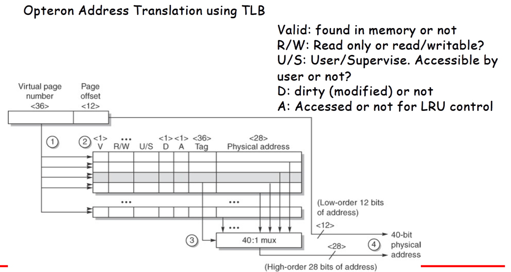

# Computer Architecture Design (CAD) - Course Summary #4 ([chapter4.pdf](chapter4.pdf))

---

## Table of Contents
- [Introduction](#introduction)
    - [Memory Wall Problem and The Principle of Locality](#memory-wall-problem-and-the-principle-of-locality)
    - [Levels of the Memory Hierarchy](#levels-of-the-memory-hierarchy)
    - [Terminology](#terminology)
- [Cache Performance](#cache-performance)
    - [Definition](#definition)
    - [Four memory hierarchy questions](#four-memory-hierarchy-questions)
        - [Q1: Where can a block be placed in the upper level?](#q1-where-can-a-block-be-placed-in-the-upper-level)
        - [Q2: How is a block found if it is in the upper level?](#q2-how-is-a-block-found-if-it-is-in-the-upper-level)
        - [Q3: Which block should be replaced on a miss?](#q3-which-block-should-be-replaced-on-a-miss)
        - [Q4: What happens on a write?](#q4-what-happens-on-a-write)
    - [Two options on a write miss](#two-options-on-a-write-miss)
    - [Miss Comparison of Instruction, Data and Unified Caches](#miss-comparison-of-instruction-data-and-unified-caches)
    - [Cache Performance](#cache-performance-1)
    - [How Memory Time can be Improved by Caches: Six Basic Cache Optimizations](#how-memory-time-can-be-improved-by-caches-six-basic-cache-optimizations)
    - [3C’s of Cache Misses](#3cs-of-cache-misses)
    - [1. Larger Block Size to Reduce Miss Rate](#1-larger-block-size-to-reduce-miss-rate)
    - [2. Larger Caches to Reduces Miss Rate](#2-larger-caches-to-reduces-miss-rate)
    - [3. Higher Associativity to Reduce Miss Rate](#3-higher-associativity-to-reduce-miss-rate)
    - [4. Multilevel Caches to Reduce Miss Penalty](#4-multilevel-caches-to-reduce-miss-penalty)
    - [Design of 2nd Level Cache: Inclusion or Exclusion?](#design-of-2nd-level-cache-inclusion-or-exclusion)
    - [5. Giving Priority to Read Misses over Writes to Reduce Miss Penalty](#5-giving-priority-to-read-misses-over-writes-to-reduce-miss-penalty)
    - [Solutions to Read-After-Write Hazard in Memory](#solutions-to-read-after-write-hazard-in-memory)
    - [6. Avoiding Address Translation During Indexing of the Cache to Reduce Hit Time](#6-avoiding-address-translation-during-indexing-of-the-cache-to-reduce-hit-time)
- [Ten Cache Optimizations](#ten-cache-optimizations)
    - [1. Small and simple first-level caches to reduce hit time and power](#1-small-and-simple-first-level-caches-to-reduce-hit-time-and-power)
    - [2. Way prediction to reduce hit time](#2-way-prediction-to-reduce-hit-time)
    - [3. Pipelined cache access to increase cache bandwidth](#3-pipelined-cache-access-to-increase-cache-bandwidth)
    - [4. Non-blocking caches to increase cache bandwidth](#4-non-blocking-caches-to-increase-cache-bandwidth)
    - [5. Multi-banked caches to increase cache bandwidth](#5-multi-banked-caches-to-increase-cache-bandwidth)
    - [6. Critical word first and early restart to reduce miss penalty](#6-critical-word-first-and-early-restart-to-reduce-miss-penalty)
    - [7. Merging write buffer to reduce miss penalty](#7-merging-write-buffer-to-reduce-miss-penalty)
    - [8. Compiler optimizations to reduce miss rate](#8-compiler-optimizations-to-reduce-miss-rate)
    - [9. Hardware prefetching of instructions and data to reduce miss penalty or miss rate](#9-hardware-prefetching-of-instructions-and-data-to-reduce-miss-penalty-or-miss-rate)
    - [10. Compiler-controlled prefetching to reduce miss penalty or miss rate](#10-compiler-controlled-prefetching-to-reduce-miss-penalty-or-miss-rate)
- [Virtual Memory](#virtual-memory)
    - [Terminology](#terminology-1)
    - [Further Difference Between Caches and Virtual Memory](#further-difference-between-caches-and-virtual-memory)
    - [Paging versus Segmentation](#paging-versus-segmentation)
    - [Four Memory Hierarchy Questions for Virtual Memory](#four-memory-hierarchy-questions-for-virtual-memory)
    - [Techniques for Fast Address Translation](#techniques-for-fast-address-translation)
    - [Fast Translation Using a TLB](#fast-translation-using-a-tlb)
    - [TLB Miss](#tlb-miss)
    - [Page Fault Handler](#page-fault-handler)
    - [Selecting a Page Size](#selecting-a-page-size)
    - [Protection with Virtual Memory](#protection-with-virtual-memory)
    - [Implementing Protection with Virtual Memory](#implementing-protection-with-virtual-memory)
    - [Memory Hierarchies in the ARM Cortex-A8](#memory-hierarchies-in-the-arm-cortex-a8)
    - [2-Level TLB Organization](#2-level-tlb-organization)
    - [3-Level Cache Organization](#3-level-cache-organization)
    - [Implemented Miss Penalty Reduction Mechanisms in Nehalem-EX](#implemented-miss-penalty-reduction-mechanisms-in-nehalem-ex)
    - [Fallacies and Pitfalls](#fallacies-and-pitfalls)
    - [Conclusions](#conclusions)

---

## Introduction
### Memory Wall Problem and The Principle of Locality

- The Principle of Locality:
    - Programs access a relatively small portion of the address space at any instant of time.
- Two Different Types of Locality:
    - Temporal Locality (Locality in Time): If an item is referenced, it will tend to be referenced again soon (e.g., loops, reuse)
    - Spatial Locality (Locality in Space): If an item is referenced, items whose addresses are close by tend to be referenced soon (e.g., straight-line code, array access)

### Levels of the Memory Hierarchy

Exemple of memory hierarchies for server and PMD at slide 5.

### Terminology
- **Cache** is originally the name given to highest or first level of the memory hierarchy for faster data accesses, but now has the meaning of buffering to reuse commonly occurring items.
    - File cache, name caches... 
- **Cache hit** means the situation where a requested data item can be found in the cache
    - **Cache miss** occurs when the processor does not find a data item in the cache
- **A cache block or line** is a fixed-size collection of data containing the requested word,  which is retrieved from the main memory and placed into the cache.
    - Because of the spatial locality, there is a high probability that the other data in the block will be needed soon.
- **Latency** is the time to retrieve the first word of the block, and
- **Bandwidth** is the total amount of work done in a given time.
- **The time required for the cache miss** depends on both **latency** and 
**bandwidth** of the memory.
    - **Latency** determines the time to retrieve the first word of the block, and 
    - **Bandwidth** determines the time to retrieve the rest of this block.
- **A cache miss is handled by hardware**.
    - In-order processors are stalled until the data are available, while 
    - Out-of-order processors switch their execution to other instructions during the miss
- **Virtual memory** provides a program with a large logical memory space beyond the physical one by using the fact that not all objects referenced by a program need to reside in main memory.
    - Some objects may reside on disk.
- The address space is broken into fixed-sized blocks, called **pages**.
- **A page fault** occurs when the processor references an item within a page that is not present in the cache or main memory, and 
    - The entire memory is moved from the disk to main memory.
    - Page faults are handled by software (OS)
    - The processor usually switches to some other task while the disk access occurs, in order to avoid processor stall since they take so long.

---

## Cache Performance
### Definition
- **We must account for memory stall cycles**, the number of cycles during which the processor is stalled waiting for a memory access, in CPU execution time
    - $CPU execution time = (CPU Clock cycles + Memory Stall Cycles) \times (Clock cycle time)$
        - **CPU Clock cycles include time to handle a cache hit**, and the processor is stalled during a cache miss.
    - $Memory stall cycles= (Number of misses) \times (Miss penalty)$ \
        $= IC \times（Misses)/(Instruction) \times(Miss penalty)$ \
        $= IC \times(Memory accesses)/(Instruction) \times（Miss rate) \times(Miss penalty)$ \
        $= IC \times (Memory accesses per Instruction) \times（Miss rate) \times(Miss penalty)$ \
        - **The miss penalty** is the cost per miss
        - **Miss rate** is the fraction of cache accesses that result in a miss.
            - \# of accesses that miss divided by # of accesses
- As **miss rates and miss penalties are often different for reads and writes**, memory stall clock cycles could then be defined as follows:
    - $Memory stall cycles=IC \times Reads per inst. \times Read miss rate \times Read miss penalty + IC \times Writes per Inst. \times Write miss rate \times Write miss penalty$

#### Exemple
Assume we have a computer where the the clocks per instruction (CPI) is 1.0 when all memory accesses hit in the cache.   The only data accesses are loads and stores, and these total 50% of the instructions.   If the miss penalty is 25 clock cycles and the miss rate is 2%, how much faster would the computer be if all instructions were cache hits?

### Four memory hierarchy questions
- **Q1: Where can a block be placed in the upper level?**
    - Block placement
    - Direct mapped cache
        - *Each block has only one place* it can appear in the cache.
        - Mapping is usually **(Block address) MOD (# of Blocks in cache)**
    - Full associative cache
        - *A block can be placed anywhere* in the cache
    - Set associative cache
        - *A block can be placed in a restricted set of places* in the cache.
        - A set is a group of blocks in the cache
        - A block is first mapped onto a set, and then the block can be placed anywhere within that set.
        - The set is usually chosen by bit selection:
            - **(Block address) MOD (# of sets in cache)**
        - If *there are n blocks in a set*, the placement is called *n-way set associative*.
            - **N-way set associative cache**

- **Q2: How is a block found if it is in the upper level?**
    - Block identification
    - *The three portions of an address in a set-associative or direct-mapped cache*.
        - **The block offset field** selects the desired data from the block
        - **The index field** selects the sets
        - **The tag field** is compared against it for a hit
        - Increasing associativity increases the number of blocks per set
            - Decreasing the size of the index and increasing the size of the tag
            - Tag-index boundary moves to the right with increasing associativity.

 \
Organization of the 2-way set-associative data cache in the Opteron

- **Q3: Which block should be replaced on a miss?**
    - Block replacement
    - Three Primary Strategies for Replacement
    1. *Random*  (There is little difference between LRU and random for the largest-size cache)
        - To spread allocation uniformly, candidate blocks are randomly selected.
    2. *Least-recently used (LRU)* (outperforms others for smaller caches)
        - To reduce the chance of throwing out information that will be needed soon, accesses to blocks are recorded.
        - **Relying on the past to predict the future**, the block replaced is the one that has been unused for the longest time.
            - If recently used blocks are likely to be used again (locality of reference), then a good candidate for disposal is the least-recently used block.
        - Effective, **but expensive**
    3. *First in, First out (FIFO)* (generally outperforms random for smaller caches)
        - Because LRU can be complicated to calculate, this approximates LRU by determining the oldest block rather than the LRU.
        - Simple to build in hardware

- **Q4: What happens on a write?**
    - Write strategy
    - As a write change the state of the cache, there are two basic policies for the cache design.
    - *Write through*
        - The information is written to both the block in the cache and to the block in the lower-level memory.
        - The cache is always **clean**.
        - Easier to implement, but **it takes a longer time to complete** due to a longer latency to access the lower-level memory.
        - Read misses never result in writes to the lower level.
            - The next lower level has the most current copy of the data, which simplifies **data coherency**, especially important for multiprocessors.
            - Multi-level cache make write through more viable for the upper-level caches
    - *Write back*
        - The information is written only to the block in the cache.  The modified cache block, **dirty block**, is written to main memory only when it is replaced.
        - **More complicated implementation**: Each block has a dirty bit that indicates whether the block is dirty or clean.
        - **Writes occur at the speed of the cache memory**, and
        - Multiple writes within a block require only one write to the lower-level memory.
            - **Less memory bandwidth, lower power consumption**
            - **Attractive features for multiprocessors and embedded applications**

### Two options on a write miss
- Write allocate
    - The block is allocated on a write miss, followed by the write hit actions. Write misses act like read misses
        - Even blocks that are only written will still be in the cache.
- No-write allocate
    - Write misses do not affect the cache.   Instead, the block is modified only in the lower-level memory.
        - Blocks stay out of the cache in no-write allocate until the program tries to read the block.

Example:
- Assume a fully associative write-back cache with many cache entries that starts empty. Below is a sequence of five memory options (the address is in square brackets):
        - Write Mem[100]; Write Mem[100]; Read Mem[200]; 
        - Write Mem[200]; Write Mem[100].
    - What are the number of hits and misses when using no-write allocate versus write allocate.

### Miss Comparison of Instruction, Data and Unified Caches
- Instruction caches have lower miss rates than data caches.
- Separating instructions and data **removes structure hazard as well as misses due to conflicts** between instruction blocks and data blocks, but
- The split also fixes the cache space devoted to each type.

### Cache Performance
**A better measure of memory hierarchy performance is** 
- $\text{Average memory access time} = \text{Hit time} + \text{Miss rate} \times \text{Miss penalty}$
    - **Hit time is the time to hit in the cache (absolute time!)**
    - **Miss rate can be just misleading...**
- Example:
    - Which has the lower miss rate: a 16KB instruction cache with a 16KB data cache or a 32KB unified cache?
        - What is the average memory access time in each case? 
    - Assume:
        - 36% of the instructions are data transfer instructions
        - A hit takes 1 clock cycle and the miss penalty is 100 clock cycles
        - A load or store hit takes 1 extra clock cycle on a unified cache if there is only one cache port to satisfy two simultaneous requests.
        - Write-through caches with a write buffer and ignore stalls due to the write buffer.

$ \text{Miss rate} = \frac{ \frac{ \frac{ \text{Misses} }{ \text{1000 Instructions} } }{ 1000 } }{ \frac{ \text{Memory accesses} }{ \text{Instruction} } } $

$ \text{Average memory acces time} = \text{\% Instruction} \times (\text{Hit time} \times \text{Instruction miss rate} \times \text{Miss penality}) + \text{\% data} \times (\text{Hit time} \times \text{Data miss rate} \times \text{Miss penality})$

**slide  20 to 22 to rattraper**

### How Memory Time can be Improved by Caches:Six Basic Cache Optimizations
*Average memory access time = Hit time + Miss rate x Miss penalty*
- Three categories of cache optimizations
    - Reducing the miss rate
        - Larger block size, larger cache size, and higher associativity
    - Reducing the miss penalty
        - Multilevel caches and giving reads priority over writes
    - Reducing the time to hit in the cache
        - Avoiding address translation when indexing the cache

### 3C’s of Cache Misses
- **Compulsory**
    - The very first access to a block **cannot** be in the cache, so block must be brought into the cache.
        - These are also called **cold-start misses** or **first-reference misses**.
- **Capacity**
    - If the cache cannot contain all the blocks needed during execution of a program, capacity misses (in addition to compulsory misses) will occur because of blocks being discarded and later retrieved.
- **Conflict**
    - If the block placement strategy is set associative or direct mapped, conflict misses (in addition to compulsory and capacity misses) will occur because a block may be discarded and later retrieved if too many blocks map to its set.
        - These misses are also called **collision misses**.

### 1. Larger Block Size to Reduce Miss Rate
Increase the block size to reduce compulsory miss by taking advantage 
of spatial locality, but larger blocks
- Increase the miss penalty
- May increase conflict misses and capacity misses if the cache is small, since they reduce the number of blocks in the cache.

### 2. Larger Caches to Reduces Miss Rate
- Increase capacity of the cache!
    - The obvious way to reduce capacity miss!
    - Longer hit time and higher cost and power
- Especially popular in the last level caches

### 3. Higher Associativity to Reduce Miss Rate
- 3C’s breakdown of misses suggests that miss rates improve with higher associativity.
- Two general rules of thumb:
    - 8-way is enough for practical use
    - 2:1 cache rule of thumb
        - A direct-mapped cache of size N has about the same miss rate as a two-way set-associative cache of size N/2.
- But... greater associativity can come at the cost of increased hit time.

A faster clock processor prefers a simple cache designs of 
directed or lower associative cache, but the increasing miss 
penalty rewards higher associativity..

### 4. Multilevel Caches to Reduce Miss Penalty
- Improvements in miss penalty can be just as beneficial as improvements in miss rate! 
    - The performance gap between processor and memory increase year by year.
- **Multilevel caches** by adding another level of cache between the original cache and memory, 
    - To make the cache faster to keep pace with the speed of processor and 
    - To make the cache larger to overcome the widening gap between the processor and main memory
        - The first-level cache can be small enough to match the clock cycle time of the fast processor
        - The second-level cache can be large enough to capture many accesses that would go to  main memory, thereby lessening the effective miss penalt

$ \text{ Average memory acces time } = \text{ Hit time }_{L1}$

**Calcul a finir ici la team**

###Design of 2nd Level Cache: Inclusion or Exclusion?
- The second level cache should be much bigger than the first.
- Higher associativity is beneficial for the second level cache
- Multilevel **inclusion** or exclusion??
    - Whether data in the first-level cache is in the second-level cache?
        - Inclusion is desirable because consistency between I/O and caches can be determined by checking the second-level cache
            - Many cache designers keep the block size the same in all levels of caches for simple control, but
            - measurements can suggest smaller blocks for the smaller first-level cache and larger blocks for the larger second-level cache.
                - 64-byte blocks in L1$ and 128-byte blocks in L2$ of Pentium4
- Multilevel inclusion or **exclusion**??
    - Whether data in the first-level cache is in the second-level cache?
        - Multilevel exclusion is preferable if an L2 cache is slightly bigger than the L1 cache.
            - To avoid wasting space for redundant copy of the L1 cache.
            - L1 data is never found in an L2 cache.
                - A cache miss in L1 results in a swap of blocks between L1 and L2 instead of a replacement of an L1 block with an L2 block
                - AMD Opteron uses the multilevel exclusion policy for two 64KB L1 caches and 1MB L2 cache

The essence of all cache design is balancing fast hits and few misses →Emphasis shifts to fewer misses in the case of L2$ because of its fewer hits than L1$ (make common case fast!)

### 5. Giving Priority to Read Misses over Writes to Reduce Miss Penalty
- This option serves reads before writes have been completed.
    - But write buffers do complicate memory access because they might hold the updated values of a location needed on a read miss.
        - Example:  assume direct-mapped, write-through cache, and memory addresses of 512 and 1024 are mapped to the same cache index.
            SW R3, 512(R0); Mem[512] ←R3       (Cache index 0)
            LD  R1, 1024(R0); R1←Mem[1024]    (Cache index 0)
            LD  R2, 512(R0) ; R2←Mem[512]       (Cache index 0)
                R2==R3??

Check Read-after-write hazard!

#### Solutions to Read-After-Write Hazard in Memory
- If a read miss occurs,
- Wait until the write buffer is empty , or
    - Very conservative and take a longer time to read 
- Check the contents of the write buffer for conflicts. If there are no conflicts, let the read miss continue.
    - Virtually all desktop and server processors use this approach

### 6. Avoiding Address Translation During Indexing of the Cache to Reduce Hit Time
- Virtual-physical address translation is always needed when the memory is accessed.
- If virtual address is used for indexing and tag comparison in cache accesses, can we improve the read latency of the cache???
- Yes, but there are several problems to be solved in virtually addressed caches.
    - Protection handling
        - Page-level protection is checked as part of the virtual to physical address translation.
    - Process switch handling
        - Every time a process is switched, the virtual addresses refer to different physical addresses
    - Synonyms/Aliases problem
        - Operating systems and user programs may use two different virtual addresses for the same physical address.
        - Two copies of the same data in the virtual cache.
- Virtual address is used for indexing and physical address used for tag comparison.
    - Fast access: During indexing, virtual to physical translation is performed
    - Limitation: the page size limits the cache size!

---

## Ten Cache Optimizations
### 1. Small and simple first-level caches to reduce hit time and power
- Small and simple hardware is faster, which is especially important for L1 cache design

### 2. Way prediction to reduce hit time
- Predict a way to be accessed
    - The multiplexor is set early to select the desired block
    - If the prediction is correct, the cache access latency is the fastest hit time.
    - If not, it tries the other block, change the way predictor, and has a latency of one extra clock cycle.

### 3. Pipelined cache access to increase cache bandwidth
- If the first level cache needs multiple cycles to access, it should be pipelined to give fast clock cycle time and hide the long latency.

### 4. **Non-blocking** caches to increase cache bandwidth
- For pipelined computer that allows the out-of-order completion, the processor needs not to stall on data cache miss.
    - The processor could continue fetching instructions from the instruction cache, while waiting for the data cache to return the missing data.
- A **non-blocking cache or lockup-free cache** escalates the potential benefits of such a scheme by allowing the data cache to continue to supply cache hits during miss.

### 5. **Multi-banked** caches to increase cache bandwidth
- Divide a cache into independent banks that can support simultaneous accesses instead of a single monolithic block.

Effective for sequential accesses AMD has 2 banks, Sun Niagara has 4 banks 

### 6. Critical word first and early restart to reduce miss penalty
- Don’t wait for the full block to be loaded before sending the requested word and restarting the processor!
    - Critical word first
        - Request the missed word first from the memory and send it to the processor as soon as it arrives. Let the processor continue execution while filling the rest of the words in the block
    - Early restart
        - Fetch the words in normal order, but as soon as the requested word of the block arrives, send it to the processor and let the processor continue execution.

Beneficial for large cache blocks

### 7. Merging write buffer to reduce miss penalty
- Multiple writes are merged into a single write
    - Uses the memory more efficiently since multiword writes are usually faster than writes performed one word at a time.
    - Effective use of the space in the write buffer

### 8. Compiler optimizations to reduce miss rate
- Code and data rearrangement
    - Reordering the procedures of  a program might reduce instruction miss-rates by reducing conflict misses
    - Aligning basic blocks so that the entry point is at the beginning of a cache block decreases the chance of a cache miss for sequential code.
    - Array calculations can be changed to operate on all data in a cache block rather than blindly striding through arrays in the order that the programmer wrote the loop.

Exemple on slide 53/54/55

### 9. Hardware prefetching of instructions and data to reduce miss penalty or miss rate
- Prefetch instructions and data before the processor requests them.
    - Fetches two blocks on a miss; the requested block and the next consecutive block
    - The requested block is placed into the cache, and the prefetched block is placed into the stream buffer.
    - If the requested block is present in the stream buffer, the original cache request is canceled. 
- Pentimum4 can prefetch data into the second-level cache from up to eight streams from eight different 4KB pages.

### 10. Compiler-controlled prefetching to reduce miss penalty or miss rate
- Software prefetching: 
    - An alternative to hardware prefetching is for compiler to insert prefetch instructions to request data before the processor needs it.
        - Resiger prefetch will load the value into a register
        - Cache prefetch loads data only into the cache and not the register.
    - Prefetching makes sense only if the processor can proceed while prefetching the data
        - Overlap execution with the prefetching of data
        - The caches do not stall but continue to supply instructions and data while waiting for the prefetched data to return.
            - E.g. compiler unrolls the loop and schedules the prefetches with the execution.
    - Issuing prefetch instructions incurs an instruction overhead
        - Compilers must take care to ensure that such overheads do not exceed the benefits

### Summary of 10 Advanced Cache Optimization

---

## Virtual Memory
- **Large logical memory space** larger than physical one
    - Uses main memory as a “cache” for secondary storage
- **Protection** among multiple processes running simultaneously
    - Divide physical memory into blocks and allocates them to different processes.
    - Restrict a process to the blocks belonging only to that process
- **Relocation** of program
    - Allows the same program to run in any location in physical memory.
    - The program can be placed any where in physical memory or disk just by changing the mapping between them.

### Terminology
- **Page or segment** is used for block 
- **Page fault or address fault** is used for miss.
- **Virtual addresses** are addresses in virtual memory, and translated by a combination of hardware and software to **physical addresses**, which access main memory.
    - This process is called **memory mapping or address translation**.

### Further Difference Between Caches and Virtual Memory
- Replacement on cache misses is primarily controlled by hardware, while virtual memory replacement is primarily controlled by the operating system.
    - The longer miss penalty means it’s more important to make a good decision, so the operating system can be involved and take time to decide what to replace.
- The size of the processor address determines the size of virtual memory, but the cache size is independent of the processor address size.
- In addition to acting as the lower-level backing store for main memory in the hierarchy, secondary storage is also used for the file system.
    - In fact, the file system occupies most of secondary storage.  It is not  normally in the address space.

### Paging versus Segmentation

### Four Memory Hierarchy Questions for Virtual Memory
1. Where Can a Block Be Placed in Main Memory
    - Place blocks anywhere in main memory to avoid the large miss penalty due to disk access
    - **Full associative for lower miss rates**
2. How Is a Block Found If It Is in Main Memory
    - Use a table named **page table** for virtual-physical address translation
    - To reduce address translation time, computers use a cache dedicated to these address translations, called a **translation lookaside buffer (TLB)**
3. Which Block Should Be Replaced on a Virtual Memory Miss?
    - Replace the **least-recently used (LRU)** block
4. What Happens on a Write?
    - **Write back** because of the great discrepancy in access time between main memory and disk
        - **A dirty bit** is provided to avoid an unnecessary access to the disk
        - It allows blocks to be **written to disk only if the page has been dirty** (modified)

### Techniques for Fast Address Translation
- Paging means it needs two memory accesses to reach data in physical memory: one for page table and one for data
- A translation lookaside buffer (TLB) is a special cache for address translation:
    - If TLB hits, memory access for physical address translation is not needed.

### Fast Translation Using a TLB
- Address translation would appear to require extra memory references
    - One to access the PTE (Page Table Entry)
    - Then the actual memory access
- But access to page tables has good locality
    - So use a fast cache of PTEs within the CPU
    - Called a Translation Look-aside Buffer (TLB)
    - Typical: 16–512 PTEs, 0.5–1 cycle for hit, 10–100 cycles for miss, 0.01%–1% miss rate
    - Misses could be handled by hardware or software
    - Higher-degree of associativity to reduce # of misses
        - Fulll associative is common

### TLB Miss
- If a TLB miss occurs, but the page is in memory
    - Load the PTE from memory into TLB and retry
    - Could be handled in hardware
        - Can get complex for more complicated page table structures
    - Or in software
        - Raise a special exception, with optimized handler
- If a TLB miss occurs, and the page is not in memory (page fault)
    - OS handles fetching the page from the disk and updating the page table
        - The processor invokes the operating system by using an exception
    - Then restart the faulting instruction

### Page Fault Handler
1. Use faulting virtual address to find PTE
2. Locate page on disk
3. Choose page to replace
    - If dirty, write to disk first
4. Read page into memory and update page table
5. Make process runnable again
    - Restart from faulting instruction

### Selecting a Page Size
The larger size is preferable because
- The size of the page table is inversely proportional to the page size;
    - Memory can be saved by making the pages bigger
- A larger page size can allow larger caches with fast cache hit time
    - **Virtually indexed, physically tagged caches**
- Transferring larger pages to or from secondary storage, possibly over a network, is more efficient than transferring smaller pages
- The number of TLB entries is restricted, so a larger page size means that more memory can be mapped efficiently, thereby reducing the number of TLB misses.

But it also causes
- Internal fragmentation problem
    - The main motivation for a smaller page size is conserving storage.   
    - A small page size will result in less wasted storage
- Longer process start-up time
    - A large page size would lengthen the time to invoke a process

### Protection with Virtual Memory
- The most important function of virtual memory is **multi-tasking, simultaneous execution of multiple tasks on a single system**
    - To allow sharing of a single main memory by multiple independent processes (tasks), while providing memory protection among these processes and the operating system.
- **The protection mechanism** must ensure that although multiple processes are sharing the same main memory, one process cannot write into the address space of another user process or into the operating system either intentionally or unintentionally

### Implementing Protection with Virtual Memory
- Three basic capabilities for protection in the virtual memory system:
1. Support at least two modes that indicate whether the running process is a user process or an operating system process (called supervisor process or kernel process..)
2. Provide a portion of the processor state that a user process can read but not write.  This includes the user/supervisor mode bit, the page table pointer and the TLB.
3. Provide mechanisms whereby the processor can go from user mode to supervisor mode and vice versa.
    - A system call  is a special instruction that transfers control from user mode to a dedicated location in supervisor code space, invoking the exception mechanism in the process.

By using these mechanisms and storing the page tables in the 
OS’s address space, OS can change the page table while 
preventing a user process from changing them

### Memory Hierarchies in the ARM Cortex-A8

### 2-Level TLB Organizarion
| Feature             | Intel Nehalem                                      | AMD Opteron X4                                      |
|---------------------|----------------------------------------------------|----------------------------------------------------|
| Virtual addr        | 48 bits                                            | 48 bits                                            |
| Physical addr       | 36 bits                                            | 48 bits                                            |
| Page size           | 4KB, 2/4MB                                         | 4KB, 2/4MB                                         |
| L1 TLB (per core)   | L1 I-TLB: 128 entries for small pages, 7 per thread (2×) for large pages, 1 cycle L1 D-TLB: 64 entries for small pages, 32 for large pages Both 4-way, Pseudo-LRU, 1 cycle | L1 I-TLB: 48 entries L1 D-TLB: 48 entries Both fully associative, LRU replacement |
| L2 TLB (per core)   | Single L2 TLB: 512 entries 4-way, Pseudo-LRU replacement, 6 cycles | L2 I-TLB: 512 entries L2 D-TLB: 512 entries Both 4-way, round-robin |
| TLB misses          | Handled in hardware                                | Handled in hardware                                |

### 3-Level Cache Organization
| Feature              | Intel Nehalem                                                                                     | AMD Opteron X4                                                                              |
|----------------------|---------------------------------------------------------------------------------------------------|--------------------------------------------------------------------------------------------|
| L1 caches (per core) | L1 I-cache: 32KB, 64-byte blocks, 4-way, Pseudo-LRU replacement, 4 cycles, pipelined L1 D-cache: 32KB, 64-byte blocks, 8-way, Pseudo-LRU replacement, write-back/allocate, 4 cycles, pipelined | L1 I-cache: 32KB, 64-byte blocks, 2-way, LRU replacement, hit time 3 cycles L1 D-cache: 32KB, 64-byte blocks, 2-way, LRU replacement, write-back/allocate, hit time 9 cycles |
| L2 unified cache (per core) | 512KB, 64-byte blocks, 8-way, Pseudo-LRU replacement, write-back/allocate, 10 cycles                          | 512KB, 64-byte blocks, 16-way, approx LRU replacement, write-back/allocate, hit time n/a |
| L3 unified cache (shared)   | 8MB (2MB per core), 64-byte blocks, 16-way, Pseudo-LRU, write-back/allocate, 35 cycles                            | 2MB, 64-byte blocks, 32-way, replace block shared by fewest cores, write-back/allocate, hit time 32 cycles |

### Implemented Miss Penalty Reduction Mechanisms in Nehalem-EX
- Return requested word first
    - Then back-fill rest of block
- Non-blocking miss processing
    - Hit under miss: allow hits to proceed
    - Miss under miss: allow multiple outstanding misses
- Hardware prefetch: instructions and data
- Opteron X4: bank interleaved L1 D-cache
    - Two concurrent accesses per cycle
    - Higher bandwitdh

### Fallacies and Pitfalls 
- **Fallacy:** Predicting cache performance of one program from another
- **Pitfall:**
    - Simulating enough instructions to get accurate performance measures of memory hierarchy.
    - Not delivering high memory bandwidth in a cache-based system
    - Implementing a virtual machine monitor on an instruction set architecture that wasn't designed to be virtualizable.

### Conclusions
- The principle of locality is base for the design of all the levels of the memory hierarchy in current computers from disk to TLBs
- The increasing relative latency to memory, taking hundreds of clock cycles in 2006, means that programmers and compiler writers must be aware of the parameters of the caches and TLBs if they want their programs to perform well.
