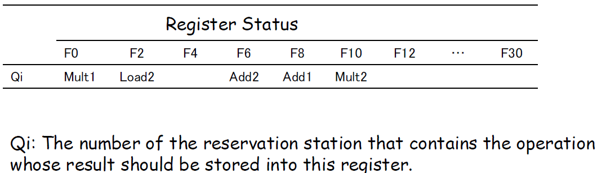
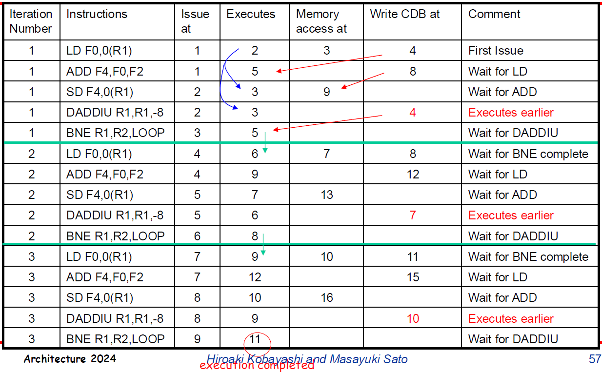

# 


## Table of contents
1. Trends in Computer Architecture Design
2. Instruction Set Principles and Examples
3. Pipelining
4. Memory Hierarchy (1/7)
5. Instruction Level Parallelism and Its Exploitation(1/7?) 
6. Multicores, Multiprocessors, and Clusters (1/14)
7. Data-Level Parallelism: SIMD, Vector, and GPU (1/14)
8. Warehouse-Scale Computers (1/21)

## Trends in Computer Architecture Design
### Techniques to Avoid Pipeline-Stalls
- Maintain the dependence among the instructions but avoid a hazard, and eliminate a dependence by transforming the code to increase instruction-level parallelism, and then
- Fill stall-slots in the pipeline with independent instructions by their reordering 
    - Exploit instruction-Level Parallelism (ILP), parallelism among instructions

Two approaches to exploiting ILP
- Dynamic reordering of instruction execution by hardware
    - Pentium III&4, Athlon, MIPSR10000/12000, UltraSPARC III, PowerPC G3&G4, Alpha 21264
- Static reordering of instruction execution by compiler
    - IA-64 (Itanium 1&2)

## Importance of Data Dependences and Hazards
- Determining whether an instruction is dependent on another instruction is critical to ...
    - Determining how much parallelism exists in a program and
    - Determining how that parallelism can be exploited.

😀 If two instructions are parallel, they can execute simultaneously in a pipeline without causing any stalls

🙁 If two instructions are dependent, they are not parallel and must be executed in order, though they may often be partially overlapped in pipelining.

## Data Dependences
- **Data depences**: An instruction *j* is *data dependent*on instruction *i* if either of the following holds
    - instruction i produces a result that may be used by instruction j, or 
    - instruction j is data dependent on instruction k, and instruction k is data dependent on instruction i.


### Name Dependences
A name dependence occurs when 
- **Two instructions use the same register or memory location**, called *name*, 
- But **there is no flow of data** between the instructions associated with that name.
- An **antidependence** between instructions i and j occurs 
    - When j writes a register or memory location that i reads.
- An **output dependence** occurs 
    - When instructions i and j write the same register or memory location.

**Since a name dependence is not a true dependence, it can be solved if the number of registers is enough**

### Data Hazards
- A hazard is created whenever 
    - There is a dependence between instructions, and 
    - They are close enough that the overlap caused by pipelining, or other reordering of instructions, would change the order of access to the operand involved in the dependence.
- The goal of software and hardware techniques is *to exploit parallelism by preserving program order only where it affects the outcome of the program*.

### Types of Data Hazards
- **RAW (read after write)**
    - j tries to read a source before iwrites it, so j incorrectly gets the old value in the case of  i occurring before j in program order
    - **True dependence**
    - RAW \
        LD **F0**, 0(R2) \
        ADD F4,**F0**,F2
- **WAW (write after write)**
    - i tries to write an operand before it is written by i.
    - **Output dependence**
    - WAW \
        ADD **F4**,F0,F2 \
        ・・・ \
        DIV **F4**, F1,F3
- **WAR (write after read)**
    - j tries to write a destination before it is read by i, so i incorrectly gets the new value.
    - **Antidependence**
    - WAR \
        ADD F4, **F0**, F2 \
        LD **F0**, 0(R2)


## Exploiting Instruction-Level Parallelism with Hardware Approaches
### Overcoming Data Hazards with Dynamic Scheduling
- Dynamic scheduling
    - Hardware rearranges the instruction execution to reduce the stalls while maintaining data flow and exception behavior.
- Advantages
    - It enables handling some cases when dependences are unknown at compile time (e.g., memory references)
    - It simplifies the compiler
    - It allows code that was compiled with one pipeline in mind to run efficiently on a different pipeline.

**🙁 The advantages of dynamic scheduling are gained at a cost of significant increase in hardware complexity.**

### Dynamic Scheduling: The Idea
- Simple pipelining techniques use in-order instruction issue and execution.
    - Instructions are issued in program order, and if an instruction is stalled in the pipeline, no later instructions can proceed.


### Some Concerns about Dynamic Scheduling
- *WAR and WAW hazards* \
Example: \
    DIV F0,F2,F4 \
    ADD F6,F0,F8 RAW \
    SUB F8,F10,F14 WAR \
    MUL F6,F10,F8 WAW \
If the pipeline executes SUB before ADD, it will violate the antidependence (**WAR**). \
Likewise, to avoid violating output dependences, **WAW** hazards must be handled.

- *Precise exception handling*
    - Dynamic scheduling with out-of-order completion must preserve exception behavior in the sense that **exactly** those exceptions that would arise if the program were executed in strict program order **actually** do arise.

Dynamically scheduled processors preserve exception behavior by ensuring that no instruction can generate an exception until the processor knows that the instruction raising the exception will be executed.

### New Pipeline Staging for Out-Of-Order Execution
To allow out-of-order execution, the ID pipe stage is split into two stages
- *Issue*: Decode instructions, check for structural hazards
- *Read operands*: Wait until no data hazards are observed, and the read operands are ready for execution.
- An instruction fetch stage precedes the issue stage and may fetch either into an instruction register or into a queue of pending instructions
- Instructions are then issued from the register or queue.
- The EX stage follows the read operands stage, just as in the five-stage pipeline

To take advantage of dynamic scheduling, 
- Pipelines allows multiple instructions to be in execution at the same time, and
- Have multiple functional units, pipelined functional units or both.

### Basic Dynamic Scheduling
In a dynamically scheduled pipeline, 
- All instructions pass through the issue stage in order (*in-order issue*), however, 
- They can be *stalled or bypass* each other in second stage (read operand) and 
- Thus enter execution *out of order*.
- *Scoreboarding: The basic idea*
    - When the next instruction to execute is stalled, other instructions can be issued and executed if they do not depend on any active or stalled instruction.

DIV **F0**,F2,F4 \
ADD ***F6***,**F0**,*F8* **RAW** \
SUB *F8*,F10,F14 *WAR* \
MUL ***F6***,F10,F8 ***WAW*** 

### Scoreboarding (First introduced in CDC6600)
- All hazard detection and resolution are centralized in the scoreboard to control instruction execution.
    - Every instruction goes through the scoreboard, where a record of the data dependences is constructed.
    - The scoreboard determines when the instruction can read its operands and begin execution.
    - If the scoreboard decides the instruction cannot execute immediately, it monitors every change in the hardware and decides when the instruction can be executed.
    - The scoreboard also controls when an instruction can write its result into the destination register.


### The basic four steps for scoreboarding
- Issue
    - If **a functional unit for the instruction is free** and **no other active instruction has the same destination register**, the scoreboard issues the instruction to the functional unit and updates it internal data structure
    - *Structural and WAW hazard handling*
- Read operands
    - The scoreboard **monitors the availability of the source operands**.
    - When the source operands are available, the scoreboard tells the functional unit **to proceed to read the operands from the register and begin execution**.
    - *Dynamic RAW hazard handling*
- Execution
    - The functional unit begins execution upon receiving operands
    - When the result is ready, it notifies the scoreboard that it has completed execution
- Write result
    - Once the scoreboard is aware that the functional unit has completed execution, **the scoreboard checks for WAR hazards and stall the completing instruction**, if necessary.
    - If **this WAR hazard does not exist**, or when it clears, the scoreboard tells the functional unit to store its result to the destination register.
    - *WAR hazard handling*

### Data Structures for Scoreboarding
- Instruction status
    - Indicates which of the four steps the instruction is in.
- Functional unit status
    - Indicates the state of the functional unit (FU).
    - There are nine fields for each functional unit
        - Busy: indicates whether the unit is busy or not
        - Op: operation to perform in the unit
        - Fi: destination register
        - Fj, Fk: source registers
        - Qj, Qk: Functional units producing source registers Fj,Fk
        - Rj,Rk: Flags indicating when Fj, Fkare ready and not yet read. Set to No after operands are read
- Register result status
    - Indicates which functional unit will write each register, if an active instruction has the register as its destination.
    - This field is set to blank whenever there are no pending instructions that will write that register.

Exemple slide 18 and 19

### Required Checks and Bookkeeping Actions
| Instruction Status   | Wait until                                      | Bookkeeping                                                                                     |
|----------------------|-------------------------------------------------|------------------------------------------------------------------------------------------------|
| Issue                | Not Busy[FU] and Not Result[D]                 | Busy[FU] ← yes; Op[FU] ← op; Fi[FU] ← D;<br>Fj[FU] ← S1; Fk[FU] ← S2;<br>Qj ← Result[S1]; Qk ← Result[S2];<br>Rj ← not Qj; Rk ← not Qk; Result[D] ← FU |
| Read operands        | Rj and Rk                                       | Rj ← No; Rk ← No; Qj ← 0; Qk ← 0                                                               |
| Execution Complete   | Functional unit done                            |                                                                                                 |
| Write result         | ∀f((Fj[f]≠Fi[FU] or Rj[f]=No) & (Fk[f]≠Fi[FU] or Rk[f]=No)) | ∀f(if Qj[f]=FU then Rj[f]←Yes);<br>∀f(if Qk[f]=FU then Rk[f]←Yes);<br>Result[Fi[FU]] ← 0; Busy[FU] ← No;       |

### Scoreboarding
👍 *1.7x Performance improvement for a Fortran program on CDC6600*
👎 **Main Cost: Large number of buses**

Factors Limiting the Scoreboard Performance
- The amount of parallelism available among the instruction
    - This determines whether independent instructions can be found to execute.

This is due to...
1. The number of scoreboard entries **limited**!
    - This determines how far ahead the pipeline can look for independent instructions.
    - The set of instructions examined as candidates for potential execution is called the *window*.
2. The number and types of functional units **limited**!
    - This determines the importance of structural hazards, which can increase when dynamic scheduling is used
3. The presence of antidependences and output dependences **unavoidable**!
    - These lead to WAR and WAW stalls

### Tomasulo’s Approach: Solve the Problems of Scoreboarding!
Invented by Robert Tomasulo for IBM 360/91 FP units
- Tracks when operands for instructions are available, to minimize RAW hazards
    - Reservation stations of functional units buffers the operands of instructions waiting to issue
- Introduces register renaming, to minimize WAW and WAR hazards
    - Register renaming eliminates WAR and WAW hazards by renaming all destination registers, including those with a pending read or write for an earlier instruction.
- Hazard detection and execution control are distributed

### Dynamic Scheduling with Register Renaming


### Reservation Stations for Register Renaming
- As instructions are issued, the register specifiers for pending operands are renamed to the names of the reservation stations
- A reservation station fetches and buffers an operand as soon as it is available, eliminating the need to get the operand from a register.
- Pending instructions designate the reservation station that will provide their input.

- Since there can be more reservation stations than real registers, the technique can even eliminate hazards arising from name dependences.


### The Advantages of Tomasulo’s Approach
- Hazard detection and execution control are distributed.
    - The information held in the reservation stations at each functional unit determines when an instruction can begin execution at that unit.
- WAW and WAR hazards are eliminated by register renaming
- Results are passed directly to functional units from the reservation stations where they are buffered, rather than going through the registers.
    - This bypassing is done with a common result bus that allows all units waiting for an operand to be loaded simultaneously.

### Pipeline Stages for Tomasulo’s Approach
- Issue
    - Get the next instruction from the head of the instruction queue, which is maintained in FIFO order to ensure the maintenance of correct data flow.
    - If there is a matching reservation station that is empty, issue the instruction to the station with the operand values, if they are currently in the registers.
    - If there is not an empty reservation station, then there is a structural hazard and  the instruction stalls until a station or buffer is freed
    - If the operands are not in the registers, keep track of the functional units that will produce the operands

**This step renames registers, eliminating WAR and WAW hazards.**

- Execute
    - If one or more of the operands is not yet available, monitor the common data bus while waiting for it to be computed.
    - When an operand becomes available, it is placed into the corresponding reservation station.
    - When all the operands are available, the operation can be executed at the corresponding functional unit.

**By delaying instruction execution until the operands are available, RAW hazards are avoided.**

- Write results
    - When the result is available, write it on the CDB, and from there into the registers and into any reservation stations waiting for this result.
    - Stores also write data to memory during this step: When both the address and data value are available, they are sent to the memory unit and the store completes.


### Dynamic Scheduling Example by Tomasulo’s Approach


### Reservation Stations


### Register Status Table



#### Exemple 
- Using the same code segment as in the previous example, show what the status tables look like when the MUL is ready to write its result.

| Instruction | Issue    | Execute  | Write result |
|-------------|----------|----------|--------------|
| LD F6,34(R2)| ✕        | ✕        | ✕            |
| LD F2,45(R3)| ✕        | ✕        | ✕            |
| MUL F0,F2,F4| ✕        | ✕        |              |
| SUB F8,F6,F2| ✕        | ✕        | ✕            |
| DIV F10,F0,F6| ✕       | ✕        |              |
| ADD F6,F8,F2| ✕        | ✕        | ✕            |

#### Exemple (count'd)
Reservation Stations
| Name   | Busy | Op   | Vj               | Vk        | Qj    | Qk    | A                |
|--------|------|------|------------------|-----------|-------|-------|------------------|
| Load1  | no   |      |                  |           |       |       |                  |
| Load2  | no   |      |                  |           |       |       |                  |
| Add1   | no   |      |                  |           |       |       |                  |
| Add2   | no   |      |                  |           |       |       |                  |
| Add3   | no   |      |                  |           |       |       |                  |
| Mult1  | yes  | MUL  | Mem[45+Reg[R3]]  | Regs[F4]  |       |       |                  |
| Mult2  | yes  | DIV  | Mem[34+Regs[R2]] |           | Mult1 |       |                  |

Register Status
| Qi   | F0   | F2   | F4   | F6   | F8   | F10  | F12  | ... | F30  |
|------|------|------|------|------|------|------|------|-----|------|
| Qi   | Mult1|      | Mult2|      |      |      |      | ... |      |


### Tomasulo’s Algorithm: A Loop-Based Example
- Example

Loop:   LD F0,0(R1) \
        MUL F4,F0,F2 \
        ST F4,0(R1) \
        ADD R1,R1,-8 \
        BNE R1,R2,Loop \

Two active iterations of the loop with no instruction yet completed.

Instruction Status
| Instruction | From iteration | Issue | Execute | Write result |
|-------------|----------------|-------|---------|--------------|
| LD F0,0(R1) | 1              | ✕     | ✕       |              |
| MUL F4,F0,F2| 1              | ✕     |         |              |
| ST F4,0(R1) | 1              | ✕     |         |              |
| LD F0,0(R1) | 2              | ✕     |         |              |
| MUL F4,F0,F2| 2              | ✕     |         |              |
| ST F4,0(R1) | 2              | ✕     |         |              |


    
### Dynamic Disambiguation of Memory Addresses
- In a load operation, if the load address matches the address of any active entries in the store buffer, the load instruction is not sent to the load buffer until the conflicting store completes.
    - RAW hazards handling for load operations
- In a store operation, processor must check for conflicts in both the load buffers and store buffers.
    - WAW and WAR hazards handling for store operations


### Summary of the Tomasulo’s Approach
- A dynamically scheduled pipeline by the Tomasulo’s algorithm can yield very high performance
    - The key components for enhancing ILP in Tomasulo’s algorithm
        - dynamic scheduling
        - register renaming
        - dynamic memory disambiguation
    - The role of dynamic scheduling as a basis for hardware speculation has made this approach very popular in modern microprocessors!
👎 The major drawback of this approach is its hardware complexity
    - Each reservation station must contain an associative buffer, which must run at high speed, as well as complex control logic.
    - The performance can be limited by the single CDB.
        - Although additional CDBs can be added, each CDB must interact with each reservation station, and the associative tag-matching hardware would need to be duplicated at each station for each CDB
    - The size of the reservation stations limits the ILP exploited.

### Reducing Branch Costs with Dynamic Hardware Prediction
- As the amount of ILP to exploit grows, control dependences rapidly become the limiting factor.
    - Branches will arrive up to n times faster in an n-issue processor and providing an instruction stream to the processor will  require that we predict the outcome of branches.
    - Amdahl’s Law reminds us that relative impact of the control stalls will be larger with the low potential CPI in such machines.
- Branch Prediction Schemes
    - Static branch prediction by compiler
        - Predict-taken/predict-not taken schemes, delayed branch scheme
    - Dynamic branch prediction by hardware
        - Branch-prediction buffer, branch history table, branch target buffer

**The goal of these mechanisms is  to allow the processor to resolve the outcome of a branch early**

### Control (Branch) Hazards
- Execution of branch instructions may or may not change the PC to something other than its current execution sequence.

_Hazards.png)

### Basic Branch Prediction and Branch-Prediction Buffers
- Branch Target Buffer
    - A small memory indexed by the lower portion of the address of the branch instruction.
    - The memory contains prediction bits that say whether the branch was recently taken or not.
    - If the prediction turns out to be wrong, the prediction bits are updated.

**Prediction accuracy depends on the prediction bits/prediction schemes!**


### How many bits are required for accurate prediction?
- 1-bit prediction scheme
    - 1-bit holds the information about last branch direction.
    - If the prediction turns out to be wrong, the prediction bit is inverted and stored back.

😊 Simple and low cost prediction scheme

🙁 Low prediction accuracy
    - Even if a branch is almost always taken, it will likely predict incorrectly twice, rather than twice, when it is not taken.


- Example
    - Consider a loop branch whose behavior is taken nine times in a row, then not taken once. What is the prediction accuracy for this branch?
    - Miss-predictions on the first and last loop iterations.

The prediction accuracy for this branch that is taken 90% of the time is **only 80%**!

### 2-bit Prediction Scheme
- A prediction must miss twice before it is changed.
- A 2-bit saturating counter hold the information about the recent branch behavior.
- The counter is incremented on a taken branch and decremented on an untaken branch.
- n-bit extension is possible, but studies of n-bit predictors have shown that the 2-bit predictors do almost as well.

=> The most systems rely on 2-bit branch predictors rather than the more general n-bit predictors.


### What Kind of Accuracy Can Be Expected From A 2-bit Branch Prediction


### How Can We Improve the Accuracy of Branch Prediction?
- Neither the number of entries, nor the size of prediction bits!

👍 Need to consider the correlation among branches for more accurate branch prediction!

👎 2-bit predictor schemes use only the recent behavior of a single branch to predict the future behavior of that branch


**TTT, TNN, NTN, NNT may occur, but the others *Never* occur**


#### 1-Bit Predictors are Useless for Prediction of Correlating Branches


### Correlating/Two-Level Predictors: Basic Idea
- Prediction bits are provided for each case of branch correlating patterns

| Prediction bits | Prediction if last branch **not taken** | Prediction if last branch **taken** |
|-----------------|-----------------------------------------|-------------------------------------|
| NT/NT          | NT                                      | NT                                  |
| NT/T           | NT                                      | T                                   |
| T/NT           | T                                       | NT                                  |
| T/T            | T                                       | T                                   |

The action of the 1bit predictor with 1 bit of correlation, initialized to not-taken/not-taken.

| d=? | b1 prediction | b1 action | New b1 prediction | b2 prediction | b2 action | New b2 prediction |
|-----|---------------|-----------|-------------------|---------------|-----------|-------------------|
| 2   | NT/NT         | T         | T/NT              | NT/NT         | T         | NT/T              |
| 0   | T/NT          | NT        | T/NT              | NT/T          | NT        | NT/T              |
| 2   | T/NT          | T         | T/T               | NT/T          | T         | NT/T              |
| 0   | T/NT          | NT        | T/NT              | NT/T          | NT        | NT/T              |

**The only misprediction is on the first iteration!**

(1,1) predictor: it uses the behavior of the last branch to choose from among a pair of 1-bit branch predictors.

### (m, n) Predictors
- Use the behavior of the last $ m $ branches to choose from $ 2^{m} $ branch predictors, each of which is an $n$-bit predictor for a single branch.

A (2,2) branch-prediction buffer uses a 2-bit global history to choose from among four predictors for each branch address

A 2-bit predictor with no global history is simply a (0,2) predictor.

_Predictors.png)

### Comparison of 2-bit **predictors**


### Pipelining with Branch Prediction
- To reduce the branch penalty for pipelines, need to know what address to fetch by the end of IF, not in ID.

**Get a hint from instruction address**


### Penalties of Branch ***Misprediction***
Penalties for all possible combinations of whether the branch is in the buffer and what it actually does, assuming we store only taken branches in the buffer.

| Instruction in buffer | Prediction | Actual branch | Penalty cycles |
|------------------------|------------|---------------|----------------|
| Yes                   | Taken      | Taken         | 0              |
| Yes                   | Taken      | Not taken     | 2              |
| No                    |            | Taken         | 2              |
| No                    |            | Not taken     | 0              |

- Example
    - Determine the total branch penalty for a branch-target buffer assuming the penalty cycles for individual mispredictions from the left table. Make the following assumptions about the prediction accuracy and hit rate:
        - Prediction accuracy is $90%$ (for instructions in buffer).
        -  Hit rate in the buffer is $90%$ (for branches predicted taken).

Assume that 60% of the branches are taken.

- Hints: calculate
    - Probability (branch in buffer, but actually not taken)
    - Probability (branch not in buffer, but actually taken)
    - $\text{Branch penalty} = (\text{the probability of two events}) \times (\text{penalty cycles})$

### Taking Advantage of More ILP with Multiple Issue
- Goal: Decrease the CPI to less than one!
    - Superscalar processors and 
    - VLIW (very long instruction word) processors

**Allow multiple instructions to issue in a clock cycle**

| Common name                 | Issue structure | Hazard detection | Scheduling             | Distinguishing characteristic             | Example                                                                 |
|-----------------------------|-----------------|------------------|------------------------|-------------------------------------------|-------------------------------------------------------------------------|
| Superscalar (static)        | Dynamic         | Hardware         | Static                 | In-order execution                        | Sun UltraSPARC II/III                                                  |
| Superscalar (dynamic)       | Dynamic         | Hardware         | Dynamic                | Some out-of-order execution               | IBM Power2                                                             |
| Superscalar (speculative)   | Dynamic         | Hardware         | Dynamic with speculation | Out-of-order execution with speculation   | Pentium III/4, MIPS R10K, Alpha 21264, HP PA 8500, IBM RS64III          |
| VLIW/LIW                    | Static          | Software         | Static                 | No hazards between issue packets          | Trimedia, i860                                                         |
| EPIC*                       | Mostly static   | Mostly software  | Mostly static          | Explicit dependences marked by compiler   | Itanium                                                                |

*EPIC: Explicitly Parallel Instruction Computers

### Characterization of Superscalar Processors
- Number of instructions per clock (issue width)
    - Necessary hazard checks among up to maximum issue width of instructions must complete in one clock cycle!
- Instruction issue mechanisms
    - Statically scheduled using compiler techniques or
        - In-order execution: if some instruction in the instruction stream is dependent or doesn’t meet the issue criteria, only the instructions preceding that one in the instruction sequence will be issued.
    - Dynamically scheduled using techniques based on Tomasulo’s algorithm
        - Out-of-order execution: Instructions will be issued as long as any hazards do not occur.

### Statically Scheduled Superscalar Processors
- Instructions issue in order and all pipeline hazards are checked for at issue time.

| Instruction type      | Pipe stages |       |       |       |       |       |       |       |
|-----------------------|-------------|-------|-------|-------|-------|-------|-------|-------|
| Integer instruction   | IF          | ID    | EX    | MEM   | WB    |       |       |       |
| FP instruction        | IF          | ID    | EX    | EX    | WB    |       |       |       |
| Integer instruction   |             | IF    | ID    | EX    | MEM   | WB    |       |       |
| FP instruction        |             | Stall | Stall | Stall | Stall | Stall |       |       |
| Integer instruction   |             |       | IF    | ID    | EX    | MEM   | WB    |       |
| FP instruction        |             |       | IF    | ID    | EX    | EX    | WB    |       |
| Integer instruction   |             |       |       | Stall | Stall | Stall | Stall | Stall |
| FP instruction        |             |       |       | Stall | Stall | Stall | Stall | Stall |

### Multiple Instruction Issue with Dynamic Scheduling
- Goal: Instructions issue at least until the hardware runs out of reservation stations.


### Clock Cycle of Issue, Execution, and Writing Results for a dual-issue Pipeline


#### Resource Usage Table


### If We Could Add One More Integer ALU...


#### Resource Usage Table With One More Integer ALU


### Factors Limiting Performance of the Two-Issue Dynamically Scheduled Pipeline
- There is an imbalance between the functional unit structure of the pipeline and example loop.
    - This imbalance means that it is impossible to fully use the FP units.  To remedy this, we would need fewer dependent integer operations per loop.
- The amount of overhead per loop interaction is very high
    - Two out of five instructions (DADDIU and BNE) are overhead.
- The control hazard, which prevents us from starting the next *LD* before we know whether the branch was correctly predicted, causes a one-cycle penalty on every loop iteration.

### Speculation
- Efficient handling of branch instructions is key for wide-issue superscalar processors 

👍 Overcoming control dependence is done by **speculating** on the outcome of branches and **executing** the program as if our guesses were correct
- Need mechanisms to handle the situation where the speculation is incorrect.

### Hardware-based Speculation: Three Key Ideas
- Dynamic branch prediction to choose which instructions to execute
- Speculation to allow the execution of instructions before the control dependences are resolved (with the ability to undo the effects of an incorrectly speculated sequence), and
- Dynamic scheduling to deal with the scheduling of different combinations of basic blocks.

**Hardware-based speculation follows the predicted flow of data values to choose when to execute instructions => Data flow execution**

### Extension of Tomasulo’s Algorithm for Speculation: Basic Idea
- Modern Microprocessors employ speculative execution mechanisms based on Tomasulo’s Algorithm
    - PowerPC603/604/G3/G4, MIPS, R10K/R12K, PentiumII/III/4, Alpha21264, AMD K5/K6/Athron

1. We cannot use the results of speculatively executed instructions until the instructions are no longer speculative!
2. A special care for speculative execution is to separate the bypassing of results among instructions, which is needed to execute an instruction speculatively, from the actual completion of an instruction.
3. When an instruction is no longer speculative, we allow it to update the register file or memory : **Instruction Commit**

### Implementation
- Allow instructions to **execute out-of-order** but to force them to *commit in-order*, and
- Prevent any irrevocable action* until an instruction commits.
    - * such as updating state or taking an exception

- Reorder Buffer: an additional set of hardware buffers that hold the results of instructions that have **finished execution but have not committed**.

**The ROB supplies operands/results in the interval between completion of instruction execution and instruction commit.**


#### Reorder Buffer:  FIFO to Keep the Execution Order When the Speculation Cleared
```assembly
LD F6,34(R2)
LD F2,45(R3)
MUL F0,F2,F4
SUB F8,F6,F2
DIV F10,F0,F6
ADD F6,F8,F2
```

| Entry | Busy | Instruction | State        | Dest | Value                |
|-------|------|-------------|--------------|------|----------------------|
| 1     | No   | LD F6,34(R2)| Commit       | F6   | Mem[34+Regs[R2]]     |
| 2     | No   | LD F2,45(R3)| Commit       | F2   | Mem[45+Reg[R3]]      |
| 3     | Yes  | MUL F0,F2,F4| Write result | F0   | #2 × Regs[F4]        |
| 4     | Yes  | SUB F8,F6,F2| Write result | F8   | #1 − #2              |
| 5     | Yes  | DIV F10,F0,F6| Execute     | F10  |                      |
| 6     | Yes  | ADD F6,F8,F2| Write result | F6   | #4 + #2              |

### Pipe Stages for Speculation
- Issue
    - Get an instruction from the instruction queue
    - Issue the instruction if there is **an empty reservation station** and **an empty slot in the ROB**
    - Send the operands to the reservation station if they are available in either the registers or the ROB
    - Update the control entries to indicate the buffers are in use.
    - The number of the ROB allocated for the result is also sent to the reservation station, so that the number can be used to tag the result when it is placed on the CDB
    - If either all reservations are full or the ROB is full, then instruction issue is stalled until both have available entries.
    - This stage is sometimes called **dispatch** in a dynamically scheduled processor
- Execute
    - If one or more of the operands is not yet available, monitor the CDB while waiting for the register to be computed (RAW hazards check).
    - When both operands are available at a reservation station, execute the operation.
    - Instructions may take multiple clock cycles in this sage, and loads still require two steps in this stage.
    - Stores need only to have the base register available at this step, since execution for a store at this point is only effective address calculation.
        - The store buffer is replaced with ROB.
- Write result
    - When the result is available, write it on the CDB (with the ROB tag sent when the instruction issued) and from the CDB into the ROB, as well as to any reservation stations waiting for this result.
    - Mark the reservation station as available.
    - Special actions are required for store instructions.
        - If the value to be stored is available, it is written into the Value field of the ROB entry for the store.
        - If the value to be stored is not available yet, the CDB must be monitored until that value is broadcast, at which time the Value field of the ROB entry of the store is updated.
- Commit
    - The normal commit case occurs when an instruction reaches the head of the ROB and its result is present in the buffer
        - At this point, the processor updates the register with the result and removes the instruction from the ROB
    - Committing a store is similar except that memory is updated rather than a result register.
    - When a branch with incorrect prediction reaches the head of the ROB, it indicates that the speculation was wrong. The ROB is flushed and execution is restarted at the correct successor of the branch.
    - If the branch was correctly predicted, the branch is finished.
    - Some machines call this commit phase **“completion”** or **“graduation”**.

**Once an instruction commits, its entry in the ROB is reclaimed and the register or memory destination is updated, eliminating the need for the ROB entry.**


#### Example
Assumptions
- 2 clock cycles for add
- 10 clock cycles for multiply
- 40 clock cycles for division

```assembly
LD F6,34(R2)
LD F2,45(R3)
MUL F0,F2,F4
SUB F8,F6,F2
DIV F10,F0,F6
ADD F6,F8,F2
```

Question:
- What does the status table look like when MUL, SUB and ADD have completed, and the MUL is ready to go to commit?

#### Reservation Stations


#### Reorder Buffer & FP Register Status


#### Loop Unrolling with Speculation
Example
```assembly
Loop:   LD F0,0(R1)
        MUL F4,F0,F2
        SD F4,0(R1)
        DADDIU R1,R1,-8
        BNE R1,R2,Loop
        ;branches if R1!=R2
```
Assume
- We have issued all the instructions in the loop twice
- LD and MUL from the first iteration have committed and all other instructions have completed execution
- The store would wait in the ROB for both the effective address operand (R1) and the value (F4). 
- Since we are only considering the floating point pipeline, assume the effective address for the store is computed by the time the instruction is issued.

#### Reorder Buffer & FP Register Status


### Multiple Issue with Speculation
**slide 74 to check**

### Time of Issue, Execution and Writing Result for a Dual-Issue Pipeline **without** Speculation


### Time of Issue, Execution and Writing Result for a Dual-Issue Pipeline **with** Speculation


## The ARM Cortex-A8
- **Dual-issue, statically scheduled superscalar**
- 512-entry two-way set-associative BTB & 4K-entry GHB
- **Instruction issue controlled by scoreboard**
- 3 types of execution pipes: ALU/MUL, ALU, and L/S
- 13-cycle branch misspredict penalty


### Decode and Execution
.png)

.png)

### Performance of A8
Pipeline Stalls are the major contributor to the CPI, which arise from
- Functional hazards
    - Two adjacent instructions selected for simultaneous execution use the same functional pipeline
- Data hazards
    - Stall both insts. or second of a pair
- Control hazards
    - Branch mispredicted


### A8 vs. A9
- A9 :
    - Dynamically scheduled superscalar
        - Two instructions per clock
    - Up to four pending instructions can begin execution in a clock cycle
        - Two ALU, one L/S or FP/multimedia, and one branch
        - More powerful branch predictor, instruction cache prefetch and non-blocking L1 data cache


## The Intel Core i7
- High throughput by combining multiple issue and high clock rates
    - Out of order speculative microarchitecture
    - Deep pipeline
        - Branch mispredictionpenalty of 15 cycles
- Micro-op engine
    - X86 instructions are translated into micro-ops
        - MIPS-like instructions
- Centralized reservation station


### Ratio of Wasted Work in Speculation


#### CPI for SPECCPU2006 on Core i7


## Exploiting Instruction-Level Parallelism with Software Approaches
**[NOT EXPLAIN]**


